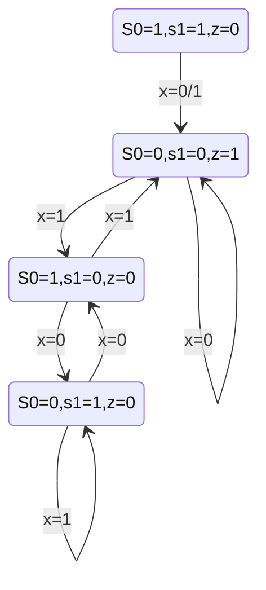
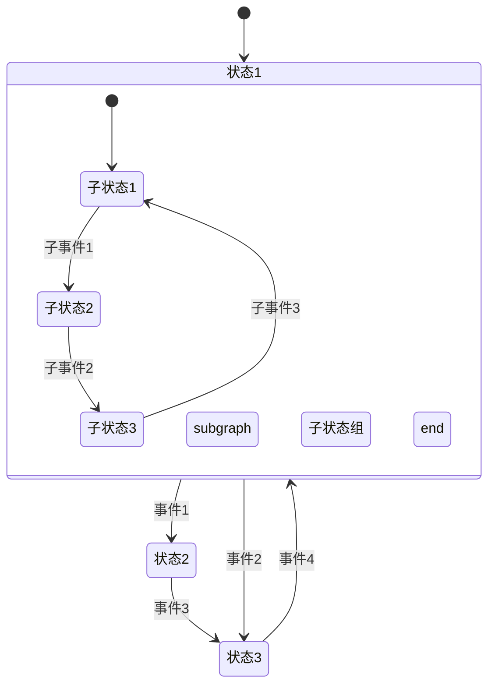
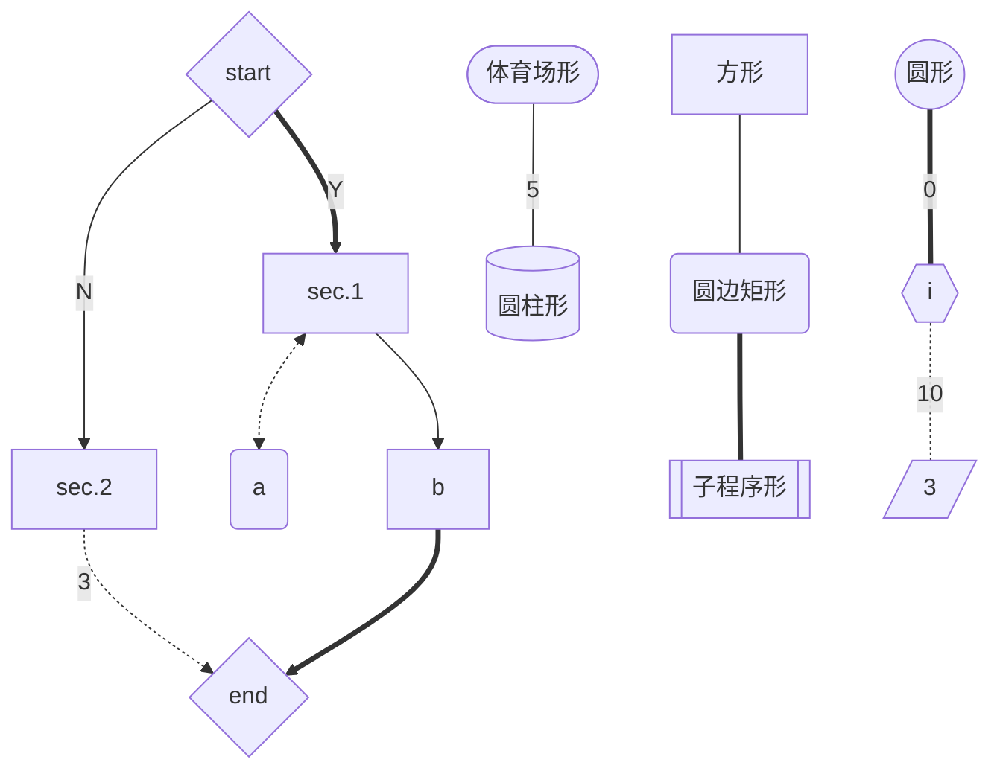
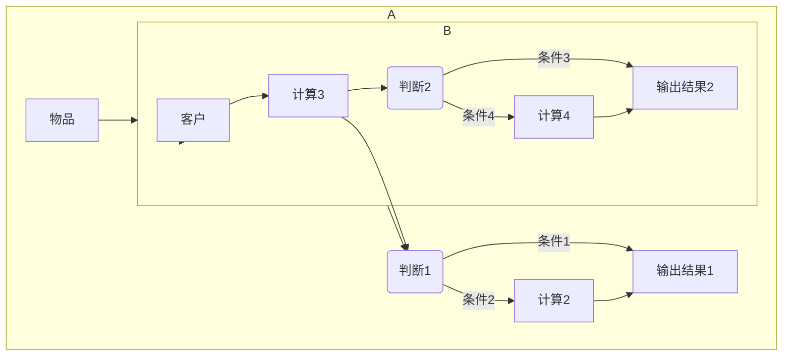
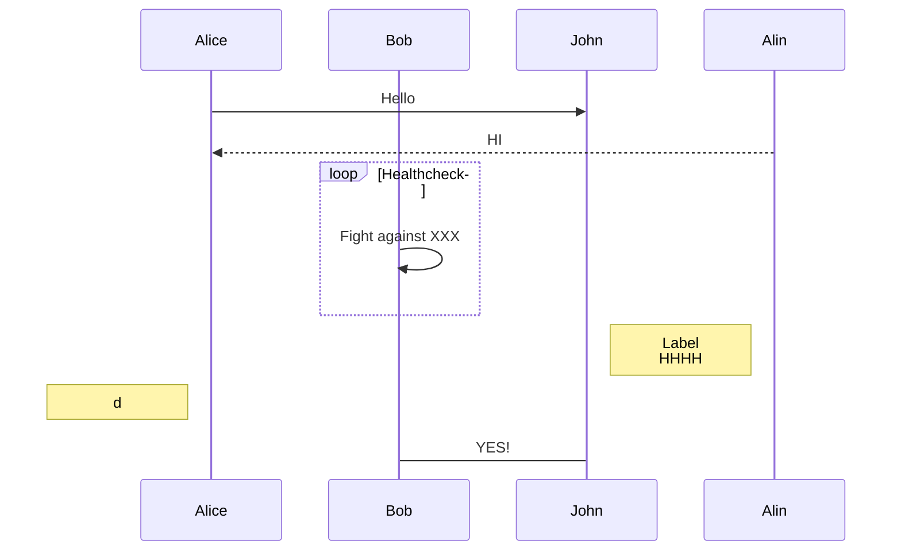
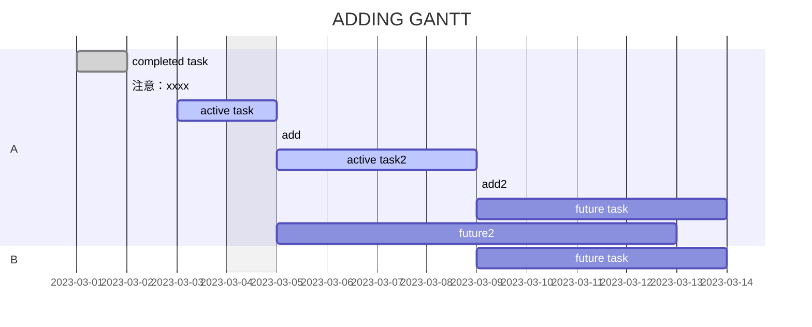
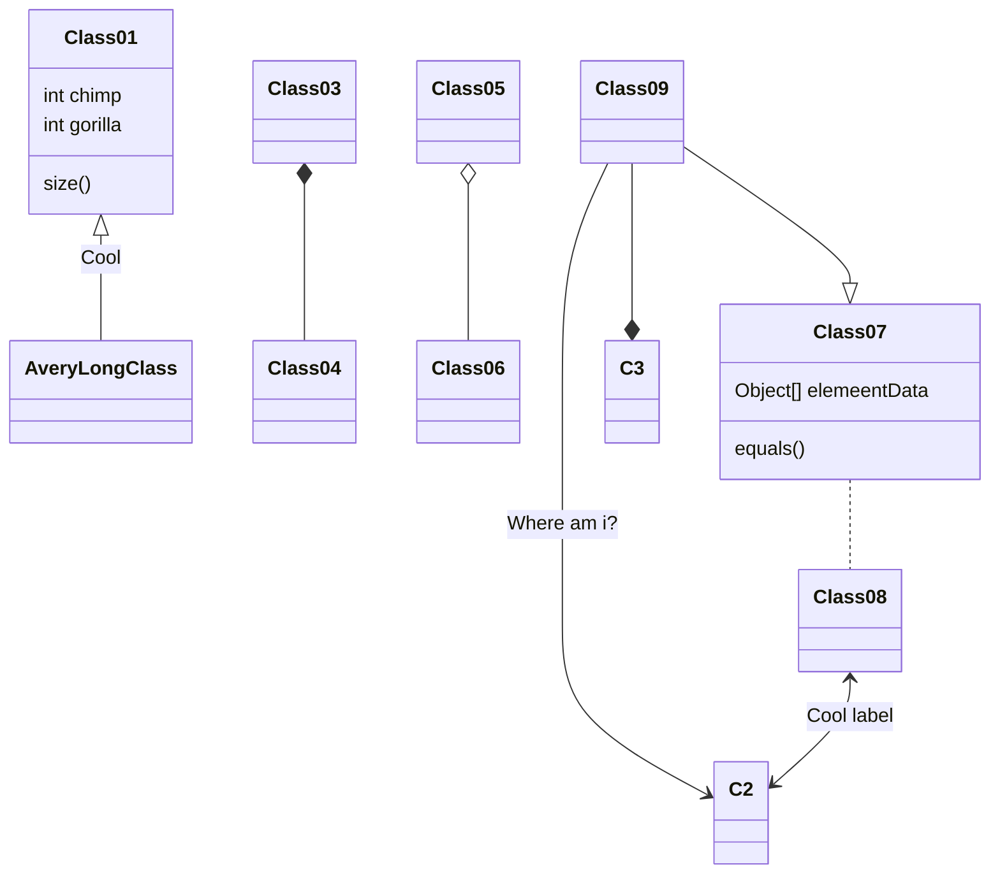
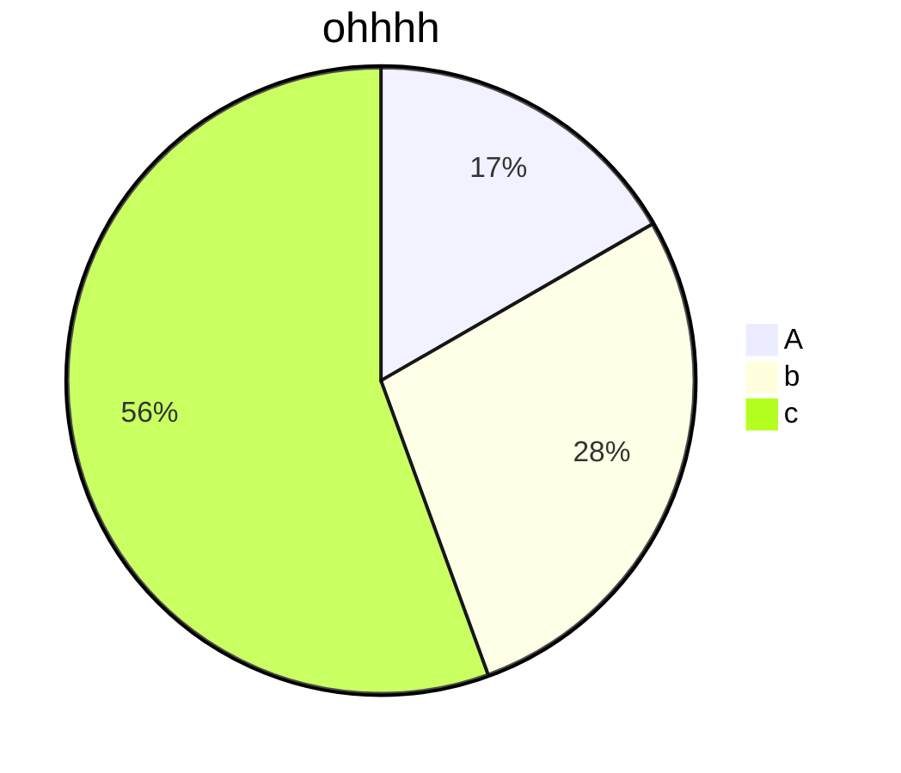

# Markdown

## basic

|      effect       |        code         |         shortcut key         |
| :---------------: | :-----------------: | :--------------------------: |
|     **bold**      |     `**bold**`      | <kbd>Ctrl</kbd>+<kbd>B</kbd> |
| ~~strikethrough~~ | `~~strikethrough~~` |                              |
|     *italic*      |     `*italic*`      |                              |
|        ` `        |         ` `         | <kbd>Ctrl</kbd>+<kbd>E</kbd> |
|        __         |         __          | <kbd>Ctrl</kbd>+<kbd>I</kbd> |

## list

`* something`

* a
* b
* c

`1. something`

1. d
2. e
3. f

`- something`

- g
- h
- i

## plan

`- [ ] to do`

`- [x] have done`

- [ ] to do
- [x] have done

## quote

`> ohhhhhh`

`> > yeeeee`

> ohhhhhh
>
> > yeeeee

## code

行内代码显示：`int a = 0;`

代码块：

```c
int main(void)
{
    int a = 0;
    return 0;
}
```

## link

[bilibili](https://www.bilibili.com)
`[bilibili](https://www.bilibili.com)`

## emoji

:star::cactus:
`:star:` `:cactus:`

## formula

行内公式显示： $x^2=1$

`$x^2=1$`

整块公式显示：

$$
x^2+y+3z^3=10
$$

```c
$$
x^2+y+3z^3=10
$$
```

---

# Mermaid

只列出了[部分]我个人较为常用的图和用法，并不全面。

## stateDiagram -v2

```
stateDiagram-v2
	S0=0,s1=0,z=1 --> S0=0,s1=0,z=1: x=0
	S0=0,s1=0,z=1 --> S0=1,s1=0,z=0: x=1
	S0=1,s1=0,z=0 --> S0=0,s1=1,z=0: x=0
	S0=1,s1=0,z=0 --> S0=0,s1=0,z=1: x=1
	S0=0,s1=1,z=0 --> S0=1,s1=0,z=0: x=0
	S0=0,s1=1,z=0 --> S0=0,s1=1,z=0: x=1
	S0=1,s1=1,z=0 --> S0=0,s1=0,z=1: x=0/1
```




```
stateDiagram
  [*] --> 状态1
  状态1 --> 状态2 : 事件1
  状态1 --> 状态3 : 事件2
  状态2 --> 状态3 : 事件3
  状态3 --> 状态1 : 事件4
  state 状态1 {
    [*] --> 子状态1
    子状态1 --> 子状态2 : 子事件1
    subgraph 子状态组
      子状态2 --> 子状态3 : 子事件2
    end
    子状态3 --> 子状态1 : 子事件3
  }

```




## graph

(-或TB或TD：从上往下；LR：从左往右；RL：从右往左)

```
graph TD
A{start} ==Y==> B[sec.1]
A --N--> C[sec.2]
C -.3.-> D{end}
B <-.-> a(a)
B --> b ==> D
id1[方形]---id2(圆边矩形)===id3[[子程序形]]
id4([体育场形]) --5--- id5[(圆柱形)]
id6((圆形))==0===id7{{i}}-.10.-id8[/3/]
```




## flowchart LR

```
flowchart LR
  subgraph A
  物品-->B[计算1]
  B-->C(判断1)
  C-->|条件1| D[输出结果1]
  C-->|条件2| E[计算2]
  E-->D
  end

  subgraph B
  客户-->F[计算3]
  F-->G(判断2)
  G-->|条件3|H[输出结果2]
  G-->|条件4|I[计算4]
  I-->H
  end

  A-->B
  F-->C
```





## sequenceDiagram

```c
sequenceDiagram
participant Alice
participant Bob
Alice ->> John: Hello
Alin -->> Alice:HI
loop Healthcheck
	Bob ->> Bob:Fight against XXX
end
note right of John:Label<br/>HHHH
note left of Alice:d
Bob -> John:YES!
```




## gantt

```
gantt
dateformat YYYY-MM-DD
title ADDING GANTT
excludes weekdays 2023-03-04

section A
completed task:done,des1,2023-03-01,2023-03-02
注意：xxxx:.
active task:active,des2,2023-03-03,2023-03-05
add:/
active task2:active,des3,after des2,4d
add2:.
future task:des4,after des3,5d
future2:des5,after des2,8d

section B
future task:des6,after des3,5d
```




## classDiagram

```
classDiagram
Class01 <|-- AveryLongClass: Cool
Class03 *-- Class04
Class05 o-- Class06
Class07 .. Class08
Class09 --> C2: Where am i?
Class09 --* C3
Class09 --|> Class07
Class07: equals()
Class07: Object[] elemeentData
Class01: size()
Class01: int chimp
Class01: int gorilla
Class08 <--> C2: Cool label
```




## pie

```
pie
title ohhhh
"A":3
"b":5
"c":10
```


