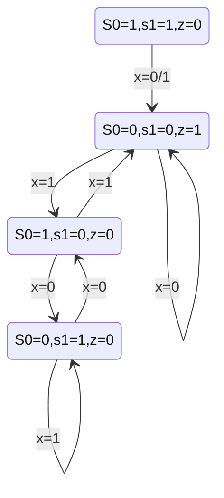
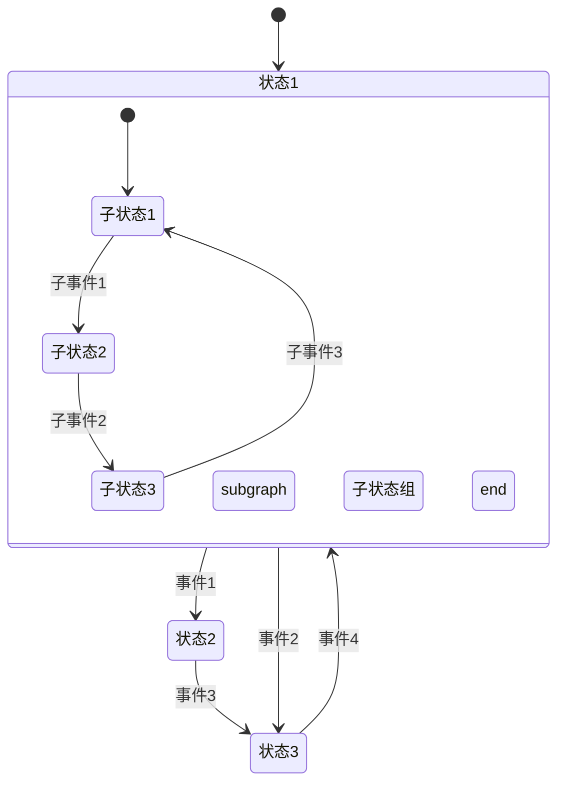
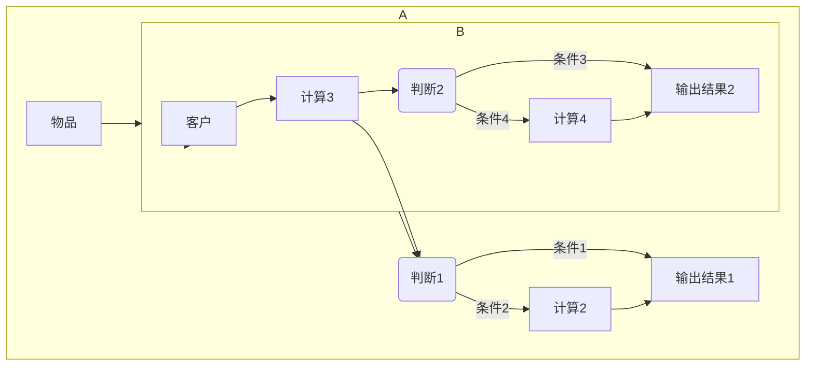
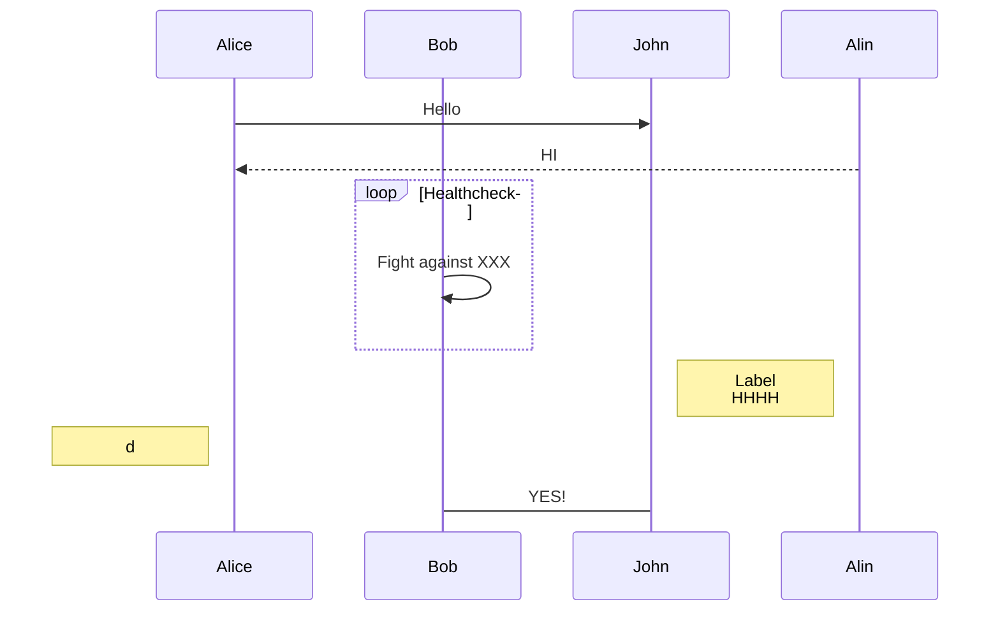
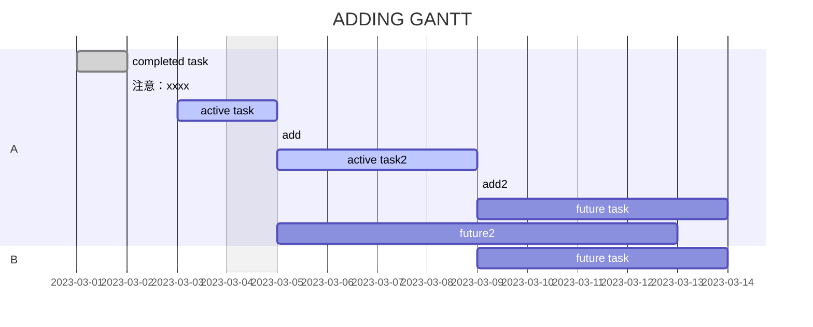
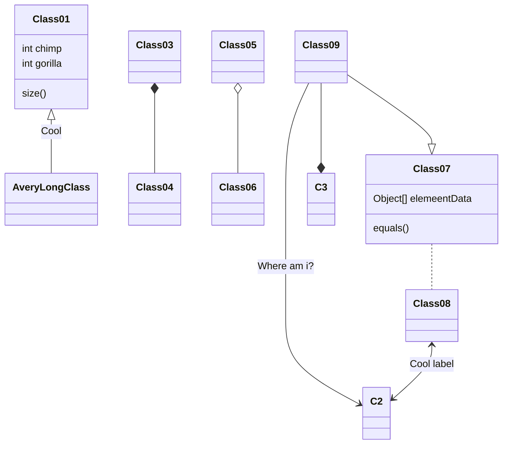
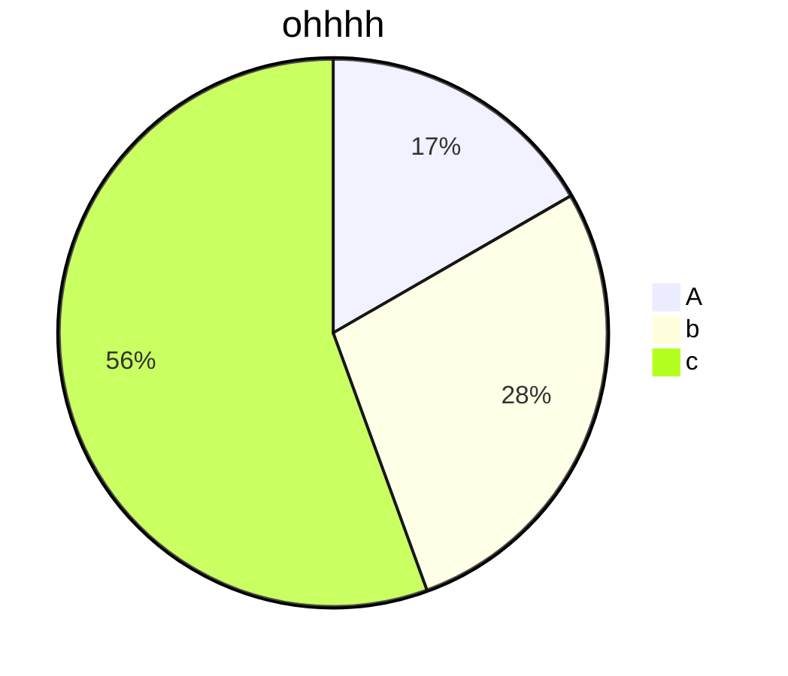

# Markdown

## basic

|      effect       |        code         |         shortcut key         |
| :---------------: | :-----------------: | :--------------------------: |
|     **bold**      |     `**bold**`      | <kbd>Ctrl</kbd>+<kbd>B</kbd> |
| ~~strikethrough~~ | `~~strikethrough~~` |                              |
|     *italic*      |     `*italic*`      |                              |
|        ` `        |         ` `         | <kbd>Ctrl</kbd>+<kbd>E</kbd> |
|        __         |         __          | <kbd>Ctrl</kbd>+<kbd>I</kbd> |

## list

`* something`

* a
* b
* c

`1. something`

1. d
2. e
3. f

`- something`

- g
- h
- i

## plan

`- [ ] to do`

`- [x] have done`

- [ ] to do
- [x] have done

## quote

`> ohhhhhh`

`> > yeeeee`

> ohhhhhh
>
> > yeeeee

## code

行内代码显示：`int a = 0;`

代码块：

```c
int main(void)
{
    int a = 0;
    return 0;
}
```

## link

[bilibili](https://www.bilibili.com)
`[bilibili](https://www.bilibili.com)`

## emoji

:star::cactus:
`:star:` `:cactus:`

## formula

行内公式显示： $x^2=1$

`$x^2=1$`

整块公式显示：

$$
x^2+y+3z^3=10
$$

```c
$$
x^2+y+3z^3=10
$$
```

---

# Mermaid

只列出了[部分]我个人较为常用的图和用法，并不全面。

## stateDiagram -v2

```
stateDiagram-v2
	S0=0,s1=0,z=1 --> S0=0,s1=0,z=1: x=0
	S0=0,s1=0,z=1 --> S0=1,s1=0,z=0: x=1
	S0=1,s1=0,z=0 --> S0=0,s1=1,z=0: x=0
	S0=1,s1=0,z=0 --> S0=0,s1=0,z=1: x=1
	S0=0,s1=1,z=0 --> S0=1,s1=0,z=0: x=0
	S0=0,s1=1,z=0 --> S0=0,s1=1,z=0: x=1
	S0=1,s1=1,z=0 --> S0=0,s1=0,z=1: x=0/1
```




```
stateDiagram
  [*] --> 状态1
  状态1 --> 状态2 : 事件1
  状态1 --> 状态3 : 事件2
  状态2 --> 状态3 : 事件3
  状态3 --> 状态1 : 事件4
  state 状态1 {
    [*] --> 子状态1
    子状态1 --> 子状态2 : 子事件1
    subgraph 子状态组
      子状态2 --> 子状态3 : 子事件2
    end
    子状态3 --> 子状态1 : 子事件3
  }

```




## graph

(-或TB或TD：从上往下；LR：从左往右；RL：从右往左)

```
graph TD
A{start} ==Y==> B[sec.1]
A --N--> C[sec.2]
C -.3.-> D{end}
B <-.-> a(a)
B --> b ==> D
id1[方形]---id2(圆边矩形)===id3[[子程序形]]
id4([体育场形]) --5--- id5[(圆柱形)]
id6((圆形))==0===id7{{i}}-.10.-id8[/3/]
```


## flowchart LR

```
flowchart LR
  subgraph A
  物品-->B[计算1]
  B-->C(判断1)
  C-->|条件1| D[输出结果1]
  C-->|条件2| E[计算2]
  E-->D
  end

  subgraph B
  客户-->F[计算3]
  F-->G(判断2)
  G-->|条件3|H[输出结果2]
  G-->|条件4|I[计算4]
  I-->H
  end

  A-->B
  F-->C
```





## sequenceDiagram

```c
sequenceDiagram
participant Alice
participant Bob
Alice ->> John: Hello
Alin -->> Alice:HI
loop Healthcheck
	Bob ->> Bob:Fight against XXX
end
note right of John:Label<br/>HHHH
note left of Alice:d
Bob -> John:YES!
```




## gantt

```
gantt
dateformat YYYY-MM-DD
title ADDING GANTT
excludes weekdays 2023-03-04

section A
completed task:done,des1,2023-03-01,2023-03-02
注意：xxxx:.
active task:active,des2,2023-03-03,2023-03-05
add:/
active task2:active,des3,after des2,4d
add2:.
future task:des4,after des3,5d
future2:des5,after des2,8d

section B
future task:des6,after des3,5d
```




## classDiagram

```
classDiagram
Class01 <|-- AveryLongClass: Cool
Class03 *-- Class04
Class05 o-- Class06
Class07 .. Class08
Class09 --> C2: Where am i?
Class09 --* C3
Class09 --|> Class07
Class07: equals()
Class07: Object[] elemeentData
Class01: size()
Class01: int chimp
Class01: int gorilla
Class08 <--> C2: Cool label
```




## pie

```
pie
title ohhhh
"A":3
"b":5
"c":10
```




---

# Docker

[1 小时教你学会 Docker Docker-compose_哔哩哔哩_bilibili](https://www.bilibili.com/video/BV16M4y1H7aH/?spm_id_from=333.337.search-card.all.click&vd_source=dd524065fbd0391ebf51cbd7e60722a1)

## version

`$ docker --version`:

```bash
Docker version 27.3.1, build ce12230
```

`$ docker version`:

```bash
Client:
 Version:           27.3.1
 API version:       1.47
 Go version:        go1.22.7
 Git commit:        ce12230
 Built:             Fri Sep 20 11:42:27 2024
 OS/Arch:           windows/amd64
 Context:           desktop-linux

Server: Docker Desktop 4.36.0 (175267)
 Engine:
  Version:          27.3.1
  API version:      1.47 (minimum version 1.24)
  Go version:       go1.22.7
  Git commit:       41ca978
  Built:            Fri Sep 20 11:41:11 2024
  OS/Arch:          linux/amd64
  Experimental:     false
 containerd:
  Version:          1.7.21
  GitCommit:        472731909fa34bd7bc9c087e4c27943f9835f111
 runc:
  Version:          1.1.13
  GitCommit:        v1.1.13-0-g58aa920
 docker-init:
  Version:          0.19.0
  GitCommit:        de40ad0
```

## 启动/创建

`$ docker run -d -p 8080:80 docker/welcome-to-docker`:

（`-d`：后台运行；`-p`：端口号，宿主地址8080映射到容器的80；`–name test_name`：指定镜像名字，默认随机生成名字）

`[Welcome to Docker](http://localhost:8080/)`:


`$ docker ps`：

```bash
CONTAINER ID   IMAGE                      COMMAND                   CREATED       STATUS       PORTS                  NAMES
d97aca38aad8   docker/welcome-to-docker   "/docker-entrypoint.…"   6 hours ago   Up 6 hours   0.0.0.0:8080->80/tcp   sweet_bouman 
```


`$ docker run -d --name docker_test docker/welcome-to-docker`后再次查看：

```bash
CONTAINER ID   IMAGE                      COMMAND                   CREATED         STATUS         PORTS                  NAMES
00dce0e23264   docker/welcome-to-docker   "/docker-entrypoint.…"   7 seconds ago   Up 5 seconds   80/tcp                 docker_test    
d97aca38aad8   docker/welcome-to-docker   "/docker-entrypoint.…"   6 hours ago     Up 6 hours     0.0.0.0:8080->80/tcp   sweet_bouman   
```

`$ docker ps -a`：查看所有容器（包括没有up的）

```bash
CONTAINER ID   IMAGE                      COMMAND                   CREATED          STATUS          PORTS     NAMES
00dce0e23264   docker/welcome-to-docker   "/docker-entrypoint.…"   16 minutes ago   Up 16 minutes   80/tcp    docker_test
e86bf1a8ac6d   docker/welcome-to-docker   "/docker-entrypoint.…"   23 minutes ago   Created                   quirky_colden
```

`$ docker stop docker_test`：关闭容器

`$ docker start docker_test`：启动容器

`$ docker restart docker_test`：重启容器

## 删除

`$ docker rm -f sweet_bouman`后再次查看：

（ID和name都是唯一的，可以用于删除）

```bash
CONTAINER ID   IMAGE                      COMMAND                   CREATED         STATUS         PORTS     NAMES
00dce0e23264   docker/welcome-to-docker   "/docker-entrypoint.…"   2 minutes ago   Up 2 minutes   80/tcp    docker_test
```

## 进入容器

`$ docker images`：查看服务器存在的镜像

```bash
REPOSITORY                 TAG       IMAGE ID       CREATED         SIZE
docker/welcome-to-docker   latest    c1f619b6477e   13 months ago   18.6MB
```

`$ docker rmi REPOSITORY:TAG`：通过容器名称和版本号删除镜像（直接使用IMAGE ID也可以）

`$ docker exec -it test_name bash`：

（`-it`：打开容器镜像的终端界面；用ID或name都可以；容器内使用的shell操作，但必须是容器内有的）

进入后`$`前会显示容器ID，也可以通过`$ hostname`查看。

`$ exit`退出容器。


## 容器内数据持久化存储

直接对容器内容做修改，删除容器后修改全部丢弃，此时重新创建容器不会保留修改。

`$ docker run -d --name nginx_test -p 8080:80 -v /data/nginx:/opt/nginx/html nginx`

（`-v`：目录挂载，宿主机目录:容器目录）

将宿主机目录映射到容器目录，如果宿主机目录为空，则容器目录内也为空；删除容器不会删除宿主机目录下的内容

## 自己构建镜像


## 报错及解决

> 在cmd或者windows powershell中(管理员运行)，输入`net start com.docker.service`以启动Docker Desktop Service服务
>
> 在windows powershell中输入`cd "C:\Program Files\Docker\Docker"`跳转到Docker Desktop安装路径
>
> 运行命令`.\DockerCli.exe -SwitchDaemon`把docker daemon启动
>
> +[windows 11系统下打开docker 提示 docker engine stopped - DbWong_0918 - 博客园](https://www.cnblogs.com/jokingremarks/p/18156334)

### docker: Error response from daemon:

```bash
docker: Error response from daemon: Get "https://registry-1.docker.io/v2/": net/http: request canceled while waiting for connection (Client.Timeout exceeded while awaiting headers).
```

尝试配置多个镜像源（没解决，发现是HyperV没有开启，开启并重启电脑后转到报错2）

默认配置 Docker Engine 记录：

```code
{
  "builder": {
    "gc": {
      "defaultKeepStorage": "20GB",
      "enabled": true
    }
  },
  "experimental": false
}
```

**Hyper-V**：控制面板-启用或关闭Windows功能-HyperV

另一个[彻底解决]的办法（但是还没尝试）；

[彻底解决docker：docker: Get https://registry-1.docker.io/v2/: net/http: request canceled 报错-CSDN博客](https://blog.csdn.net/2301_79849395/article/details/142829852)

### docker: error during connect:

```bash
docker: error during connect: Head "http://%2F%2F.%2Fpipe%2FdockerDesktopLinuxEngine/_ping": open //./pipe/dockerDesktopLinuxEngine: The system cannot find the file specified.
See 'docker run --help'.
```

[Windows系统安装Docker遇到error during connect: In the default daemon configuration on Windows, the docker-CSDN博客](https://blog.csdn.net/nyasm/article/details/121569182)

```bash
cd "C:\Program Files\Docker\Docker"
DockerCli.exe -SwitchDaemon
```

出现下列报错，开启服务：


###  Unit docker.service not found.

```bash
$ sudo systemctl restart docker
[sudo] password for jyt: 
Failed to restart docker.service: Unit docker.service not found.
```

[Failed to start docker.service — 完美解决方法详解 ️_failed to start docker.service: interactive authen-CSDN博客](https://blog.csdn.net/qq_42055933/article/details/142030350)

### 登录不上去

[win docker desktop踩坑及解决方案（拉取镜像失败）_docker desktop无法拉取镜像-CSDN博客](https://blog.csdn.net/weixin_44925711/article/details/143338120)

### running engine: waiting for the Docker API: context deadline exceeded


[解决windows docker context deadline exceeded问题_running engine: waiting for the vm setup to be rea-CSDN博客](https://blog.csdn.net/qq_51796436/article/details/137679736)

发现不支持代理


[解决“wsl: 检测到 localhost 代理配置，但未镜像到 WSL。NAT 模式下的 WSL 不支持 localhost 代理”_wsl: 检测到 localhost 代理配置,但未镜像到 wsl。nat 模式下的 wsl 不支持-CSDN博客](https://blog.csdn.net/m0_62815143/article/details/141285660)

即上一步（登录不上去）配置了`.wslconfig`之后需要重启wsl：

```cmd
cmd> wsl --shutdown
cmd> wsl
```

### Docker Engine stopped

过一会儿会出现 **running engine: waiting for the Docker API: context deadline exceeded** 的报错，尝试后怀疑是中间开关梯子太多次但是又没有重启wsl（上一步修改之后每次开关梯子wsl都会弹提示说检测到代理更改，请重启之类的）

但是此时vscode连接不上wsl…不过不在wsl也可以运行，再看看先


## 部署记录

不知道成不成，但是过了Node:14的槛，记录一下


洗完澡回来怎么还是5//10，我要蛐蛐你了。看在还没有红色报错的份上，先算了。


