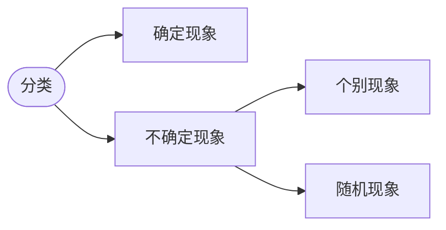

以前的资料和笔记大概是不会搬过来了...

# aaa

> [jyt555/zju_cs: My note warehouse (github.com)](https://github.com/jyt555/zju_cs): `https://github.com/jyt555/zju_cs`

### score

* 平时分60
  
  （上交教室作业+到课率 25 + 学在浙大讨论题 5 + 学在浙大三次测验 30）
  
* 期末考试 40（设置最低分）

* 测验初步安排：
  * 1：到第二章，秋7周五 21:30-22:30
  * 2：到第四章，冬3周六
  * 3：到第七章，冬6周五
  
* 内容：第一章到第八章

---

## bbb

### bb1

概统是研究随机现象数量规律的学科
在个别试验中其结果呈现不确定性，但在大量重复试验中其结果又具有统计规律性

**随机试验**：对随机现象的观察、记录、实验
（可在相同条件下重复进行，事先知道可能出现的结果，事先不知道哪个结果发生）

#### ccc

随机试验E的所有结果构成的集合称为E的**样本空间**，记为S，称S中的元素e为**样本点**.

#### cc2

称S的子集A为E的**随机事件A**，简称事件A.
当且仅当A所包含的一个样本点发生称事件A发生。

由一个样本点组成的单点集，称为**基本事件**。
每次试验S总是发生，故又称S为**必然事件**。
记**Φ为空集**，不包含任何样本点, 则每次试验Φ都不发生, 称Φ为**不可能事件**。

#### cc3

* A⊂B：（**包含**）A发生一定导致B发生
* A=B：（**相等**）A⊂B且B⊂A

* **和事件**：A∪B 至少有一个发生
* **积事件**：A∩B，A·B，AB 同时发生
* **差事件**：A-B，发生A，不发生B

当AB= Φ时，称事件A与B是互不相容的，或**互斥**的.
当AB= Φ且A∪B=S时，称A，B**互逆**（互为对立事件）（此时B是A的逆事件-A）

* **串联系统**：由n个元件组成的系统，其中一个损坏，则系统损坏
* **并联系统**：一个不损坏则系统不损坏

### bb2

#### c

**f~n~(A) = n~A~ / n** 其中n~A~是**频数**（发生次数），n是总试验测试

f~n~(A)随着n的增大渐趋稳定，记稳定值为p

#### c2

对任意A，**P(A)**满足非负性、规范性（总和为一），可列可加性，则P(A)为事件A的概率

### bb3

S中样本点有限(有限性)
出现每一样本点的概率相等(等可能性)

实际推断原理：概率很小的事件在一次试验中实际上几乎不发生

* `每一样本点等概率，第k次出现某种情况的概率与k无关`

### bb4

P(B|A)表示A发生的条件下，B发生的条件概率

P(AB) = P(A)·P(B|A) = P(B)·P(A|B)

#### ccc

称B~1~, B~2~, … , B~n~ 为S的**一个划分**，若：
不漏 B~1~∪B~2~∪…∪B~n~ = S
不重 B~i~B~j~ = Φ，i ≠ j

**全概率公式:**
$$
P(A)=\sum_{j=1}^nP(B_j)P(A|B_j)
$$

**Bayes公式:**
$$
P(B_i|A)=\frac{P(B_i)P(A|B_i)}{\sum_{j=1}^nP(B_j)P(A|B_j)}
$$

### 事件的独立性

设A，B为两随机事件，如果**P(AB)=P(A)*P(B)**，则称A，B 相互独立。若P(A) ≠ 0，则 P(AB)=P(A)P(B)等价于P(B|A)=P(B).

独立试验：结果不影响其他子试验的结果

重复试验：各子试验在相同条件下进行的

---

## 随机变量及其分布

###  随机变量

设随随机变量的样本空间为S = {e}，若X = X(e)为定义在样本空间S上的实值单值函数，则称X = X(e)为**随机变量**

常见的两类：离散性的 / 连续型的

###  离散型随机变量及其分布

取值至多可数的随机变量为离散型的随机变量 $\sum_{i=1}^\infty p_i=1$

**概率分布律**：写出所有可能取值和对应概率

#### 0-1分布 / 两点分布

**X ~ 0 - 1(p) 或 B(1,p)**
$$
P(X=k)=p^k(1-p)^{1-k},k=0,1.
$$
Bernoulli 试验

