# 。

## starting

| 之前的FDS笔记pdf网页版:point_right: [FDS](https://jyt555.github.io/zju_cs/FDS/) |

### grading policy

60 ( 10 hw + 10 discussions + 30 PR + 10 midterm) | 40 final exam

### project

initial version - 7 days

ALL Groups pr - 2 days

revise and submit - 2 days

---

## AVL Trees, Splay Trees, Amortized Analysis

### AVL Trees (Adelson-Velskii-Landis)

* Target: speed up searching
* Tool: binary search trees
* Problem: Although Tp = O(height), the height can be as bad as O(N)

【Definition】An **empty** binary tree is height balanced. If T is a nonempty binary tree with TL and TR as its left and right subtrees, then T is height balanced iff

  (1) TL and TR are height balanced, and

  (2) $\mid hL-hR\mid\le 1$ where hL and hR are the heights of TL and TR , respectively.

【Definition】The `balance factor BF(node)` = hL - hR. In an AVL tree, BF(node) = -1, 0, or 1.

### The rotation operations on a BST


| trouble maker 和 trouble finder 的关系决定树该如何调整 |

Obviously we have Tp **=** O(h), where h is the height of the tree. **h = O(ln n)**

### Splay Trees

> ##### from [Isshiki修](https://note.isshikih.top/cour_note/D2CX_AdvancedDataStructure/)
>
> Splay 树，即伸展树，想要解决的问题和 AVL 树类似，只不过 Splay 树希望达到的目标是在**摊还(Amortized)**复杂度O(logN)的情况下完成大部分对点操作。
>
> 我们知道，为使 AVL 保持平衡，我们需要维护从根节点到 Trouble Maker 这条路径上所有点的平衡因子。而 Splay 则不再维护这些信息，这意味着我们无法保证 Splay 树的状态都是平衡的，但是我们希望它尽可能平衡。具体来说就是对于M次任意操作，其时间复杂度都为O*(*MlogN)，均摊下来这 M 个操作每一个都需要O(logN)。
{: .block-tip }

* Target: M consecutive tree operations **starting from an empty tree** take at most O(M log N) times – the **amortized(均摊) time** is O(log N)
* Idea: after a node is accessed, it is **pushed to the root** by a series of AVL tree rotations

|仅凭上述LL/LR/RL/RR无法较好实现目标（可以参照PPT上 trouble maker [BF=0] 与 trouble finder [BF=2] 直接相连的例子或是只有左/右子树的例子），因此我们 try again :point_down: |


> ##### tip
> 
> 可以简单记忆为G、P、X的上下关系颠倒，X的子树尽可能让处在下位的节点分担。（zig-zag后X左右均有节点，因此子树B与C均能下移，zig-zig后X只有一边有节点，只能下移子树B。）
{: .block-warning}

| Splaying not only moves the accessed node to the root, but also roughly halves the depth of most nodes on the path. |

* Deletions: Find X (X will be at the root) - Remove X - FindMax(TL) - Move it

### Amortized Analysis (:star:mark)

* Target: **Any M consecutive operations** take at most O(M log N) time – `Amortized time bound`
  worst-case bound $\ge$ amortized bound $\ge$ average-case bound

#### Aggregate analysis

Show that for all n, a sequence of n operations takes **worst-case** time T(n) in total. In the worst case, the average cost, or amortized cost, per operation is therefore T(n)/n.

`aggregate analysis 聚合法` | $T_{amortized}=T(n)/n$​

#### Accounting method

When an operation’s **amortized cost** $\hat c_i$ exceeds its **actual cost** $c_i$, we assign the difference to specific objects in the data structure as **credit**. Credit can help **pay** for later operations whose amortized cost is less than their actual cost.

`accounting method 核法` | $T_{amortized}=\sum_{i=1}^n\hat{c}_i/n \geq \sum_{i=1}^nc_i/n$

> ##### Link
>
> [https://www.baeldung.com/cs/amortized-analysis](https://www.baeldung.com/cs/amortized-analysis)
{: .block-tip}

#### Potential method

a good potential function should always assume its **minimum** at the start of the sequence.

`potential method 势能法` | 404 Not found…

> ##### Link – 鱼肆周报 002
> 
> [https://www.yuque.com/xianyuxuan/saltfish_shop/weekly002_amortized_analysis#KmnY6](https://www.yuque.com/xianyuxuan/saltfish_shop/weekly002_amortized_analysis#KmnY6)
{: .block-tip}

---

## Red-Black Trees and B+ Trees

### Red-Black Trees

> Target: Balanced binary search tree

【Definition】A `red-black tree` is a binary search tree that satisfies the following properties:

* Every node is either red or black
* The **root is black**
* Every **leaf (NIL) is black**
* If a node is red, then both its children are black
* For each node, all simple paths from the node to descendant leaves contain the **same number of black nodes**

【Definition】The `black-height` of any node x, denoted by `bh(x)`, is the number of black nodes on any simple path from x down to a leaf. bh(Tree) = bh(root)

【Lemma】 A red-black tree with N internal nodes has height at most 2ln(N+1)

| Insertion：通过重新染色和旋转来解决（把两个红色相连的情况向上移），最多两个旋转可以解决 |

> ##### highlight
> 
> 重新染色会让红色向上移动，但是根节点必须是黑色的，因此如果有类似case 1，但是重新染色后最顶上的红色是根节点，直接将根节点染回黑色。
> 
{: .block-tip}

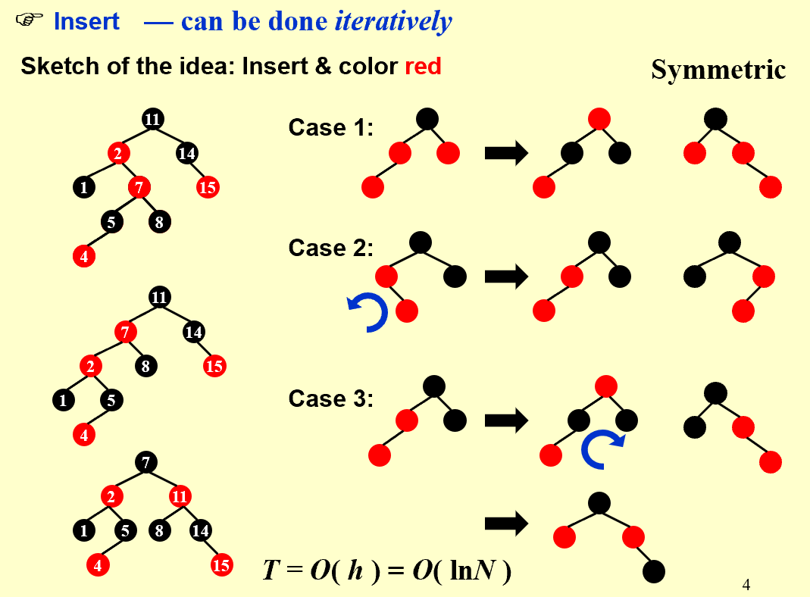

| Delete: adjust only if the node is black |

删除操作可以根据被删节点（黑色）的子节点个数划分成三种情况：0、1、2

* 有两个子节点时，把被删除节点的数据改成左子树最大值/右子树最小值，然后问题转换成删除左子树最大值/右子树最小值所在节点；
* 有一个子节点时，将子节点移到被删除位置，并保留被删除节点的颜色–黑色（这里的一个子节点必然是红色，如果是黑色，则被删节点左右不平衡）；
* 没有子节点时，删除会导致不平衡

。

。Delete

Number of Rotations:

|           |   AVL   | Red-Black Tree |
| :-------: | :-----: | :------------: |
| Insertion | $\le 2$ |    $\le 2$     |
| Deletion  | O(logN) |    $\le 3$     |

### B+ Trees

【Definition】A `B+ tree` of order **M** is a tree with the following structural properties:

* The root is either a leaf or has between 2 and $M$ children
* All nonleaf nodes (except the root) have between $\lceil M/2\rceil$ and $M$ children
*  All leaves are at the same depth (Assume each nonroot leaf also has between $\lceil M/2\rceil$ and $M$ children)

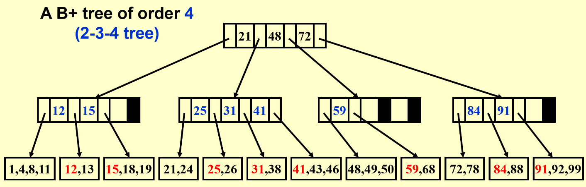

| 插入过多时会分裂，删除和插入操作很类似 |

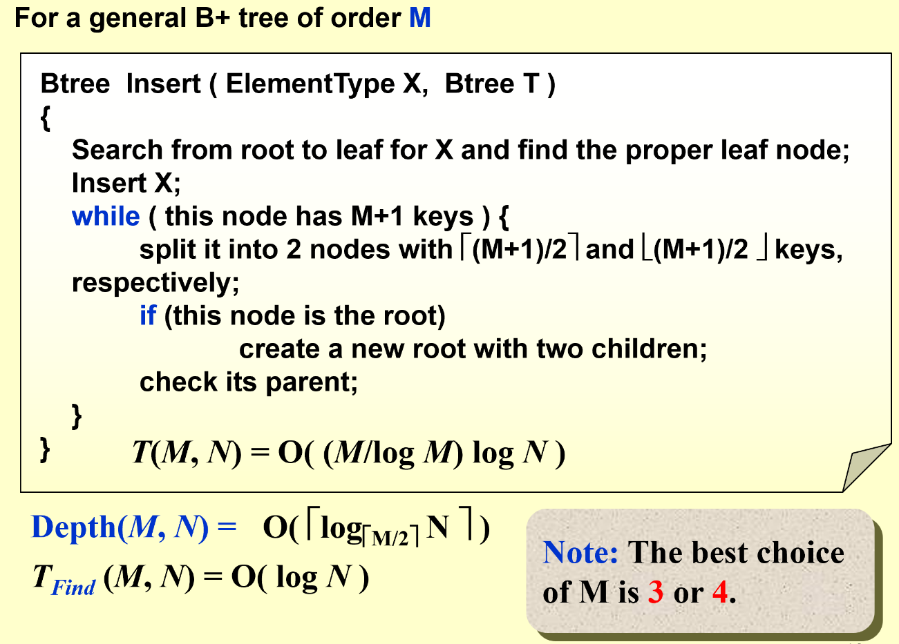

---

## Inverted File Index

### Search

- Scan each page for the string “Computer Science”

- (TF) Term-Document Incidence (meaning “the rate of”) Matrix

  –> (IDF) inverse document frequency

- Compact Version – Inverted File Index

  | frequency可以找到优化的搜索路径（先找关键词出现次数小的） |

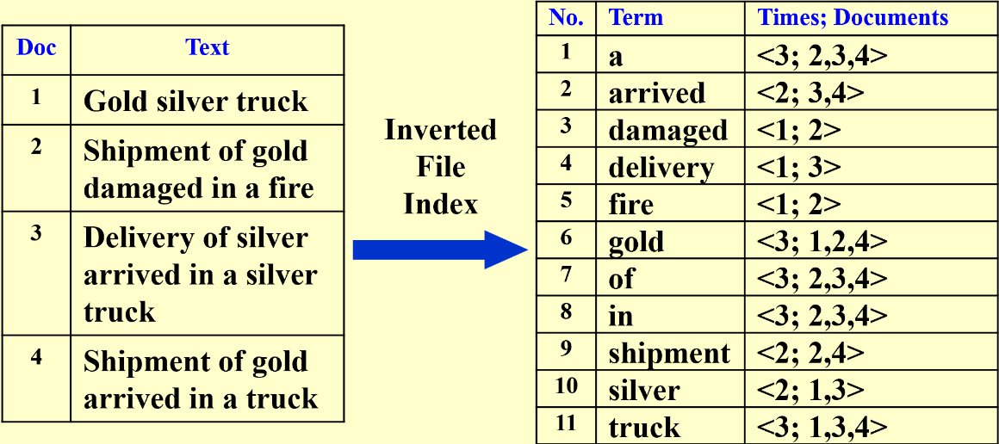

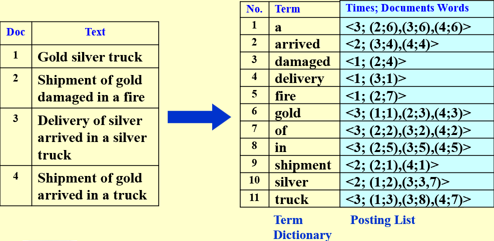

### Index Generator

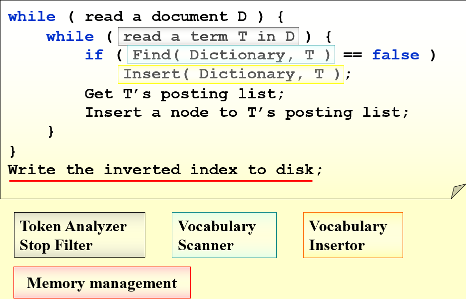

#### While reading a term

- Word Stemming: says, said, saying –> say
- Stop Words: a, the, it…

#### While accessing a term

Search Tree, Hashing…

> ##### compare
>
> 哈希：
> pros：快速查找，易实现（特别是对于提供内置支持的语言），内存效率
> cons：冲突解决，无序性，性能变化（最坏情况下的性能可能很差）
> 
> 搜索树：
>pros：有序操作，无冲突，平衡树（保证最坏情况性能）
> cons：复杂性（ 实现和维护平衡树可能比实现哈希更复杂），内存开销，某些情况下查找较慢
> 
{: .block-tip}

#### While not having enough memory

| 平常学习的排序都是在内存中进行的，但是数据量大的时候排序没办法在内存中进行，只能在硬盘中进行。最后几次课会学习如何在硬盘中实现排序。 |

#### Distributed indexing

(for web-scale indexing) — each node contains index of a subset of collection

Term-partitioned index (A~C, D~F,…, X~Z)

Document-partitioned index (File1~10000, 10001~20000,…)

#### Dynamic indexing

$Main\;Index \Leftarrow auxiliary\;index(辅助，也可看做缓存区)$

有新数据先写入辅助区，每隔一段时间/写满了再往Main index中归并

常见的删除方法：加标记位，看见直接跳过

#### Compression

Term Dictionary中把a, of, in等词删除，并删除词汇之间的空格：

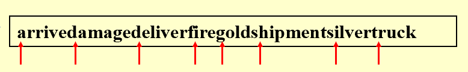

Posting List采用**差分存储**（后面存的数据是实际值与上一个实际值的差）：

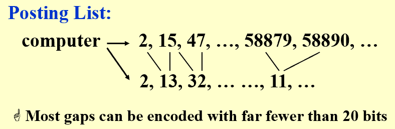

#### Thresholding阈值

- Document: only retrieve the top $x$​ documents where the document are ranked by weight

  :thumbsdown:Not feasible for Boolean queries

  :thumbsdown:Can miss some relevant documents due to truncation (截断)

- Query: Sort the query terms by their frequency in ascending order; search according to only some percentage of the original query terms (丢弃一些query terms)

### Measure for a search engine

- Data Retrieval Performance Evaluation (after establishing correctness)
  ^ response time, index space
- Information Retrieval Performance Evaluation
  ^ how relevant is the answer set ?

精确度和召回率 (两个指标会彼此“抵消”)

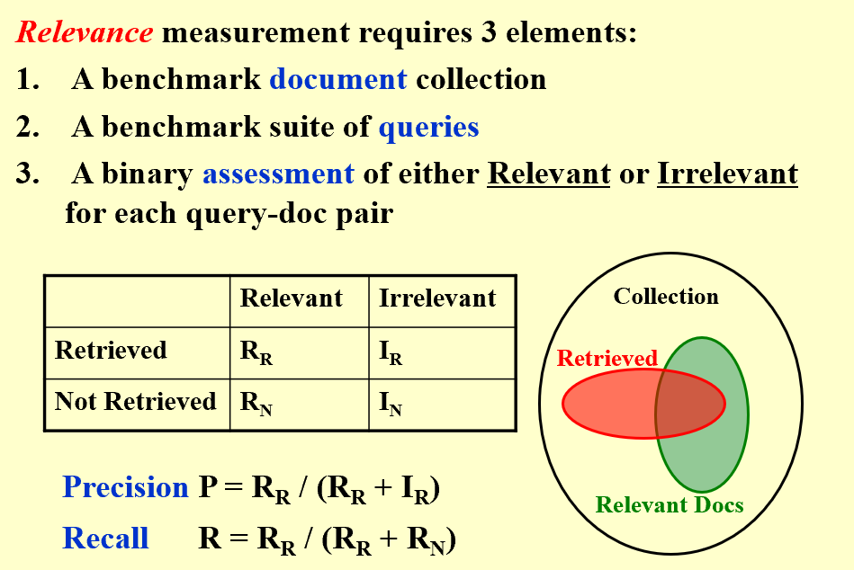

> ##### note
> 
> Recall is more important than precision when evaluating the explosive detection in airport security.
> 
{: .block-tip}

---

## Leftist Heaps and Skew Heaps

### Leftist Heaps

- Target: speed up merging in O(N) 
- 由于至少需要一个拷贝操作，传统堆结构merge复杂度O(N)。现使用leftist heaps使复杂度降为O(log N)

【definition】The `null path length, Npl(X)`, of any node X is the length of the shortest path from X to a node without two children. **Define Npl(NULL) = -1**
$$
Npl(X)=\min \{ Npl(C)+1\;\text{for all C as children of X} \}
$$
【definition】The `leftist heap property` is that for every node X in the heap, the null path length of the left child is **at least as large as** that of the right child.

| A leftist tree with r nodes on the right path must have at least $2^r-1$ nodes. 右路径是所有路径中最短的路径 |

【recursive version】:

* $Merge(H_1\rightarrow Right,H_2)$
* $Attach(H_2,H_1\rightarrow Right)$
* $Swap(H_1\rightarrow Right,H_1\rightarrow Left)\;\text{if necessary}$

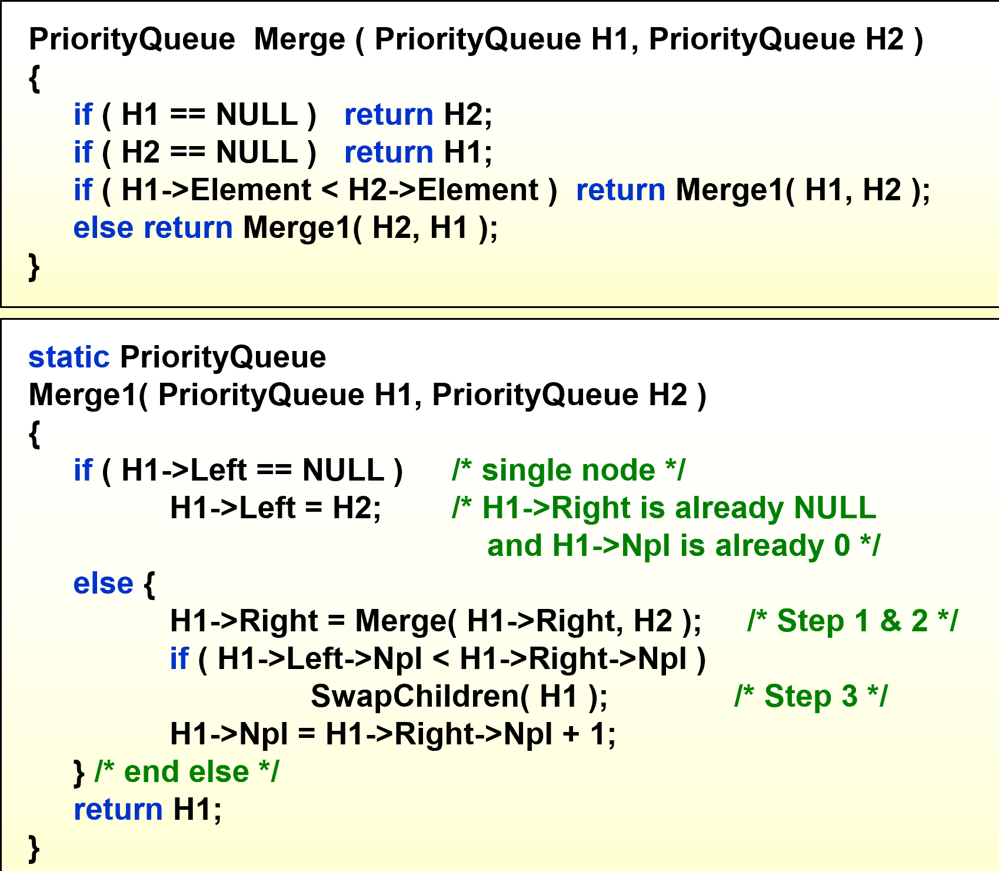

【iterative version】:

* Sort the right paths without changing their left children
* Swap children if necessry

### Skew

> a simple version of the leftist heaps
>
> Target: Any M consecutive operations take at most O(M log N) time.

Merge: **Always** swap the left and right children except that the **largest** of all the nodes on the right paths does not have its children swapped.  No Npl.

| 关于except，我的理解就是保证单孩子的节点其孩子为左孩子。 |

:spiral_notepad: Skew heaps have the advantage tha**t no extra space** is required to maintain path lengths and **no tests** are required to determine when to swap children.

:spiral_notepad: It is an open problem to determine precisely the **expected right path length** of both leftist and skew heaps.

> ##### note
>
> The right path of a skew heap can be arbitrarily long. (T)
>
> The result of inserting keys 1 to $2^{k-1}$ for any $k>4$ in order into an initially empty skew heap is always a full binary tree. (T)
>
{: .block-tip}


---

## Binomial Queue

`A binomial queue` is not a heap-ordered tree, but rather **a collection of heap-ordered trees**, known as a `forest`.  Each heap-ordered tree is a **binomial tree**.

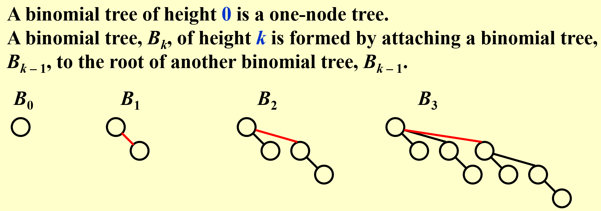
$$
B_k\text{ consists of a root with }k\text{ children,which are }B_0,B_1,\dots B_{k-1}\\
B_k\text{ has exactly }2^k\text{ nodes.}\\
\text{The number of nodes at depth }d\text{ is }(_d^k)\text{, namely }C_k^d.
$$
| A priority queue of **any size** can be **uniquely** represented by a collection of binomial trees. |

- [ ] FindMin:

  The minimum key is in one of the roots.

  There are at most $\lceil logN\rceil$ roots, hence $T_p=O(logN)$​.

  > We can remember the minimum and update whenever it is changed.  Then this operation will take O(1).

- [ ] Merge:

  

  Must keep the trees in the binomial queue **sorted by height**.

- [ ] Insert:

  像二进制加法一样，不断进位（由$B_k$合成$B_{k+1}$）

  If the smallest nonexistent binomial tree is $B_i$ , then $T_p=Const(i+1)$

   Performing N Inserts on an initially empty binomial queue will take **O(N)** worst-case time.  Hence **the average time is constant**.

- [ ] DeleteMin(H)

  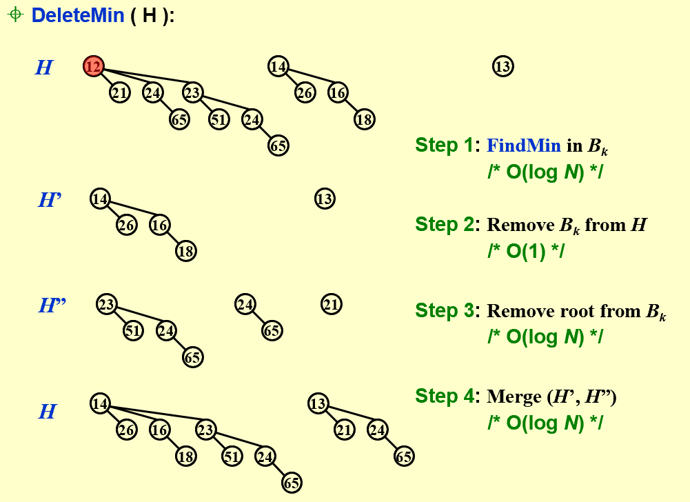

| 利用“左孩子右兄弟（降序排列）”可以实现多棵树变一棵树且能够快速访问各树 |

```c
typedef struct BinNode *Position;
typedef struct Collection *BinQueue;
typedef struct BinNode *BinTree;  /* missing from p.176 */
struct BinNode
{ 
	ElementType	    Element;
	Position	    LeftChild;
	Position 	    NextSibling;
};
struct Collection
{ 
	int	    CurrentSize;  /* total number of nodes */
	BinTree	TheTrees[ MaxTrees ];
};
```

```c
CombineTrees( BinTree T1, BinTree T2 )
{  /* merge equal-sized T1 and T2 */
	if ( T1->Element > T2->Element )
		/* attach the larger one to the smaller one */
		return CombineTrees( T2, T1 );
	/* insert T2 to the front of the children list of T1 */
	T2->NextSibling = T1->LeftChild;
	T1->LeftChild = T2;
	return T1;
} // Tp = O(1)
```

。
