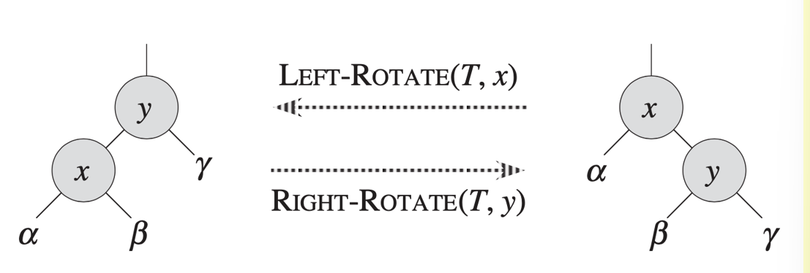
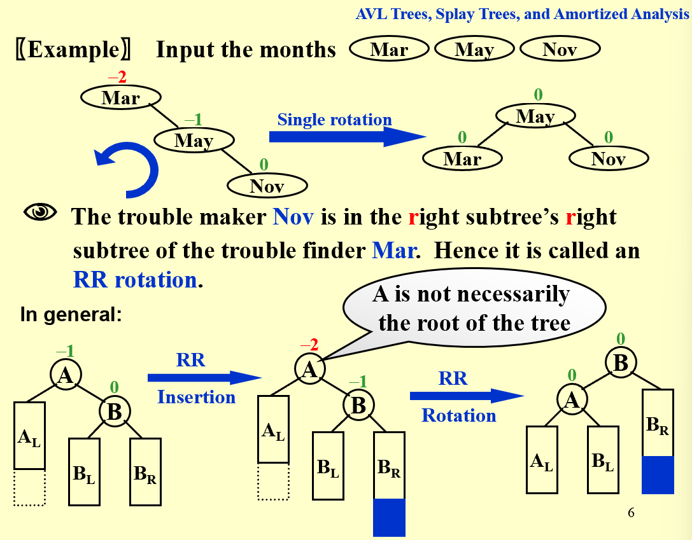
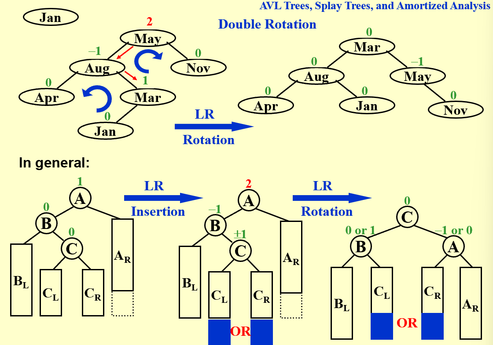
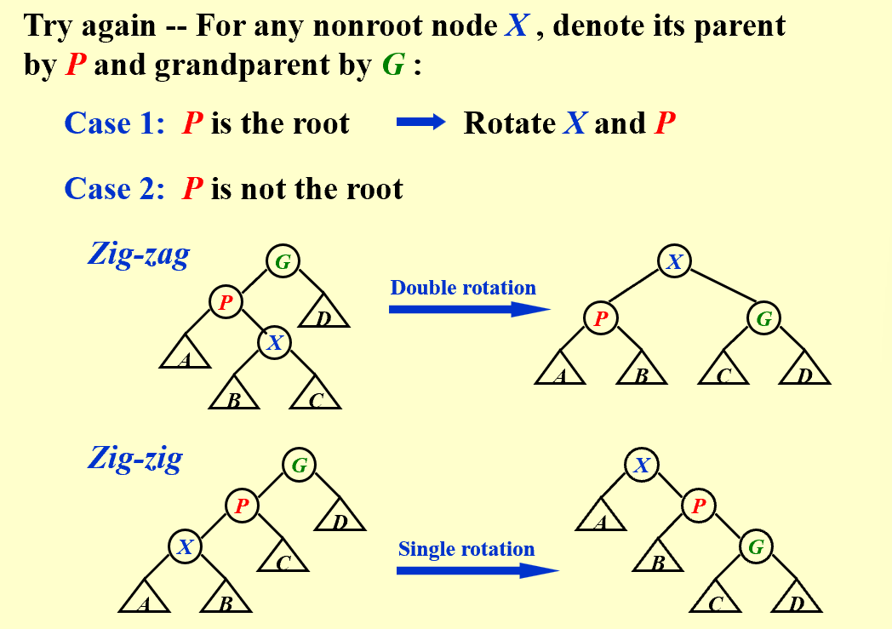

## starting

### grading policy

60 ( 10 hw + 10 discussions + 30 PR + 10 midterm) | 40 final exam

### project

initial version - 7 days

ALL Groups pr - 2 days

revise and submit - 2 days

## AVL Trees, Splay Trees, Amortized Analysis

### AVL Trees (Adelson-Velskii-Landis)

* Target: speed up searching
* Tool: binary search trees
* Problem: Although Tp = O(height), the height can be as bad as O(N)

【Definition】An **empty** binary tree is height balanced. If T is a nonempty binary tree with TL and TR as its left and right subtrees, then T is height balanced iff

  (1) TL and TR are height balanced, and

  (2) $\mid hL-hR\mid\le 1$ where hL and hR are the heights of TL and TR , respectively.

【Definition】The **balance factor BF(node)** = hL - hR. In an AVL tree, BF(node) = -1, 0, or 1.

### The rotation operations on a BST

| trouble maker 和 trouble finder 的关系决定树该如何调整 |

Obviously we have Tp **=** O(h), where h is the height of the tree. **h = O(ln n)**

### Splay Trees 伸展树

* Target: M consecutive tree operations starting from an empty tree take at most O(M log N) times – the **amortized(均摊) time** is O(log N)
* Idea: after a node is accessed, it is pushed to the root by a series of AVL tree rotations

| Splaying not only moves the accessed node to the root, but also roughly halves the depth of most nodes on the path. |

* Deletions: Find X (X will be an the root) - Remove X - FindMax(TL) - Move it

### Amortized Analysis (*mark)

* Target: Any M consecutive operations take at most O(M log N) time - Amortized time bound
  worst-case bound $\ge$ amortized bound $\ge$ average-case bound

#### Aggregate analysis

Show that for all n, a sequence of n operations takes **worst-case** time T(n) in total. In the worst case, the average cost, or amortized cost, per operation is therefore T(n)/n

#### Accounting method

#### Potential method

