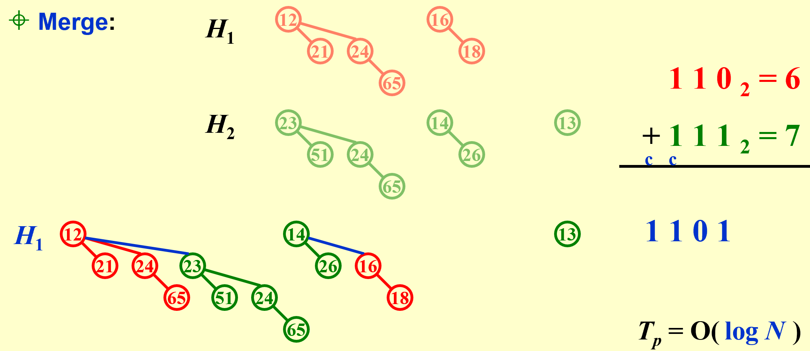

# 。

[TOC]

## starting

| 之前的FDS笔记pdf网页版:point_right: [FDS](https://jyt555.github.io/zju_cs/FDS/) |

| 参考资料 | [isshikih修](https://note.isshikih.top/cour_note/D2CX_AdvancedDataStructure/) | [咸鱼暄](https://www.yuque.com/xianyuxuan/coding/ads_exam_1) | [小角龙](https://zhang-each.github.io/My-CS-Notebook/DS/ads/) | [yaoyaoling](https://yaoyaolingbro.github.io/notebook/ZJU_CS/ADS/homework/) |

### grading policy

60 ( 10 hw + 10 discussions + 30 PR + 10 midterm) | 40 final exam

### project

initial version - 7 days

ALL Groups pr - 2 days

revise and submit - 2 days

---

## AVL Trees, Splay Trees, Amortized Analysis

### AVL Trees (Adelson-Velskii-Landis)

* Target: speed up searching
* Tool: binary search trees
* Problem: Although Tp = O(height), the height can be as bad as O(N)

【Definition】An **empty** binary tree is height balanced. If T is a nonempty binary tree with TL and TR as its left and right subtrees, then T is height balanced iff

  (1) TL and TR are height balanced, and

  (2) $\mid hL-hR\mid\le 1$ where hL and hR are the heights of TL and TR , respectively.

【Definition】The `balance factor BF(node)` = hL - hR. In an AVL tree, BF(node) = -1, 0, or 1.

### The rotation operations on a BST


| trouble maker 和 trouble finder 的关系决定树该如何调整 |

Obviously we have Tp **=** O(h), where h is the height of the tree. **h = O(ln n)**

### Splay Trees

> ##### from [Isshiki修](https://note.isshikih.top/cour_note/D2CX_AdvancedDataStructure/)
>
> Splay 树，即伸展树，想要解决的问题和 AVL 树类似，只不过 Splay 树希望达到的目标是在**摊还(Amortized)**复杂度O(logN)的情况下完成大部分对点操作。
>
> 我们知道，为使 AVL 保持平衡，我们需要维护从根节点到 Trouble Maker 这条路径上所有点的平衡因子。而 Splay 则不再维护这些信息，这意味着我们无法保证 Splay 树的状态都是平衡的，但是我们希望它尽可能平衡。具体来说就是对于M次任意操作，其时间复杂度都为O*(*MlogN)，均摊下来这 M 个操作每一个都需要O(logN)。
{: .block-tip }

* Target: M consecutive tree operations **starting from an empty tree** take at most O(M log N) times – the **amortized(均摊) time** is O(log N)
* Idea: after a node is accessed, it is **pushed to the root** by a series of AVL tree rotations

|仅凭上述LL/LR/RL/RR无法较好实现目标（可以参照PPT上 trouble maker [BF=0] 与 trouble finder [BF=2] 直接相连的例子或是只有左/右子树的例子），因此我们 try again :point_down: |


> ##### tip
> 
> 可以简单记忆为G、P、X的上下关系颠倒，X的子树尽可能让处在下位的节点分担。（zig-zag后X左右均有节点，因此子树B与C均能下移，zig-zig后X只有一边有节点，只能下移子树B。）
{: .block-warning}

| Splaying not only moves the accessed node to the root, but also roughly halves the depth of most nodes on the path. |

* Deletions: Find X (X will be at the root) - Remove X - FindMax(TL) - Move it

### Amortized Analysis (:star:mark)

* Target: **Any M consecutive operations** take at most O(M log N) time – `Amortized time bound`
  worst-case bound $\ge$ amortized bound $\ge$ average-case bound

#### Aggregate analysis

Show that for all n, a sequence of n operations takes **worst-case** time T(n) in total. In the worst case, the average cost, or amortized cost, per operation is therefore T(n)/n.

`aggregate analysis 聚合法` | $T_{amortized}=T(n)/n$​

#### Accounting method

When an operation’s **amortized cost** $\hat c_i$ exceeds its **actual cost** $c_i$, we assign the difference to specific objects in the data structure as **credit**. Credit can help **pay** for later operations whose amortized cost is less than their actual cost.

`accounting method 核法` | $T_{amortized}=\sum_{i=1}^n\hat{c}_i/n \geq \sum_{i=1}^nc_i/n$

> ##### Link
>
> [https://www.baeldung.com/cs/amortized-analysis](https://www.baeldung.com/cs/amortized-analysis)
{: .block-tip}

#### Potential method

a good potential function should always assume its **minimum** at the start of the sequence.

`potential method 势能法` | 404 Not found…

> ##### Link – 鱼肆周报 002
> 
> [https://www.yuque.com/xianyuxuan/saltfish_shop/weekly002_amortized_analysis#KmnY6](https://www.yuque.com/xianyuxuan/saltfish_shop/weekly002_amortized_analysis#KmnY6)
{: .block-tip}

---

## Red-Black Trees and B+ Trees

### Red-Black Trees

> Target: Balanced binary search tree

【Definition】A `red-black tree` is a binary search tree that satisfies the following properties:

* Every node is either red or black
* The **root is black**
* Every **leaf (NIL) is black**
* If a node is red, then both its children are black
* For each node, all simple paths from the node to descendant leaves contain the **same number of black nodes**

【Definition】The `black-height` of any node x, denoted by `bh(x)`, is the number of black nodes on any simple path from x down to a leaf. bh(Tree) = bh(root)

【Lemma】 A red-black tree with N internal nodes has height at most 2ln(N+1)

| Insertion：通过重新染色和旋转来解决（把两个红色相连的情况向上移），最多两个旋转可以解决 |

> ##### highlight
> 
> 重新染色会让红色向上移动，但是根节点必须是黑色的，因此如果有类似case 1，但是重新染色后最顶上的红色是根节点，直接将根节点染回黑色。
> 
{: .block-tip}


| Delete: adjust only if the node is black |

删除操作可以根据被删节点（黑色）的子节点个数划分成三种情况：0、1、2

* 有两个子节点时，把被删除节点的数据改成左子树最大值/右子树最小值，然后问题转换成删除左子树最大值/右子树最小值所在节点；
* 有一个子节点时，将子节点移到被删除位置，并保留被删除节点的颜色–黑色（这里的一个子节点必然是红色，如果是黑色，则被删节点左右不平衡）；
* 没有子节点时，删除会导致不平衡

。

。Delete

Number of Rotations:

|           |   AVL   | Red-Black Tree |
| :-------: | :-----: | :------------: |
| Insertion | $\le 2$ |    $\le 2$     |
| Deletion  | O(logN) |    $\le 3$     |

### B+ Trees

【Definition】A `B+ tree` of order **M** is a tree with the following structural properties:

* The root is either a leaf or has between 2 and $M$ children
* All nonleaf nodes (except the root) have between $\lceil M/2\rceil$ and $M$ children
*  All leaves are at the same depth (Assume each nonroot leaf also has between $\lceil M/2\rceil$ and $M$ children)


| 插入过多时会分裂，删除和插入操作很类似 |


| For a B+ tree with order M and N keys, the time complexity of find operations is $O(log_MN)$  (F) |

---

## Inverted File Index

### Search

- Scan each page for the string “Computer Science”

- (TF) Term-Document Incidence (meaning “the rate of”) Matrix

  –> (IDF) inverse document frequency

- Compact Version – Inverted File Index

  | frequency可以找到优化的搜索路径（先找关键词出现次数小的） |


### Index Generator


#### While reading a term

- Word Stemming: says, said, saying –> say
- Stop Words: a, the, it…

#### While accessing a term

Search Tree, Hashing…

> ##### compare
>
> 哈希：
>
> pros：快速查找，易实现（特别是对于提供内置支持的语言），内存效率
>
> cons：冲突解决，无序性，性能变化（最坏情况下的性能可能很差）
>
> 搜索树：
>
> pros：有序操作，无冲突，平衡树（保证最坏情况性能）
>
> cons：复杂性（ 实现和维护平衡树可能比实现哈希更复杂），内存开销，某些情况下查找较慢
>
{: .block-tip}

#### While not having enough memory

| 平常学习的排序都是在内存中进行的，但是数据量大的时候排序没办法在内存中进行，只能在硬盘中进行。最后几次课会学习如何在硬盘中实现排序。 |

#### Distributed indexing

(for web-scale indexing) — each node contains index of a subset of collection

Term-partitioned index (A~C, D~F,…, X~Z)

Document-partitioned index (File1~10000, 10001~20000,…)

#### Dynamic indexing

$Main\;Index \Leftarrow auxiliary\;index(辅助，也可看做缓存区)$

有新数据先写入辅助区，每隔一段时间/写满了再往Main index中归并

常见的删除方法：加标记位，看见直接跳过

#### Compression

Term Dictionary中把a, of, in等词删除，并删除词汇之间的空格：


Posting List采用**差分存储**（后面存的数据是实际值与上一个实际值的差）：


#### Thresholding阈值

- Document: only retrieve the top $x$​ documents where the document are ranked by weight

  :thumbsdown:Not feasible for Boolean queries

  :thumbsdown:Can miss some relevant documents due to truncation (截断)

- Query: Sort the query terms by their frequency in ascending order; search according to only some percentage of the original query terms (丢弃一些query terms)

### Measure for a search engine

- Data Retrieval Performance Evaluation (after establishing correctness)
  ^ response time, index space
- Information Retrieval Performance Evaluation
  ^ how relevant is the answer set ?

精确度和召回率 (两个指标会彼此“抵消”)


> ##### note
> 
> Recall is more important than precision when evaluating the explosive detection in airport security.
> 
{: .block-tip}

---

## Leftist Heaps and Skew Heaps

### Leftist Heaps

- Target: speed up merging in O(N) 
- 由于至少需要一个拷贝操作，传统堆结构merge复杂度O(N)。现使用leftist heaps使复杂度降为O(log N)

【definition】The `null path length, Npl(X)`, of any node X is the length of the shortest path from X to a node without two children. **Define Npl(NULL) = -1**

$$
Npl(X)=\min \{ Npl(C)+1\;\text{for all C as children of X} \}
$$


【definition】The `leftist heap property` is that for every node X in the heap, the null path length of the left child is **at least as large as** that of the right child.

| A leftist tree with r nodes on the right path must have at least $2^r-1$ nodes. |

| In the leftist heap, the null path length of the right path will be less than or equal to the null path length of any other path originating from the root. 右路径是所有路径中最短的路径 |

【recursive version】:

* $Merge(H_1\rightarrow Right,H_2)$
* $Attach(H_2,H_1\rightarrow Right)$
* $Swap(H_1\rightarrow Right,H_1\rightarrow Left)\;\text{if necessary}$


【iterative version】:

* Sort the right paths without changing their left children
* Swap children if necessry

### Skew

> a simple version of the leftist heaps
>
> Target: Any M consecutive operations take at most O(M log N) time.

Merge: **Always** swap the left and right children except that the **largest** of all the nodes on the right paths does not have its children swapped.  No Npl.

| 关于except，我的理解就是保证单孩子的节点其孩子为左孩子。 |


:spiral_notepad: Skew heaps have the advantage tha**t no extra space** is required to maintain path lengths and **no tests** are required to determine when to swap children.

:spiral_notepad: It is an open problem to determine precisely the **expected right path length** of both leftist and skew heaps.

> ##### note
>
> The right path of a skew heap can be arbitrarily long. (T)
>
> The result of inserting keys 1 to $2^{k-1}$ for any $k>4$​ in order into an initially empty skew heap is always a full binary tree. (T)
>
> Comparing to leftist heaps, skew heaps are always more efficient in space. (T)
>
> Skew heaps have O(logN) worst-case cost for merging. (F) 只能说摊还是，但是worst-case不是
>
> {: .block-tip}


---

## Binomial Queue

`A binomial queue` is not a heap-ordered tree, but rather **a collection of heap-ordered trees**, known as a `forest`.  Each heap-ordered tree is a **binomial tree**.


$$
B_k\text{ consists of a root with }k\text{ children,which are }B_0,B_1,\dots B_{k-1}
$$

$$
B_k\text{ has exactly }2^k\text{ nodes.}
$$

$$
\text{The number of nodes at depth }d\text{ is }(_d^k)\text{, namely }C_k^d.
$$

| A priority queue of **any size** can be **uniquely** represented by a collection of binomial trees. |

- [ ] FindMin:

  The minimum key is in one of the roots.

  There are at most $\lceil logN\rceil$ roots, hence $T_p=O(logN)$​.

  > We can remember the minimum and update whenever it is changed.  Then this operation will take O(1).

- [ ] Merge:

  

  Must keep the trees in the binomial queue **sorted by height**.

- [ ] Insert:

  像二进制加法一样，不断进位（由$B_k$合成$B_{k+1}$）

  If the smallest nonexistent binomial tree is $B_i$ , then $T_p=Const(i+1)$

   Performing N Inserts on an initially empty binomial queue will take **O(N)** worst-case time.  Hence **the average time is constant**.

- [ ] DeleteMin(H)

  

| 利用“左孩子右兄弟（降序排列）”可以实现多棵树变一棵树且能够快速访问各树 |

```c
typedef struct BinNode *Position;
typedef struct Collection *BinQueue;
typedef struct BinNode *BinTree;  /* missing from p.176 */
struct BinNode
{ 
	ElementType	    Element;
	Position	    LeftChild;
	Position 	    NextSibling;
};
struct Collection
{ 
	int	    CurrentSize;  /* total number of nodes */
	BinTree	TheTrees[ MaxTrees ];
};
```

```c
CombineTrees( BinTree T1, BinTree T2 )
{  /* merge equal-sized T1 and T2 */
	if ( T1->Element > T2->Element )
		/* attach the larger one to the smaller one */
		return CombineTrees( T2, T1 );
	/* insert T2 to the front of the children list of T1 */
	T2->NextSibling = T1->LeftChild;
	T1->LeftChild = T2;
	return T1;
} // Tp = O(1)
```

```c
BinQueue  Merge( BinQueue H1, BinQueue H2 )
{	BinTree T1, T2, Carry = NULL; 	
	int i, j;
	if ( H1->CurrentSize + H2-> CurrentSize > Capacity )  ErrorMessage();
	H1->CurrentSize += H2-> CurrentSize;
	for ( i=0, j=1; j<= H1->CurrentSize; i++, j*=2 ) {
	    T1 = H1->TheTrees[i]; T2 = H2->TheTrees[i]; /*current trees */
	    switch( 4*!!Carry + 2*!!T2 + !!T1 ) { 
		case 0: /* 000 */
	 	case 1: /* 001 */  break;	
		case 2: /* 010 */  H1->TheTrees[i] = T2; H2->TheTrees[i] = NULL; break;
		case 4: /* 100 */  H1->TheTrees[i] = Carry; Carry = NULL; break;
		case 3: /* 011 */  Carry = CombineTrees( T1, T2 );
			            H1->TheTrees[i] = H2->TheTrees[i] = NULL; break;
		case 5: /* 101 */  Carry = CombineTrees( T1, Carry );
			            H1->TheTrees[i] = NULL; break;
		case 6: /* 110 */  Carry = CombineTrees( T2, Carry );
			            H2->TheTrees[i] = NULL; break;
		case 7: /* 111 */  H1->TheTrees[i] = Carry; 
			            Carry = CombineTrees( T1, T2 ); 
			            H2->TheTrees[i] = NULL; break;
	    } /* end switch */
	} /* end for-loop */
	return H1;
}
```

```c
ElementType  DeleteMin( BinQueue H )
{	BinQueue DeletedQueue; 
	Position DeletedTree, OldRoot;
	ElementType MinItem = Infinity;  /* the minimum item to be returned */	
	int i, j, MinTree; /* MinTree is the index of the tree with the minimum item */

	if ( IsEmpty( H ) )  {  PrintErrorMessage();  return –Infinity; }

	for ( i = 0; i < MaxTrees; i++) {  /* Step 1: find the minimum item */
	    if( H->TheTrees[i] && H->TheTrees[i]->Element < MinItem ) { 
		MinItem = H->TheTrees[i]->Element;  MinTree = i;    } /* end if */
	} /* end for-i-loop */
	DeletedTree = H->TheTrees[ MinTree ];  
	H->TheTrees[ MinTree ] = NULL;   /* Step 2: remove the MinTree from H => H’ */ 
	OldRoot = DeletedTree;   /* Step 3.1: remove the root */ 
	DeletedTree = DeletedTree->LeftChild;   free(OldRoot);
	DeletedQueue = Initialize();   /* Step 3.2: create H” */ 
	DeletedQueue->CurrentSize = ( 1<<MinTree ) – 1;  /* 2MinTree – 1 */
	for ( j = MinTree – 1; j >= 0; j – – ) {  
	    DeletedQueue->TheTrees[j] = DeletedTree;
	    DeletedTree = DeletedTree->NextSibling;
	    DeletedQueue->TheTrees[j]->NextSibling = NULL;
	} /* end for-j-loop */
	H->CurrentSize  – = DeletedQueue->CurrentSize + 1;
	H = Merge( H, DeletedQueue ); /* Step 4: merge H’ and H” */ 
	return MinItem;
}
```

| 【Claim】**A binomial queue of N elements can be built by N successive insertions in O(N) time.** |

---

## Backtracking

Eight Queens（八皇后问题）

The Turnpike Reconstruction Problem（收费站重建问题）:

```c
bool Reconstruct ( DistType X[ ], DistSet D, int N, int left, int right )
{ /* X[1]...X[left-1] and X[right+1]...X[N] are solved */
    bool Found = false;
    if ( Is_Empty( D ) )
        return true; /* solved */
    D_max = Find_Max( D );
    /* option 1：X[right] = D_max */
    /* check if |D_max-X[i]|D is true for all X[i]’s that have been solved */
    OK = Check( D_max, N, left, right ); /* pruning */
    if ( OK ) { /* add X[right] and update D */
        X[right] = D_max;
        for ( i=1; i<left; i++ )  Delete( |X[right]-X[i]|, D);
        for ( i=right+1; i<=N; i++ )  Delete( |X[right]-X[i]|, D);
        Found = Reconstruct ( X, D, N, left, right-1 );
        if ( !Found ) { /* if does not work, undo */
            for ( i=1; i<left; i++ )  Insert( |X[right]-X[i]|, D);
            for ( i=right+1; i<=N; i++ )  Insert( |X[right]-X[i]|, D);
        }
    }
    /* finish checking option 1 */
    if ( !Found ) { /* if option 1 does not work */
        /* option 2: X[left] = X[N]-D_max */
        OK = Check( X[N]-D_max, N, left, right );
        if ( OK ) {
            X[left] = X[N] – D_max;
            for ( i=1; i<left; i++ )  Delete( |X[left]-X[i]|, D);
            for ( i=right+1; i<=N; i++ )  Delete( |X[left]-X[i]|, D);
            Found = Reconstruct (X, D, N, left+1, right );
            if ( !Found ) {
                for ( i=1; i<left; i++ ) Insert( |X[left]-X[i]|, D);
                for ( i=right+1; i<=N; i++ ) Insert( |X[left]-X[i]|, D);
            }
        }
        /* finish checking option 2 */
    } /* finish checking all the options */
    
    return Found;
}
```

A Template:

```c
bool Backtracking ( int i )
{   Found = false;
    if ( i > N )
        return true; /* solved with (x1, …, xN) */
    for ( each xi in Si ) { 
        /* check if satisfies the restriction R */
        OK = Check((x1, …, xi) , R ); /* pruning */
        if ( OK ) {
            Count xi in;
            Found = Backtracking( i+1 );
            if ( !Found )
                Undo( i ); /* recover to (x1, …, xi-1) */
        }
        if ( Found ) break; 
    }
    return Found;
}
```

回溯的效率跟S的规模、约束函数的复杂性、满足约束条件的结点数相关。

约束函数决定了剪枝的效率，但是如果函数本身太复杂也未必合算。

满足约束条件的结点数最难估计，使得复杂度分析很难完成。

---

## Divide and Conquer

**Divide** the problem into a number of sub-problems
**Conquer** the sub-problems by solving them recursively
**Combine** the solutions to the sub-problems into the solution for the original problem

> Cases solved by divide and conquer:
>
> -The maximum subsequence sum – the O( N log N ) solution
> 
> -Tree traversals – O( N )
> 
> -Mergesort and quicksort – O( N log N )

| 不一定都是O(N logN)： |


:star:Three methods for solving recurrences:
$$
T(N)=aT(N/b)+f(N)
$$

|         3 methods         |                    info                     |
| :-----------------------: | :-----------------------------------------: |
|  **Substitution method**  |       guess, then prove by induction        |
| **Recursion-tree method** | when not complete, can proof by subtitution |
|     **Master method**     |                :point_down:                 |


| 第一个主定理要求推导，后两个只需要记住。但是我感觉前面两个也只是最后一个的特例，只记最后一页就好了，前面的可以验证记忆的对不对。 |

---

## Dynamic Programming

Solve **sub-problems** just once and save answer in a **table** – use a table instead of recursion

| 两大特征：重复子问题，优化子结构 |

### Fibonacci Numbers

反映重复子问题的特征

Trouble-maker:  The growth of redundant calculations is explosive.

Solution:  Record the two most recently computed values to avoid recursive calls.


### Ordering Matrix Multiplications

反映优化子结构的特征（问题最优解中包含了子问题的最优解）

〖Example〗 Suppose we are to multiply 4 matrices 
$$
M_{1[10x20]}*M_{2[20x50]}*M_{3[50x1]}*M_{4[1x100]}
$$
Problem:  In which order can we compute the product of n matrices with minimal computing time?


### Optimal Binary Search Tree

- The best for static searching (without insertion and deletion)

Problem: Arrange these words in a binary search tree in a way that minimize the expected total access time. $T(N)=\sum_{i=1}^Np_i·(1+d_i)$.
$$
c_{ij}=\min _{i<1\le j}\{ w_{ij}+c_{i,l-1}+c_{l+1,j} \}
$$


…

| In dynamic programming algorithms, only the results of the subproblems used to compose the solution to the **largest** problem are stored.  (F) 所有子问题的答案都要记住，而不仅仅是“最大”问题的子问题，这是审题问题 |

---

## Greedy Algorithms

- Optimization Problems:

  Given a set of **constraints and an optimization function**. Solutions that satisfy the constrains are called **feasible solutions.** A feasible solution for which the optimization function has the best possible value is called an **optimal solution.**

- The Greedy Method:

  Make the **best** decision at each stage, under some **greedy criterion**. A decision made in one stage is **not changed** in a later stage, so each decision should assure feasibility.

| 贪心算法只能取到局部最优解，但它不一定是全局最优解 |

`Activity Selection Problem`:

starts earliest, shortest, fewest conflicts, ends first (看是否能举出反例，能举出反例则该贪心方法不可取) => ends first满足贪心算法

如何验证‘ends first’的正确性？$a_m$是最早结束的活动，可以替代$a_{ef}$即最优解中最早结束的活动，因此它可以是最优解之一。（尾递归tail recursion，可以用迭代iteration来实现，O(N logN）

如果是带权的Activity Selection Problem，则贪心算法不能保证最优解。

| Beneath every greedy algorithm, there is almost always a more cumbersome (笨重繁琐的) dynamic-programming solution |

`Huffman Codes` – for file compression:

要求：任意字符的编码都不能是其他字符编码的前缀（表现在树上就是该字符的结点不能是另一个字符结点的父节点）


```c
/* Huffman's Algorithm */
void Huffman ( PriorityQueue  heap[ ],  int  C )
{   consider the C characters as C single node binary trees,and initialize them into a min heap;
     for ( i = 1; i < C; i++ ) { 
        create a new node;
        /* be greedy here */
        delete root from min heap and attach it to left_child of node;
        delete root from min heap and attach it to right_child of node;
        weight of node = sum of weights of its children;
        /* weight of a tree = sum of the frequencies of its leaves */
        insert node into min heap;
   }
}
// T = O(ClogC)
```


证明正确性：

1/ The greedy-choice property; 2/ The optimal substructure property

---

## NP-Completeness

Recall:

| 有多项式复杂度解法的问题：:smile: （没有：:unamused: ）|

|:smile: Euler circuit (path touching every edge exactly once)|

|:unamused: Hamilton cycle problems (cycle containing every vertex)|

|:smile: Single-source unweighted shortest-path problem|

|:unamused: Single-source unweighted longest-path problem|

**Decidability(可决性)**：Could there exist, at least in principle, any definite method or process by which all mathematical questions could be decided?

[example] **Halting problem(图灵停机问题)**: 

Is it possible to have your C compiler detect all infinite loops? (NO)

无法设计算法来解决停机问题，因此它是undecidable problem


**TURING MACHINE:**

`Deterministic Turing Machine`: executes one instruction at each point in time.  Then depending on the instruction, it goes to the next **unique** instruction.

`Nondeterministic Turing Machine`: **free to choose** its next step from a finite set.  And if one of these steps leads to a solution, it will **always choose the correct one.**

非确定型图灵机$N$步解决的问题，确定型的要$K^N$步；但是一个机器能解决的问题，另一个也能解决，只是有时间差异

`NP`: nondeterministic polynomial-time （The problem is NP if we can prove any solution is true in polynomial time.）

NP问题可以简单理解为给一个答案，能够在多项式时间内验证它是否是对的（我们并不确定NP问题是否有多项式时间复杂度，只是没找到，但是不一定不存在），比如Hamilton cycle problem（这实际上是一个NPC问题）。

:anchor:P问题指可以用确定型图灵机在多项式时间内解决的问题（多项式时间内解决）；NP问题指可以用非确定型图灵机在多项式时间内解决，等价于用非确定型图灵机在多项式时间内验证（多项式时间内验证）。

|=> P是NP的子集，但是两者的具体关系目前还不得而知（不知道是不是真子集） |

为了解决“P是否为NP真子集”的问题，我们尝试解决NPC问题（这里的解决指找到多项式复杂度的解法），如果明确不能解决（不能找到多项式复杂度的解法），则P是NP的真子集。

`NP-Complete Problems`– hardest decidabe：

An NP-complete problem has the property that **any** problem in NP can be **polynomially** reduced to it.

:anchor:NPC问题是NP中最难的**可决性**问题。所有NP问题都可以通过多项式时间转化为该问题，因此所有NPC问题难度相同（等价），一个NPC被解决就能解决所有NP问题（也就包括了所有NPC问题）。

The first problem that was proven to be NP-complete was the Satisfiability problem (Circuit-SAT): Input a boolean expression and ask if it has an assignment to the variables that gives the expression a value of 1.

如果一个问题A能够通过多项式时间复杂度转化成另一个问题B，则A和B在复杂度上是一个等价类（均为P问题，或均为NP问题）


**A Formal-language Framework**: 

Abstract Problem

An `abstract problem Q `is a binary relation on a set `I of problem instance`s and a set `S of problem solutions.`


…学不懂一点

---

## Approximation

急急急

---

## Local Search

| 和贪心算法有区别，贪心算法不是局部搜索的特例 |

- Local：在 feasible set 中定义 neighborhoods，其中有 local optimum
- Search：从一个可行解开始，在neighborhood中找更优的

算法框架：

```c
SolutionType Gradient_descent()
{   Start from a feasible solution S  FS ;
    MinCost = cost(S);
    while (1) {
        S’ = Search( N(S) ); /* find the best S’ in N(S) */
        CurrentCost = cost(S’);
        if ( CurrentCost < MinCost ) {
            MinCost = CurrentCost;    S = S’;
        }
        else  break;
    }
    return S;
}
```

**【example】The Vertex Cover Problem**

Given an undirected graph G = (V, E).  Find a minimum subset S of  V such that for each edge (u, v) in E, either u or v  is in S.

:point_right: Search: Start from S = V; delete a node and check if S' is a vertex cover with a smaller cost.


improve: The Metropolis Algorithm（大都市算法）

梯度下降法定向选择S’，但是不一定取到全局最优；metropolis随机选择S’

用温度T来控制算法的活性（到后期取到较优解后，减小活性防止后续跳过最优解）=>模拟退火的概念，温度逐渐缓慢下降走向稳定 Cooling Schedule


**【example】Hopfield Neural Networks**

Graph G = (V, E) with integer edge weights w (positive or negative). If **we < 0**, where e = (u, v), then u and v want to have the **same state**; if **we > 0** then u and v want **different states.** The absolute value $\mid w_e\mid$ indicates the strength of this requirement.

| There may be no configuration that respects the requirements imposed by all the edges. :point_right: Find a configuration that is sufficiently good. |


一个节点没被满足是因为坏边权重大于好边权重，翻转节点状态能让它被满足（但是它的邻节点状态会改变，因为需要考虑能否最终达到稳定状态）

| =>肯定会稳定，因为好边的权重和最大为所有权重和，而每次调整，好边权重都会至少增加1，因此最多需要$W=\sum_e\mid w_e\mid$次翻转便可稳定。 |

State-flipping Algorithm:

```c
ConfigType State_flipping()
{
    Start from an arbitrary configuration S;
    while ( ! IsStable(S) ) {
        u = GetUnsatisfied(S);
        su = - su;
    }
    return S;
}
```

针对此问题，我们希望找到好边权重最大的配置。（S'可以通过S翻转一个节点的状态得到，而所有稳定的配置都是该问题的局部最优解。）这个问题和一些NPC问题关联，还没有找到多项式复杂度的解法。

**【example】The Maximum Cut Problem**

Given an undirected graph G = (V, E) with positive integer edge weights $w_e$, find a node partition (A, B) such that the total weight of edges crossing the cut is maximized.

就是上述的HNN问题的一个特例，形式为组内均为坏边，组间均为好边，最大化好边权重和（即组间权重下限是总权重的二分之一，上限是总权重）。

这个问题目前还没有找到多项式时间复杂度的解，可以通过求近似解（牺牲优化程度）来节省时间开销。其中一个可采取的方式为大增长置反（增长超过阈值才置反）：


**better local**：rich enough, but not be too large


---

## Randomized Algorithm

Randomized Algorithms: make random decisions as the algorithm processes the **worst-case** input

**【example】The Hiring Problem**

- Hire an office assistant from headhunter 
- Interview a different applicant per day for N days
- Interviewing Cost = Ci  <<  Hiring Cost = Ch
- Analyze interview & hiring cost instead of running time

Assume M people are hired. Total Cost: $O(NC_i+MC_h)$

每天都比较，最坏的情况（总最坏到最好）开销是$O(NC_h)$

在候选人随机到达的情况下，$E\mid X\mid =\sum_{i=1}^N1/i=lnN+O(1),\;cost=O(C_hlnN+NC_i)$

随机算法表现为主动给输入数据进行随机排序

**【example】Online Hiring Algorithm - hire only once**

先面试k个，都不雇佣，随后面试的人里，有比前k个更好的就雇佣

雇佣到最好候选人i的条件：i大于k，且k+1到i-1没有人没雇佣（1到i-1中最好候选者出现在前k个中）


**【example】Quicksort**

- $O(N^2)$ worst-case running time
- $O(NlogN)$ average case running time, assuming every input permutation is equally likely

Central splitter := the pivot that divides the set so that each side contains at least n/4

Modified Quicksort := always select a central splitter before recursions

---

## Parallel Algorithms

Machine parallelism (Processor parallelism, Pipelining, Very-Long Instruction Word)

Parallel Algorithms (PRAM, WD)

**PRAM**

`Parallel Random Access Machine`


使用共享内存的方式，就会产生访问冲突

To resolve access conflicts:

- Exclusive-Read Exclusive-Write (EREW，不能同时读写)
- Concurrent-Read Exclusive-Write (CREW，可同时读不能同时写)
- Concurrent-Read Concurrent-Write (CRCW，可同时读写)
  - Arbitrary rule
  - Priority rule (P with the smallest number)
  - Common rule (if all the processors are trying to write the same value)

【example】The summation problem


**WD**

`Work-Depth`

WD模型相较于PRAM模型，改进在于使用编译器自动对这些并发计算单元进行优化，由编译器来完成这个任务的分派；另一方面也使代码具有可移植性。


**Measuring the performance**

| sign |                             note                             |
| :--: | :----------------------------------------------------------: |
| W(n) |            Work load – total number of operation             |
| T(n) | Worst-case runninig time<br>处理器数量增长到一定程度后，再增长也无法缩短时间 |

- W(n) operations and T(n) time
- P(n) = W(n)/T(n) processors and **T(n)** time (on a PRAM)
- **W(n)/p** time using any number of p ≤ W(n)/T(n) processors (on a PRAM)
- **W(n)/p + T(n)** time using any number of p processors (on a PRAM)

【WD-presentation Sufficiency Theorem】

An algorithm in the WD mode can be implemented by any P(n) processors within
**O(W(n)/P(n) + T(n))** time, using the same concurrent-write convention as in the WD presentation.

【example】Prefix-Sums


【example】Merging - Merge two non-decreasing arrays

解决ranking问题后，merging问题可被解 in O(1) time and O(n+m) work

> RANK( j, A) = i,   if A(i) < B(j) < A(i + 1), for 1  i < n
> RANK( j, A) = 0,  if B(j) < A(1) 
> RANK( j, A) = n,  if B(j) > A(n)

```pseudocode
for Pi , 1  i  n  pardo
    C(i + RANK(i, B)) := A(i)
for Pi , 1  i  n  pardo
    C(i + RANK(i, A)) := B(i)
```

如何找到数组中元素在对方数组中的排序（这里不再只有一个处理器了）？


二分搜索T(n)小，串行排序W(n)小，二者可否得兼？可以


【example】Maximum Finding

| 并行算法的核心点在于如何划分 |

- Compare all pairs: T(n) = O(1), W(n) = O(n^2)
- A Doubly-logarithmic Paradigm: T(n) = O(loglog n), W(n) = O(n loglog n)
  $h=\log \log n$
  按照$\sqrt n$的规模将问题划分为$\sqrt n$ 个子问题，每个子问题用T和W为$O(\sqrt n)$的算法解决，Compare all pairs求出$\sqrt n$​个结果的最大值
  划分成规模更小的h: T(n)不变, W(n) = O(n)
- Random Sampling: T(n) = O(1), W(n) = O(n)
  很高的概率满足上述T和W
  
  挑出$n^{7/8}$个比现在最大值还大的数放入new A，进行第二轮，以此类推
  【Theorem】The algorithm finds the maximum among n elements.  With very high probability it runs in O(1) time and O(n) work.  The probability of **not** finishing within this time and work complexity is $O(1/n^c)$ for some positive constant c.

---

## External Sorting

数据量大到内存装不下时，如何排序？

:unamused: If only one tape drive is available to perform the external sorting, then the tape access time for any algorithm will be Ω(*N*2).

:smiley: 采用类似MergeSort的算法：Store data on tapes (can only be accessed sequentially), Can use at least 3 tape drives.


数据量N，内存大小M（严格来说M是段的长短，内存大小固定，但M可变）

在内存中对一小段（run）进行排序，然后写到新的磁带上（T2和T3交替写，不能写回T1）。然后对T2和T3小段进行归并（two-way merge 二路归并），交替写到新的磁带T1和T4上（一共需要四条磁带）。

花销最大的部分并不是内存中的排序，而是I\O部分：


**Reduction of the number of passes: k-way merge** （要2k条磁带，开销大）

（用最小堆对k个小段进行归并，堆顶数据来自哪一段就从其中读取新数据）

如何减少磁带数的开销？

- :unamused:均匀划分：比如利用三条磁带，对34段数据进行二路归并。先平均拷贝到T2和T3各17段，然后归并到T1，以此类推。但是拷贝增加了I\O的开支
- :smiley:不均匀划分：利用斐波那契数列来划分，只需要k+1条磁带。如果不满足斐波那契数，可以补全空block。

**How to handle the buffers for parallel operation?**


数据的输出缓冲区最小要一个block，否则很浪费

output buffer写满和数据重新读到input buffer是耗时重头戏：k路归并需要2k个input buffer和2个output buffer。

k的值不能一直增加，k超过一定的值，性能反而会下降：k增加，input buffer数增加，buffer size下降，block size on disk下降，seek time会增加，一定程度上抵消了k增加带来的好处。

**Can we generate a longer run?**


做k路归并，进入最小堆的数据比出去的数据小时，就不可能写入磁带了。

如果原来的数据大致有序，则段可以变得很长，加速效应明显。

**How to minimize the merge time?**


