# 。

## Starting

### grading policy

50 期末考 | 50 平时作业（查重）

更详细的讲义走这里：[http://cc.zju.edu.cn/bhh/crypto.doc](http://cc.zju.edu.cn/bhh/crypto.doc)

一些解密：[zju_school_bus](https://zjusec.com/challenges/31)

### 主要内容

。编程工具：[http://cc.zju.edu.cn/bhh/VC6_Aegisys.exe](http://cc.zju.edu.cn/bhh/VC6_Aegisys.exe)

。大数库：[http://cc.zju.edu.cn/bhh/openssl.rar](http://cc.zju.edu.cn/bhh/openssl.rar)

。官网：[www.openssl.org](www.openssl.org)

数学基础、古典密码、MD5、SHA-1、RC4、**DES、AES、RSA、ECC**

DES和AES是对称密码学算法（加密解密同一把钥匙），RSA和ECC是非对称的

---

## 数学基础

### 整除

$b = a * k，a \mid b$

### 素数prime 互素relatively prime

gcd(a,b) = 1：a、b 互素，e.g. 4和9

### 最大公约数 greatest common divisor

a、b为整数，且至少有一个不为零，d = gcd(a,b)，则一定存在整数x、y使 a * x + b * y = d

### 模mod 同余congruent

$a=b+n*k\;(k\in Z),\;a\equiv b\mod n$

### 逆元inverse

a是b的**加法模n逆元**：$a+b\equiv 0 \mod n$

a是b的**乘法模n逆元**：$a*b\equiv 1\mod n$，将$b$记作$a^{-1}$

> e.g. $13*x\equiv 1\mod 35 \Leftrightarrow gcd(13,35)=1\Rightarrow \dots\Rightarrow x=27$

---

## 古典密码

### 单表密码

只使用**一张**密码字母表，且明文字母与密文字母有**固定对应关系**。**频率分析法**可以对付单表密码

`Edgar Allan Poe “The Gold-Bug”`, `Arthur Conan Doyle“The Dancing Men”`

#### 加法密码-凯撒密码

e.g. $y=(x+3)\% 26,\;x=(y+23)\%26$

#### 乘法密码

加密算法：$y=x*k\%n$

解密算法：$x=y*k^{-1}\%n$

#### 仿射密码

加密算法：$y=(x*k1+k2)\%n$

解密算法：$x=(y-k2)*k_1^{-1}\%n$

### 多表密码

明文与密文字母没有固定对应关系（同一明文字母对应密文会变）

`Enigma` ：http://cc.zju.edu.cn/bhh/enigma.rar

* 先转动齿轮，再对键盘输入信号进行修改；

* 接线板只影响键盘输入和灯泡输出；

* 密文字母一定**不等于**明文字母（reflector对应必不相同）；

* 明文 -> plugboard -> rotor (3) -> reflector -> rotor(3)**（反查表）** ->plugboard -> 暗文
  
  注意按**逆向路径**经过3个齿轮时要**反查表**；
  
* **Ring Setting**是齿轮内部的初始状态，它们在齿轮转动时不会发生变化。
  
  而齿轮外部的状态**MessageKey**是会随每一次按键而发生变化的。
  
  **Δ = MessageKey - RingSetting**，进入I号齿轮时，需要先加上Δ，**出去时要减掉**
  
* **5**个齿轮使下一个齿轮发生跳转的字母:
  
  QEVJZ：齿轮的当前位置，从左到右对应齿轮I II III IV V
  
  RFWKA：齿轮的下一步位置

| 齿轮 | ABCDEFGHIJKLMNOPQRSTUVWXYZ |
| :--: | :------------------------: |
|  I   | EKMFLGDQVZNTOWYHXUSPAIBRCJ |
|  II  | AJDKSIRUXBLHWTMCQGZNPYFVOE |
| III  | BDFHJLCPRTXVZNYEIWGAKMUSQO |
|  IV  | ESOVPZJAYQUIRHXLNFTGKDCMWB |
|  V   | VZBRGITYUPSDNHLXAWMJQOFECK |

* **double stepping:** 
  
  由Enigma的机械结构决定的，该现象只会出现在中间那个齿轮上
  
  **II当前在E位置, I不管在什么位置**，旋转I都会带动II转

* 密码本给出日期、选择的齿轮和顺序、Ring setting、接线板连接字母对、一串和日期有关的代码
* MessegeKey传递：先通过无线电传明文（假设为ABC），收报方暂时将MessageKey设为该值（ABC）；再把当天MessageKey（假设为XYZ）加密发给对方，对方解密出MessageKey后开始通讯

图灵采用了“已知明文攻击”的方法破解Enigma

---

## hash函数

### MD5

$plaintext\;明文\leftrightarrow ciphertext\;密文$

$message\;报文\rightarrow digest\;摘要$

md5算法算出的结果是32位以16进制表示的数（128位，即16字节）（报文可以无限长，也可以为空）

只能根据报文算出摘要，不能根据摘要算出报文（不属于加密解密，是``单向``的）

相当于``有损压缩``（压缩过程中特意丢弃一些信息），可以用来验证下载的文件是否和原始文件是同一份文件（不是严格一对一的，同一个摘要对应的报文可能有多个，但是`碰撞`的概率非常非常小），也可以保存用户密码到数据库（不存password而是存经md5计算后的代码）

碰撞的`放大`效果：m1(128字节)和m2(128字节)碰撞，则1.exe = 0.exe + m1和2.exe = 0.exe + m2也会碰撞。（文件上传网站时会经过病毒检测，如果发生碰撞则认为是同一份文件，不再进行扫描–>可以通过碰撞放大恶意传病毒文件）

- 切块计算：每次处理64字节的信息（明文）data[64]，计算结果保存在state[4]（即128位摘要）中，count[2]表示原始明文总长度（单位bit，1G内容是1G*8，`count[0] += buf_len<<3`）
- 种子值：state[0] = 0x67452301, state[1] = 0xEFCDAB89, state[2] = 0x98BADCFE, state[3] = 0x10325476（自己想复现上述1.exe与2.exe的碰撞，则这里的种子值应当修改为0.exe的md5结果，且只能做update不能做final）
- count内8字节的信息需要作为填充补到data末尾（前面先跟一个0x80，然后用0x00填充直到剩下给count的8字节）（特殊情况：如果缓冲区buf是空的，即buf长度为0，data里没有数据，先填充0x80，再55个0x00，最后8字节的count值）
- 一般最后只需要做一次灌输，但如果最后一次buf读入超过55字节（不够填充0x80的1字节和count的8字节），则需要两次灌输：第一次灌输data[0]~data[55]，data[56] = 0x80，后面7字节0x00；第二次56字节0x00和8字节count

`破解`方法：`rainbow table`（我的评价是：世界的尽头是‘穷举’）

### SHA

sha-1散列算法计算出来的hash值达160位（20 Byte），比md5多了32位

也是分块计算（64字节，最后一块不足时按照md5的方式进行填充）

数据块最后要补上表示报文总共位数的8字节

---

## 分组密码工作模式与流密码

### 分组密码工作模式

#### 电子密码簿ECB

加密：$C_j=E_k(P_j)$

解密：$P_j=D_k(C_j)$

`electronic codebook`：方便（加密解密过程可以并行处理），但是安全性不是很好（对于相同内容的明文段，加密后得到的密文块相同）

#### 密文块链接模式CBC

C1 = e(P1, key, iv); C2 = e(P2, key, iv’); P1 = P2，但是C1 != C2 // initialization vector是一个随机产生的数，长度与P相同，iv’=C1 //

加密：$C_j=E_k(P_j\oplus C_{j-1} )$

解密：$P_j=D_k(C_j)\oplus C_{j-1}$

`cipher block chaining`：当前块的密文与前一块的密文有关；加密过程只能串行处理；解密过程可以并行处理

#### 密文反馈模式CFB

$C'=E(iv,key),\;C[0]=C'[0] \wedge P[0]$​

$new.iv=\{iv[0],iv[1],\dots,iv[15],C[0]\}$

$new.C'=E(new.iv,key),\;C[1]=new.C'[0]\wedge P[1]$

`cipher feedback`：安全性高，但是效率不高（每次加密一字节，无法并行加密），可以从密文传输的错误中恢复（造成的错误有限）

### 流密码算法RC4

适合网络信息的实时加密和解密（逐字节解密）

- 根据seed_key生成真正要用的key (prepare_key)
- 输入和输出是同一个buf（同一个算法，输出结果写回buf）

---

## DES算法和AES算法

### Data Encryption Standard

明文64bit = 8byte；密钥64bit = 8byte (实际只有56bit)；加密与解密的密钥相同

缺点：密钥太短，差分分析可以攻击des算法，sbox没有公开可能有后门

des框架：

```c
L[0]表示明文左32位, R[0]表示明文右32位
DES加密需要做16轮循环, 循环轮号以1为基数
K[0]表示DES的初始64位密钥
K[i]表示第i轮加密时用到的56位密钥
des_encrypt()
{
	for(i=1; i<=16; i++)
	{
		if(i%2==1) // 奇数轮加密L[i]
		{
			L[i] = L[i-1] ^ f(K[i], R[i-1]);
			R[i] = R[i-1];
		}
		else // 偶数轮加密R[i]
		{
			R[i] = R[i-1] ^ f(K[i], L[i-1]);
			L[i] = L[i-1];
		}
	}
	t = L[16];
	L[16] = R[16];
	R[16] = t;
}

des_decrypt()
{
	for(i=16; i>=1; i--)
	{
		if(i%2==0) // 偶数轮解密L[i]
		{
			L[i-1] = L[i] ^ f(K[i], R[i]);
			R[i-1] = R[i];
		}
		else // 奇数轮解密R[i]
		{
			R[i-1] = R[i] ^ f(K[i], L[i]);
			L[i-1] = L[i];
		}
	}
	t = L[i];
	L[i] = R[i];
	R[i] = t;
}

long f(K[i], D[i])
{
   K48 = Shrink(K[i]);
	D48 = Expand(D[i]);
	return query_sbox(K48 ^ D48);   
}
```

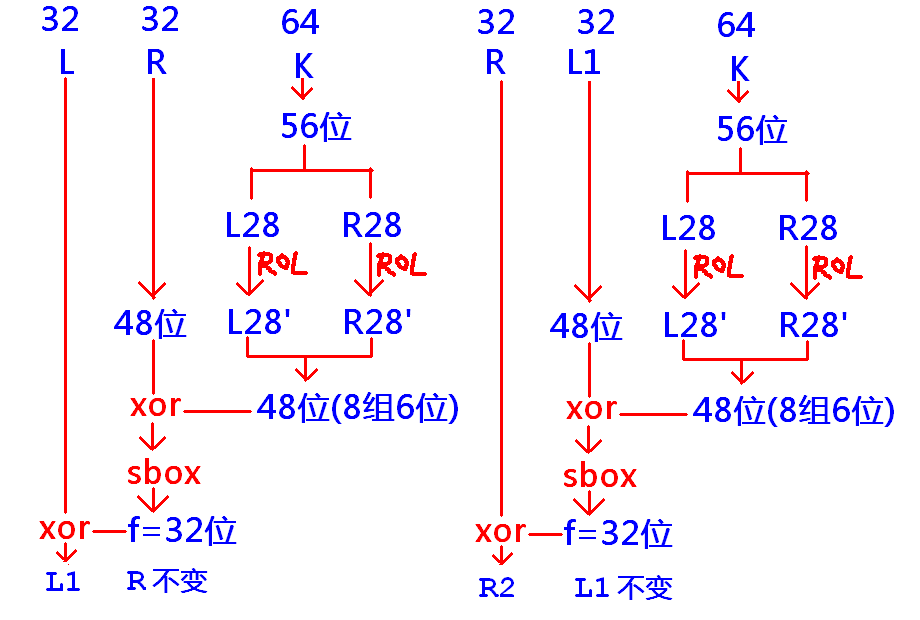

* (1) 64位明文在进入加密前有一个打乱的过程，此时要用到一张打乱表(static char ip[64])，把64位的顺序打乱,例如:
  ip[0]=58表示源数据中的第58位(实际是第58-1=57位，base 0)要转化成目标数据中的第0位，其中下标代表的是以0为基数的目标位，而数组的元素值代表的是以1为基数的源位;（下标是0到63变化，值是1到64）
* (2) 64位明文经过加密变成密文后还要有一个打乱的过程，此时要用到的打乱表为static char fp[64]; fp[57] = 1表示源第0位变成目标第57位
* (3) 8个**sbox**转化出来32位结果也需要打乱, 这张打乱表为
  static char sbox_perm_table[32];
* (4) 64位密钥要砍掉8位变成56位, 此时要用到一张表:
  static char key_perm_table[56];
* (5) 56位密钥在循环左移后,要提取其中的48位,此时也要用到一张表:
  static char key_56bit_to_48bit_table[48];

56位变48位：100011–》`a[3][1]`:

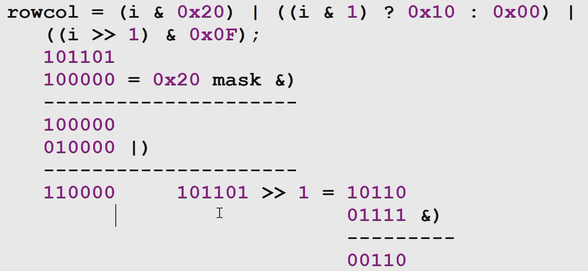

des算法中位的编号采用大端（从右到左编号，基数为1）：

```c
b[0]		b[1]		b[2]
1011 0110	0101 1111
第1位 第2位 ... 第64位
```

用查表代替打乱（下图），可以提高计算效率，是对代码的优化

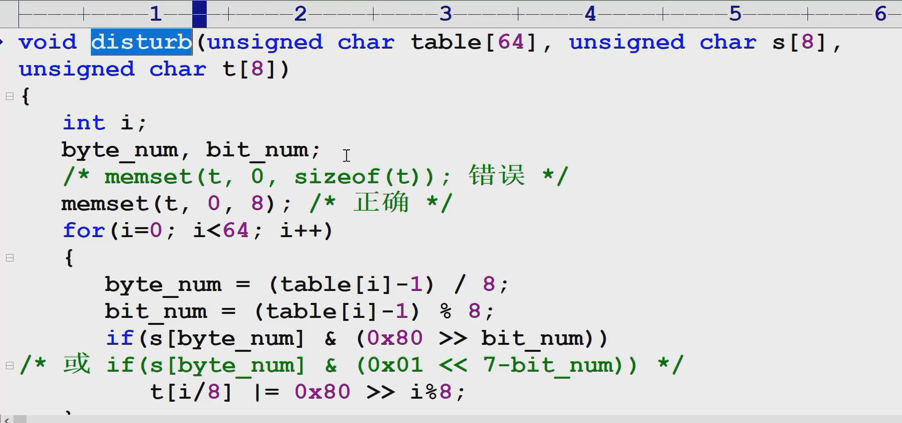

智云4-8号38分小结des算法

差分分析：已知明文攻击（明文和暗文均已知，求密钥）

利用`差分分析`来破解des可以大大减少穷举次数（讲起来较为复杂，做了一点精简：明文原来是左右各32位，精简后为左右各6位，密钥原56后9，原sbox进6出4现在进4出3）

- 首先是6位扩充成8位（012345->01323245）
- 密钥Kn是对上一轮密钥循环左移，取高8位
- 把扩充而成的8位和左移后的密钥做异或xor，然后查sbox
  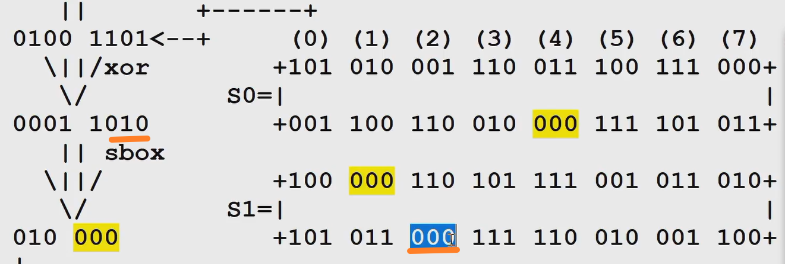
- 出来6位成为密钥和另一边做异或，如此循环

上述过程可以表示为：

```c
L1 = L0 ^ f(R0, K1);
R1 = R0;

R2 = R1 ^ f(L1, K2);
L2 = L1;

L3 = L2 ^ f(R2, K3);
R3 = R2;
```

整理得到 `L3 = L0 ^ f(R0, K1) ^ f(R3, K3);` （L0和R0是明文，L3和R3是暗文，二者均已知；但是两个未知数K1和K3不好求，因此考虑消掉一个）

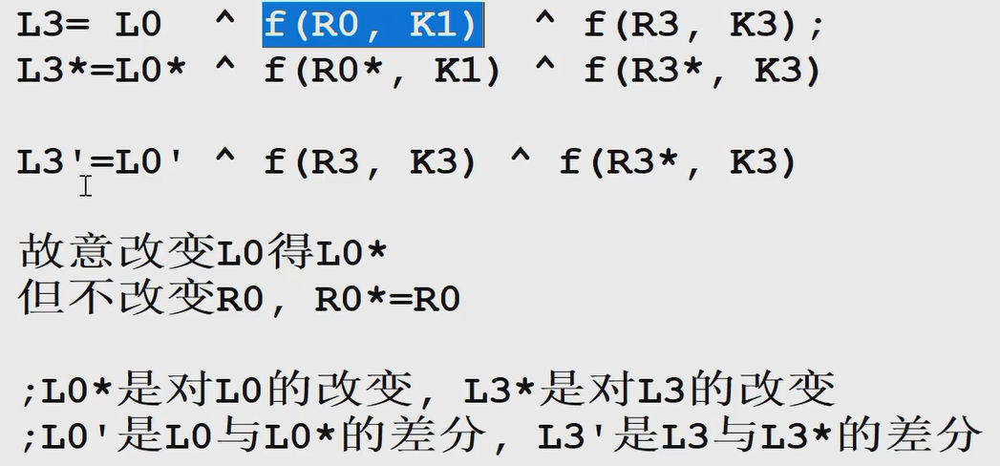

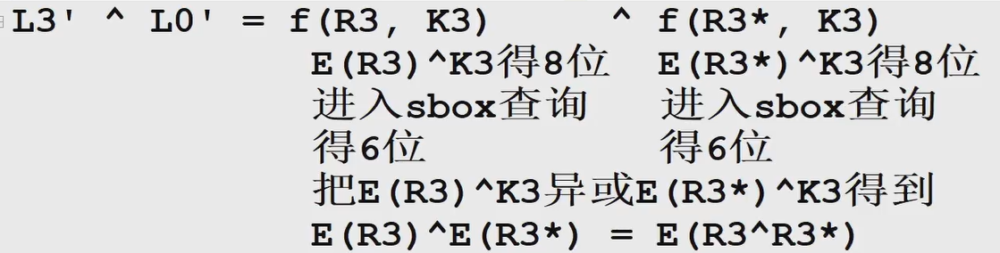

`E(R3^R3*)`是已知的，根据它去找符合要求的`E(R3)^K3 `和`E(R3*)^K3`组合，进入sbox后的结果与`L3^L0'`进行比较

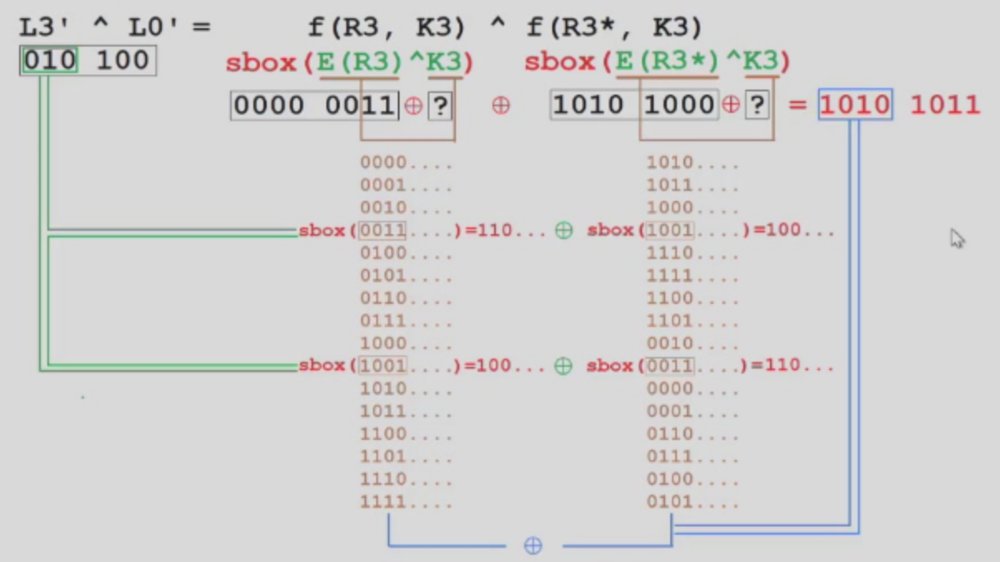

`二重DES算法`：$c=E(E(p,K1),K2)$

有缺陷，即穷举次数并不是$2^{56*2}$次，可以用meet in the middle attack（中间人攻击）

$c1=E(p,K1)$穷举K1共$2^{56}$次得到$2^{56}$个c1，对c用K2穷举解密得$2^{56}$个p1，比对

`三重DES算法`：

$c=E(D(E(p,K1),K2),K3)$

$p=D(E(D(c,K3),K2),K1)$

### Advanced Encryption Standard

AES前身是Rijndael（明文长度可变）

AES的明文=128位（16字节），密文=16字节

密钥长度分成三种: 128位(16字节), 192位(24字节), 256位(32字节)，对应aes循环论述key_rounds分别是10、12、14

aes没有像des可以用差分分析这样明显的弱点，基本只能用穷举破解

基本框架：

```c
// 以16字节密钥为例
unsigned char p[16];
unsigned char m[4][4];
unsigned char a[4] = {0x03, 0x01, 0x01, 0x02};
// 通过aes_set_key()函数把原始的k变成16*11字节
AddRoundKey(p, k); 
// 调用该函数消耗k的16字节，因此进入之前k必须是(key_rounds+1)*16字节
for(i=1; i<=10; i++)
{
   ByteSub(p, 16); /* for(j=0;j<16;j++)
					p[j] = sbox[p[j]]; */
   提取p中各个元素，按纵向顺序填入数组m中:
    m[0][0]=p[0], m[1][0]=p[1],
    m[2][0]=p[2], m[3][0]=p[3],
	...
	m[0][3]=p[12],m[1][3]=p[13],
	m[2][3]=p[14],m[3][3]=p[15];
   ShiftRow(m);
   if(i != 10)
      MixColumn(m, a, 1); /* do mul */
   else
      MixColumn(m, a, 0); /* don't mul */
   memcpy(p, m, 16);
   AddRoundKey(p, k+i*(4*4));
}
```

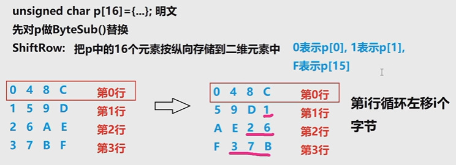

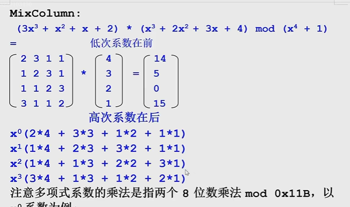

$3x^3+x^2+x+2$在aes中是固定的（这是一个不可约多项式，可以看成一个素数，为的是能求它的乘法逆元。如果$x^4+1$位置的是一个不可约多项式，则前面这里可以随便选择）

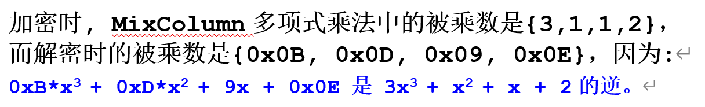

注意这里的乘法需要mod 0x11B（一个不可约多项式，$x^8+x^4+x^3+x+1$），加法对每位mod 2（位内加法不产生进位，相当于异或）

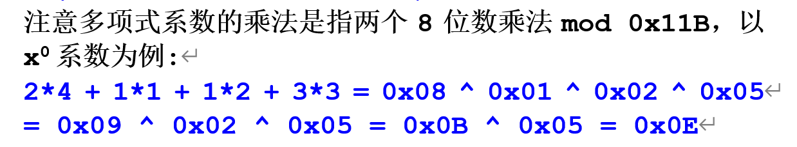

编程中不好操作这些算法，采用农夫算法：

首先假设结果p为0。乘数最低位是1时，把被乘数加到p上（有限域内加法，相当于异或），然后被乘数左移一位，乘数右移一位；乘数最低位是0时，只进行移位操作。若被乘数移位导致超过8位，对它mod 0x11B求模（两个数相近，除法转化成减法，有限域内相当于异或）。

MixColumn对明文的每一列做矩阵乘法运算后，需要把乘积转化为行：

```c
0 4 8 C		02 07 00 05
1 5 9 D	=> 	06 03 03 01
2 6 A E		...
3 7 B F		...
```

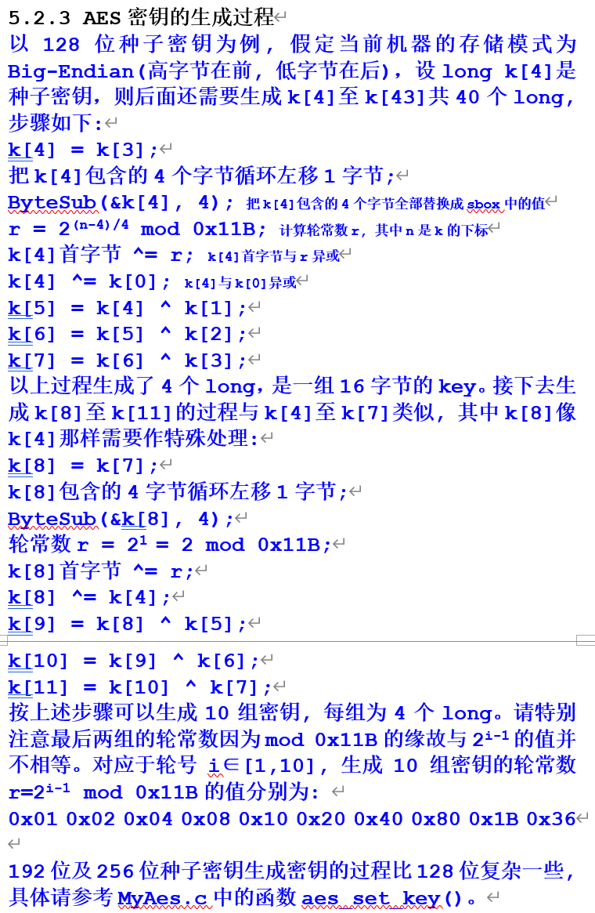

---

## RSA

DES及AES属于对称密码体制(symmetric cryptosystem)，加密解密使用同一密钥
RSA算法属于`公钥密码体制(public-key cryptosystem)`，也称`非对称`密码体制(asymmetric cryptosystem)，加密密钥与解密密钥是不同的，加密密钥简称`公钥(public key)`，解密密钥简称`私钥(private key)`。

### 具体流程

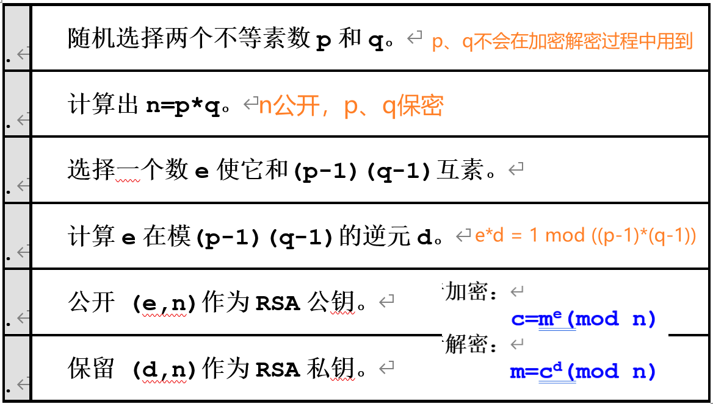

明文的公钥加密、明文的私钥加密、密文的公钥解密、密文的私钥解密都能用同一个函数实现

### RSA的数学基础

**Euler函数**
$$
\Phi(n):\text {小于n且与n互素的整数个数，例如}\Phi(5)=4
$$
**Euler定理**
$$
\gcd (x,n)=1 \rightarrow x^{\Phi(n)}=1\mod n
$$
**Fermat小定理**
$$
\text{设p为素数，且}\gcd(x,p)=1\text{，则}x^{p-1}=1\mod p\\
\text{因为p为素数时，}\Phi(p)=p-1
$$
**Chinese Remainder Theorem 中国余数定理**
$$
\text{设}m_1,m_2,\dots,m_r\text{两两互素，则以下同余方程组}\\
x\equiv a_i\mod m_i\;,\;i=1,2,\dots,r\\
模M=m_1m_2m_3\dots m_r\text{的唯一解为}\\
x=\sum_{i=1}^r a_i*M_i*(M_i^{-1}\mod m_i)\mod M\text{，其中}i=1
$$
回顾乘法逆元:  $13*x\equiv 1\mod 35 \Leftrightarrow gcd(13,35)=1\Rightarrow \dots\Rightarrow x=27$

**Euler函数的乘法性质**
$$
\text{若}n_1,n_2\text{互素，则}\Phi(n_1*n_2)=\Phi(n_1)*\Phi(n_2)
$$
**Euler函数的乘积公式**
$$
\Phi(n)=n*\Pi_{p\mid n}(1-1/p)\\
e.g.\;\Phi(10)=10*(1-1/2)*(1-1/5)
$$

### 算法证明

- m、c、n、e、d均按大端格式保存
- m的二进制位数需和n一致，例如加密m为16字节字符串“0123456789ABCDEF”，n的位数是128位
- m < n

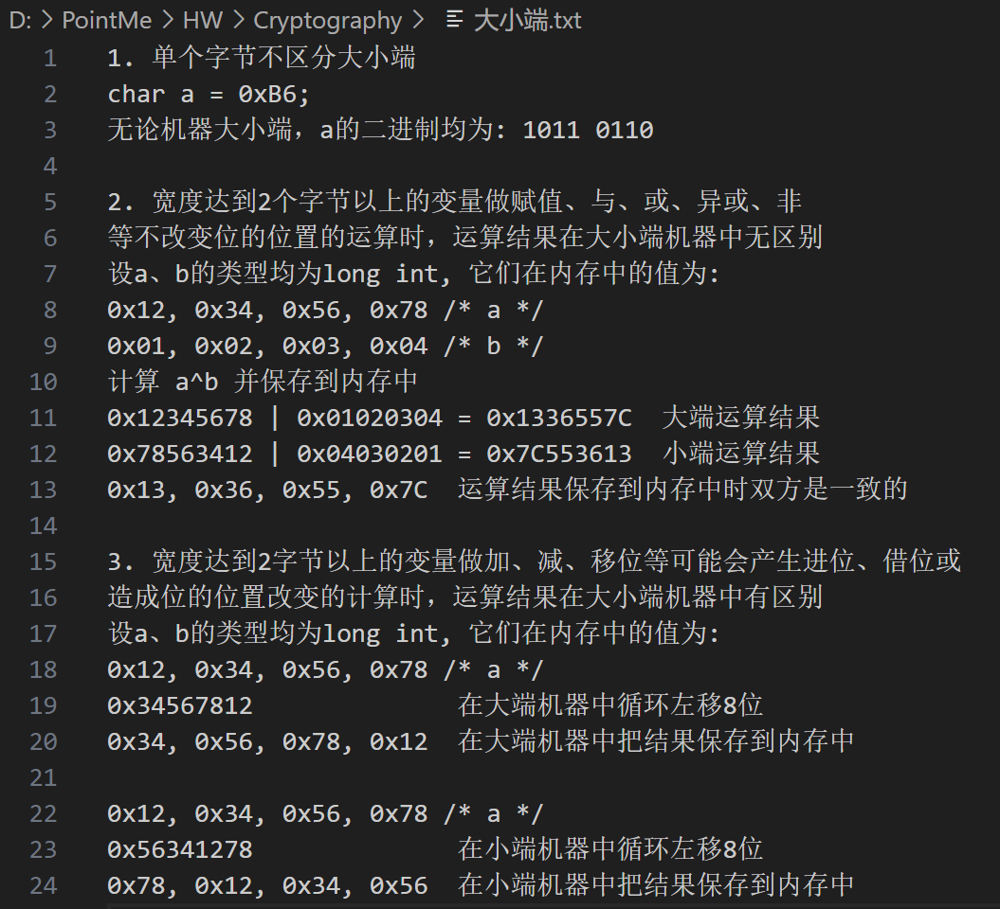

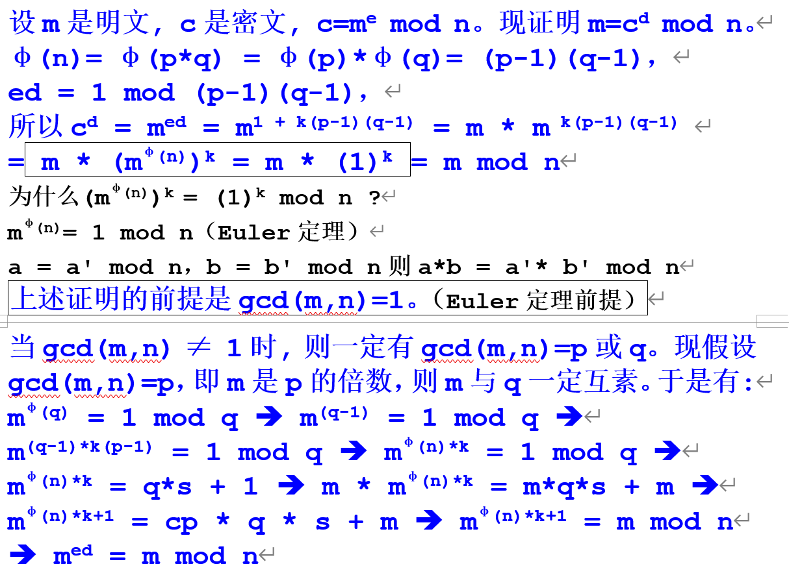

### 代码实现

源代码中`pras->flags |= RSA_FLAG_NO_BLINDING;`是为了避免加密模式下也用到密钥d（防旁路攻击的），即此时代码中加密只用到e和n

> rsa生成注册码的好处：破解者无法在不修改软件exe的情况下算出正确注册码
> 
> 1. 软件打开时显示一个机器码，其中机器码m'=rsa(mac, 公钥)
> 2. 软件作者: mac=rsa(m', 私钥)，注册码sn=(mac, 私钥)
> 3. 软件验证注册码: rsa(sn, 公钥)==mac
> 
> 暴力破解排暗桩，修改程序逻辑（暗桩多时，可能没有排完）
> 
> 公钥替换法破解（替换e和n，自己的d就可用了）（但是升级优化后会失效）
> 
> 软件作者可以用vmprotect对exe加壳保护防止程序被修改

随机生成p和q：`time()`是1970.1.1零点到现在时间的总秒数，常被用来当成生成随机数的种子数；加入用户移动鼠标的实时坐标；截取用户桌面图片计算md5…

**PKCS1_PADDING:**

1. 保证m < n (首字节填充零)
2. 加入一些随机数来确保两次加密相同明文得到的密文不同,防止可能的攻击

例如：加密明文“ABCDE”，假定N是128位即16字节。填充后的明文为[ 00，02，8个字节非零随机数，00，“ABCDE” ] （随即填充的个数大于等于8）

### 数字签名

防止第三方假冒，防止发送方抵赖

A发送一封信L给B：

A加密：L’=RSA( L，B的公钥 )

A签名：M‘=RSA( MD5(L)，A的私钥 )

B解密：L=RSA( L’，B的私钥 )

B验证：M=RSA( M’，A的公钥 ) $\underset = ?$ MD5(L)

---

## ECC

**Elliptic Curve** 椭圆曲线算法

