# 。

## Introduction

grading policy:

50 final exam | 30 lab and project | 20 hw and class test

final exam: close book test, but allow taking one handwritten A4 page note

### what should we learn?

* Modeling and design of databases
* Programming: use database - queries and update of data
* `DBMS( Database Management system )` implementation - how does DBMS work, and how to design a DBMS

### what’s a database

<details>
    <summary>Database Definition [click]</summary>
    .<br/>
    A collection of <b>interrelated data</b>, relevant to an enterprise.<br/>
    A large collection of <b>integrated and persistent</b> data.<br/>
    A collection of information that exists over a long period of time, often many years.<br/>
    .
</details>

<details>
	<summary>Database Management System (DBMS) [click]</summary>
    .<br/>
    (Database) + A set of programs used to access, update and manage the data in database.<br/>
    .
</details>

<details>
    <summary>Major properties of DBMS [click]</summary>
    .<br/>
    * <b>Efficiency</b> and <b>scalability</b> (可扩展性) in data access;<br/>
    * <b>Reduced</b> application development time;<br/>
    * Data <b>independence</b> (physical data independence / logical data independence);<br/>
    * Data <b>integrity</b> (完整性) and security;<br/>
    * <b>Concurrent access</b> and <b>robustness</b> (recovery).<br/>
    .
</details>

### DBMS

- a historical perspective
- database systems VS file processing systems
- marketplace

### Levels of Data Abstraction

How to use DB - Different usage needs different level of **abstraction.** 
(e.g., student score management system)

* Physical level: describes how a record is stored.
* Logical level: describes data stored in database, and the relationships among the data on upper level.
* View level: application programs hide details of data types. Views can also hide information.

`Schemas (模式) and Instances (实例)`

Similar to types (schema) and variables (instance) in programming languages

* Schema: the **structure of the database on different level**
* Instance: the actual **content** of the database at a particular point in time

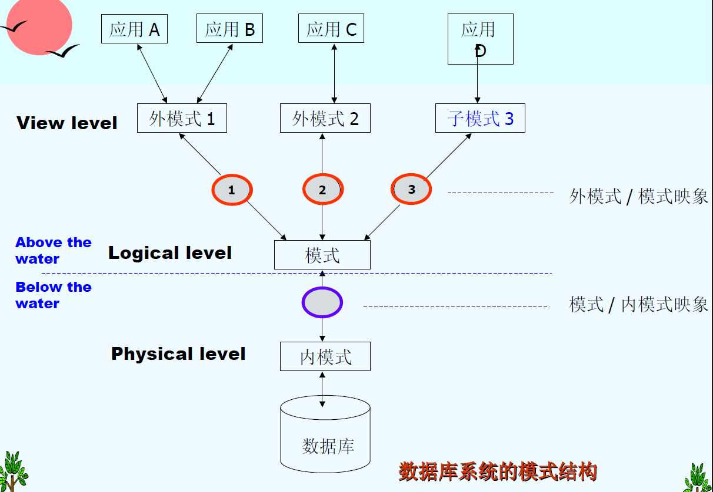

### Data Models

<details>
    <summary>Data model - A collection of conceptual tools for describing [click]</summary>
    .<br/>
    data structure, data relationships, data semantics (语义), data constraints<br/>
    .
</details>

<details>
    <summary>Different data models [click]</summary>
    .<br/>
    Entity-Relationship model, Relational model, object-oriented model. semi-structured data model(XML)…<br/>
    .
</details>

<details>
    <summary>6 Steps of Database Design [click]</summary>
    .<br/>
    Requirement analysis<br/>
    Conceptual database design<br/>
    Logical database design<br/>
    Schema refinement<br/>
    Physical database design<br/>
    Create and initialize the database.Security design<br/>
    .
</details>

### Database Language

#### Data Definition Language (DDL,数据定义语言)

* Specifies a **database scheme** as a set of definitions of **relational schema**.
* Also specifies **storage structure, access methods and consistency constraints.**
* DDL statements are compiled, resulting in a set of tables stored in a special file: **data dictionary** (数据字典), which contains metadata (元数据).

#### Data Manipulation Language (DML,数据操纵语言)

DML (alse known as query language):

**Retrieve**(检索) data from the database, **Insert / delete / update** data in the database 

Two classes of languages: Procedural and **Non**procedural (user specifies what data is required **without** specifying how to get those data e.g. SQL, Prolog)

#### Data Control Language (DCL,数据控制语言)

#### Structured Query Language (SQL,结构化查询语言)

SQL = DDL + DML + DCL, it’s the most widely used query language.

### Database Users

### Database Administrator (DBA)

### Transaction Management (事务管理)

**Transaction requirement: ACID**

atomicity ( 原子性), consistence (一致性), isolation (隔离性), durability ( 持久性)

### Database management system structure

---

## Relational Model

### What is relational model

* The relational model is very simple and elegant.
* A `relational database` is a collection of one or more `relations`, which are based on relational model.
* A relation is a **table** with **rows and columns.**
* The major advantages of the relational model are its simple data representation and the ease with which even complex queries can be expressed.
* Owing to the great language SQL, the most widely used language for creating, manipulating, and querying relational database.

| A **relationship** (联系): an association among several **entities**. |

| A **relation**(关系): is the mathematical concept, referred to a **table**. |

### Basic Structure

A relation *r* is a subset of $D_1\times D_2\times \dots \times D_n$, a Cartesian product (笛卡尔积) of a list of domain $D_i$.

Thus a relation is a set of n-tuples $(a_{1j},\;a_{2j},\;\dots ,\;a_{nj})$

#### Attribute Types (属性类型)

* Each attribute of a relation has a name
* The set of allowed values for each attribute is called the **domain** of the attribute
* `Attribute values` are (normally) required to be **atomic**, that is, indivisible (1st NF，第一范式)
* The special value **null** is a member of every domain
* The **null** value causes complications in the definition of many operations

#### Concepts about relation

A relation is concerned with two concepts: 

* `relation schema 模式`: describe the structure of the relation
* `relation instance 实例`: corresponds to the snapshot of the data in the relation at a given instant in time

|    variable    |     relation      |
| :------------: | :---------------: |
| variable type  |  relation schema  |
| variable value | relation instance |

#### Relations are Unordered

**Order of tuples is irrelevant** (tuples may be stored in an arbitrary order), and tuples in a relation are no duplicate.

#### Keys (码，键)


#### Foreign Key (外键，外码)

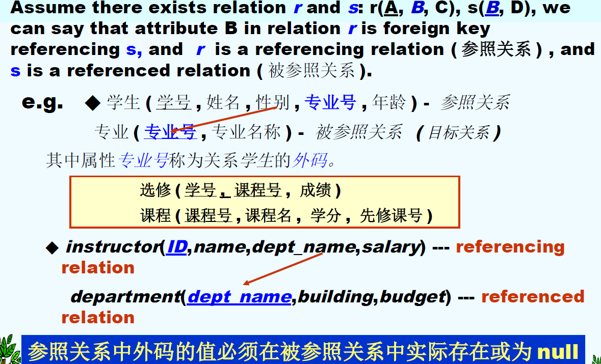

#### Query Languages:star:

* Language in which user requests information from the database
* “Pure” languages:
  * Relational Algebra - the basis of SQL
  * Tuple Relational Calculus (元组关系演算)
  * Domain Relational Calculus (域关系演算) - QBE
* Pure languages form underlying basis of query languages that people use

### Relational Algebra

* Procedural language (in some extent)

* Six basic operators

  |          operator          |             notation             |                      example                      |
  | :------------------------: | :------------------------------: | :-----------------------------------------------: |
  |        select 选择         |          $\sigma_P(r)$           |   $\sigma_{dept\_ name='Finance'}(department)$    |
  |        Project 投影        |  $\Pi_{A_1,A_2,\dots ,A_k}(r)$   |           $\Pi_{building}(department)$            |
  |          Union 并          |            $r\cup s$             | $\Pi_{name}(instructor)\cup \Pi_{name}(student)$  |
  |     set difference 差      |              $r-s$               |          (between compatible relations)           |
  | Cartesian product 笛卡尔积 |           $r\times s$            | ($R\cap S=\varnothing$ or rename the attributes)  |
  |       Rename 重命名        | $\rho_{X(A_1,A_2,\dots,A_n)}(E)$ | ($E\rightarrow X,attributes\rightarrow A_1\dots$) |

* The operators take one or two relations as inputs and give a new relation as a result.

  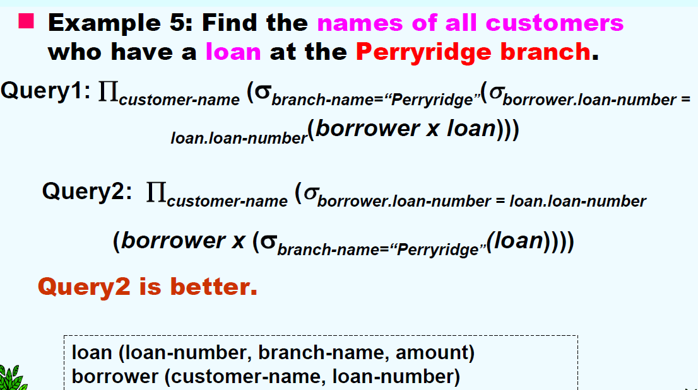

* Additional operations

|       operator        |                           notation                           |                   example                   |
| :-------------------: | :----------------------------------------------------------: | :-----------------------------------------: |
|  Set intersection 交  |                          $r\cap s$                           |             ($r\cap s=r-(r-s)$)             |
| Natural join 自然连接 | 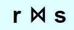 |                :point_down:                 |
|      Division 除      |                          $r$ ÷ $s$                           |                :point_down:                 |
|    Assignment 赋值    |                       $r\leftarrow s$                        | (be  made to a temporary relation variable) |

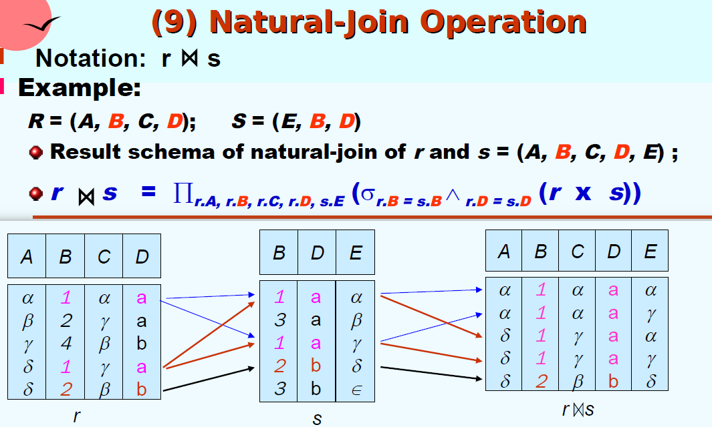

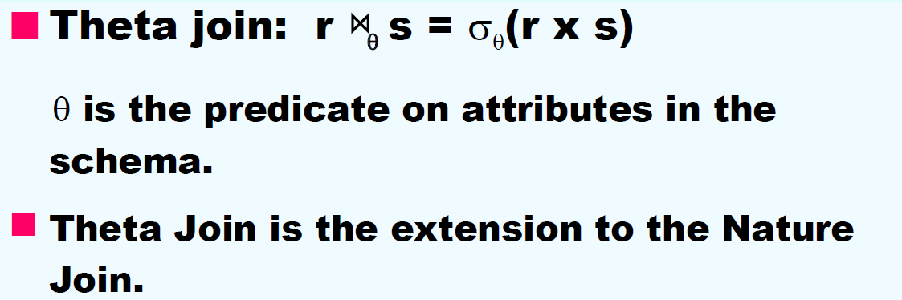

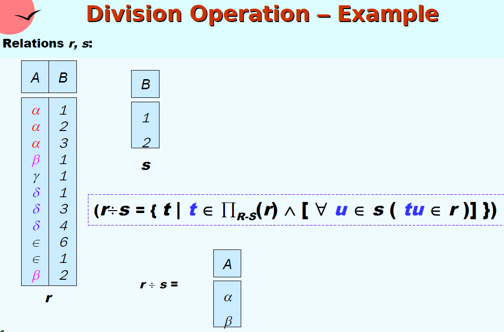

`Priority`:

$Project\rightarrow Select\rightarrow Cartesian\;Product\rightarrow Join,division\\\rightarrow Intersection\rightarrow Union,difference$

> ##### 区别笛卡尔积和自然连接
>
> 做笛卡尔积时，attribute不同名（满足条件空集）或是需要在新的关系中重命名（如r.B和s.B，满足条件重命名）；做自然连接时，attribute必须有同名的部分（作为连接桥梁）。
>
{: .block-warning}

### Extended Relational-Algebra-Operations

| operator                        |         notation          |                           example                            |
| ------------------------------- | :-----------------------: | :----------------------------------------------------------: |
| Generalized Projection 广义投影 | $\Pi_{F1,F2,\dots,Fn}(E)$ | $\Pi_{customer-name,\;limit\;-\;credit-balance}(credit-info)$ |
| Aggregate Functions 聚集函数    | avg, min, max, sum. count |           $g_{avg(balance)}(account)$ :point_down:           |
| Outer Join 外连接               |       :point_down:        |                         :point_down:                         |

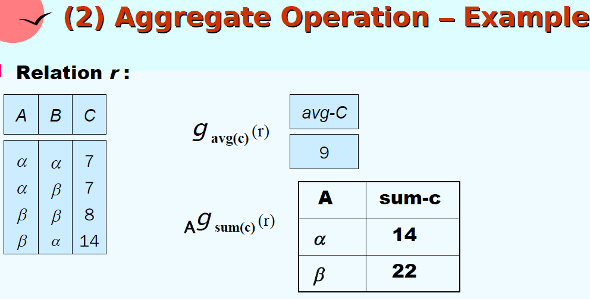

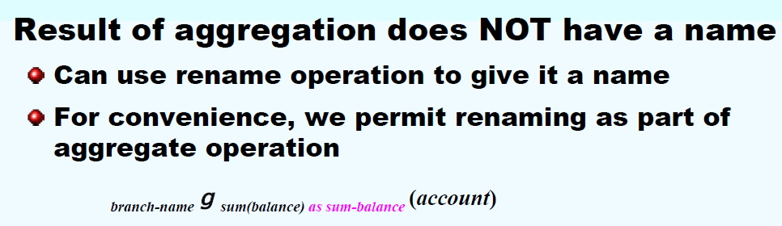

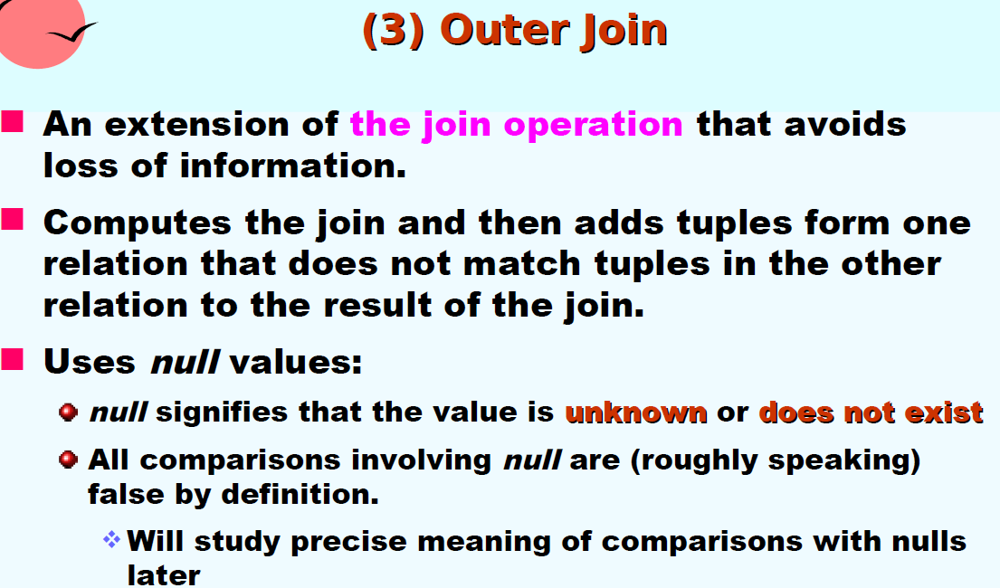

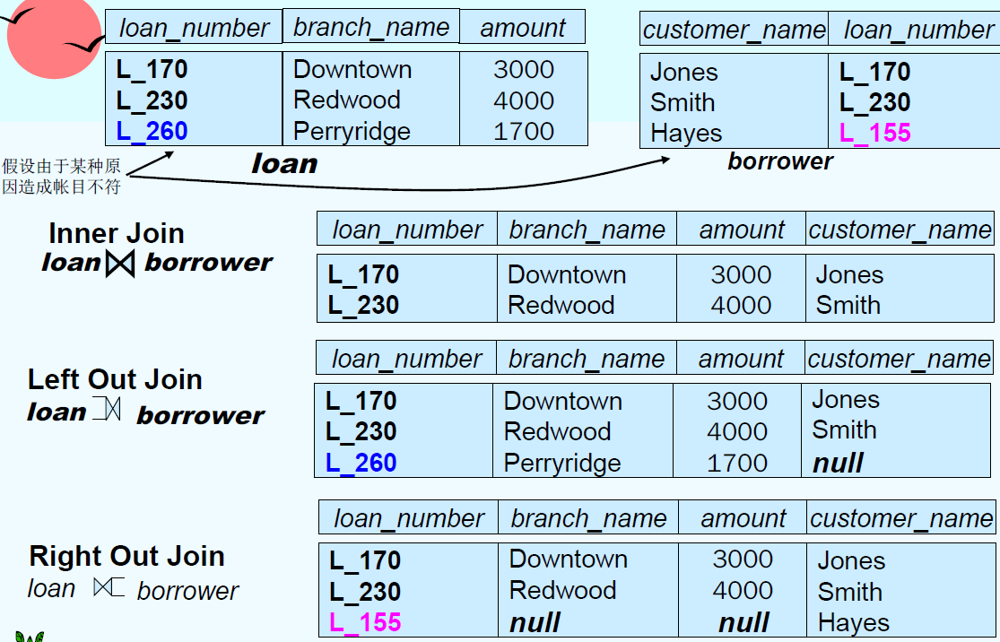

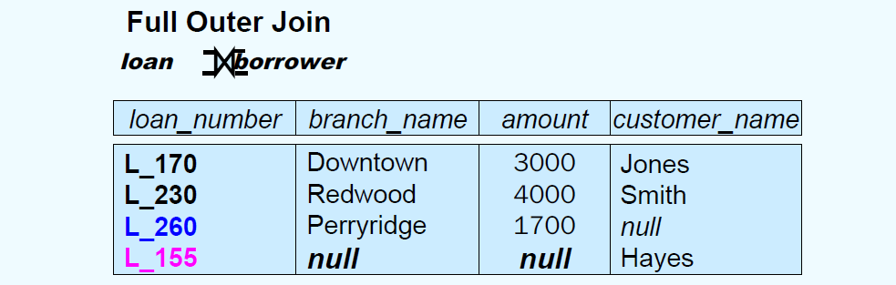

* **Null Values**: *null* signifies an unknown value or that a value does NOT exist, and the result of any arithmetic expression involving *null* is null (so aggregate functions simply ignore null values)

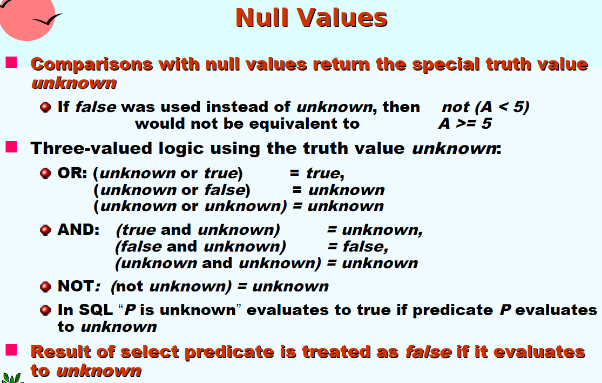

### Modification of the Database

| operator  |               notation               |                           example                            |
| :-------: | :----------------------------------: | :----------------------------------------------------------: |
| Deletion  |          $r \leftarrow r-E$          | $account\leftarrow account-\sigma_{branch-name="xxx"}(account)$ |
| Insertion |        $r\leftarrow r\cup E$         | $account \leftarrow account\cup \{ ("Perry",A-973,1200) \}$  |
| Updating  | $r\leftarrow \Pi_{F1,F2\dots,Fn}(r)$ |      $account\leftarrow \Pi_{AN,BN,BAL*1.05}(account)$       |

---

## Introduction to SQL

Structured Query Language 结构化查询语言

SQL Conformance levels 标准符合度

### Data Definition Language

`Create Table` - example:

```sql
CREATE TABLE instructor(
	ID char(5),
	name varchar(20) not null,
	dept_name varchar(20),
	salary numeric(8,2),
	primary key(ID));
```

|      Domain Types      |                         description                          |
| :--------------------: | :----------------------------------------------------------: |
|        char(n)         |  fixed length character string, with user-specified length   |
|       varchar(n)       | variable length character strings, with user-specified maximum length |
|          int           | integer (a finite subset of the integers that is machine-dependent) |
|        smallint        | small integer (machine-dependent subset of the integer domain type) |
|      numeric(p,d)      | fixed point number (user-specified precision $p$, $d$ digits to the right of decimal point) |
| real, double precision |  floating point and double-precision floating point numbers  |
|        float(n)        | floating point number (user-specified precision of at least $n$ dight) |
|          Null          |               allowed in all the domain types                |
|          data          |                     year, month and date                     |
|          time          |                  hours, minutes and seconds                  |
|       Timestamp        |                        date plus time                        |

Integrity `Constraints` in Create Table:

|             Constraints             |          example          |
| :---------------------------------: | :-----------------------: |
|              not null               | name varchar(20) not null |
|    primary key $(A_1,\dots,A_n)$    |     primary key (ID)      |
| check $(P)$, where P is a predicate |    check(salary >= 0)     |

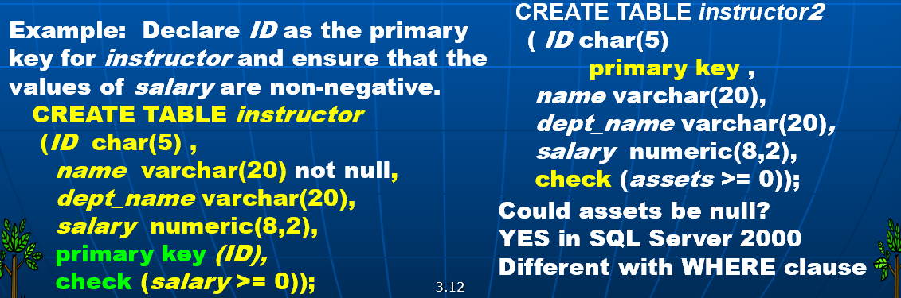

`Drop Table`command deletes all information about the relation:

```sql
DROP TABLE r;
```

`Alter Table`command is used to add attributes to an existing relation (all tuples in the relation are assigned *null* as the value for the new attribute):

```sql
ALTER TABLE r ADD (
	A1 D1,
	A2 D2,
	...
	An Dn);
```

Alter Table command can also be used to drop attributes of a relation (not supported by many database):

```sql
ALTER TABLE r DROP A
```

The Alter Table command can also be used to modify the attributes of a relation:

```sql
ALTER TABLE instructor MODIFY (ID char(10), salary not null);
```

`Create Index`:

```sql
CREATE INDEX <i-name> ON <table-name>(<attribute-list>);
```

```sql
CREATE UNIQUE INDEX <i-name> ON <table-name>(attribute-list);
```

```sql
DROP INDEX <i-name>;
```


### Basic Structure of select

> use SQL Server query analyzer 查询分析器

```sql
SELECT A1, A2,..., An
FROM r1, r2,..., rm
WHERE P
```

$\Leftrightarrow \Pi_{A1,A2,\dots,An}(\sigma_P(r_1\times r_2\times\dots\times r_m))$​

| 前者是SQL语言 (其结果是一个relation)，后者是relational algebra expression |

> ##### Note
>
> SQL dose not permit the '-' character in names, Use, e.g.
>
> SQL names are **case insensitive** (不区分大小写)
>
{: .block-danger}

- SQL allows duplicates (重复) in relations as well as in query results

  force the elimination of duplicates: `distinct` (e.g. <u>SELECT</u> distinct dept_name…)

  default: `all` allow duplicates

- `*` denotes “all attributes”: <u>SELECT</u> * FROM …

  <u>SELECT</u> ID, name, salary * 1.05 FROM… (times)

- `AND OR NOT BETWEEN`: <u>WHERE</u> salary BETWEEN 90000 AND 100000

-  <u>SELECT</u> * <u>FROM</u> instructor, teaches: Cartesian product

  (如果是自然连接，要在WHERE里加上限制条件，如instructor.ID=teaches.ID)

- `as`: column rename

  ```sql
  SELECT name as instructor_name,course_id
  FROM instructor,teaches
  WHERE instructor.ID = teaches.ID and dept_name = 'xxx';
  
  SELECT T.name, S.course_id
  FROM instructor as T, teaches as S
  WHERE T.ID = S.ID;
  
  -- 用以区分
  SELECT distinct T.name
  FROM instructor as T, instructor as S
  WHERE T.salary > S.salary and S.dept_name = 'xxx';
  ```

- string-matching operator for comparison on character strings

  `%` matches **any substring** (like * in file system)

  `_` matches **any character** (like ? in file system)

  ```sql
  SELECT FirstName, LastName
  FROM Person.Person
  WHERE FirstName LIKE 'Dan%';
  -- 名字以Dan开头
  
  SELECT FirstName, LastName
  FROM Person.Person
  WHERE FirstName LIKE 'J%n';
  -- 以J开头以n结尾
  
  SELECT name FROM sys.databases
  WHERE name LIKE 'm_d%';
  -- 例如model
  ```

- `order by`:  (ascending order is the default)

  ```sql
  SELECT *
  FROM instructor
  ORDER BY salary desc, name asc;
  ```

### Set Operations

In SQL, use the set operations: `union, intersect, except`operate on relations and correspond to the relational algebra operations $\cup, \cap,-$

* each of the operations automatically **eliminates duplicates**

* to retain all duplicates use the corresponding multiset versions: `union all, intersect all, except all`

* suppose a tuple occurs m times in r and n times in s:

  | occurs _ times |     in _ relation      |
  | :------------: | :--------------------: |
  |     $m+n$      |   $r\;union\;all\;s$   |
  |   $min(m,n)$   | $r\;intersect\;all\;s$ |
  |  $max(0,m-n)$  |  $r\;except\;all\;s$   |

  ```sql
  (SELECT course_id
   FROM section
   WHERE semester = 'Fall' and year = 2009)
   UNION
  (SELECT course_id
   FROM section
   WHERE semester = 'Spring' and year = 2010);
  ```

### Aggregate Functions

$avg(col),min(col),max(col),sum(col),count(col)$

```sql
SELECT avg(salary) as avg_salary
FROM instructor
WHERE dept_name = 'Comp.Sci';
```

* Attribute in select clause outside of aggregate functions must appear in **group by** list

```sql
SELECT dept_name, avg(salary) avg_salary
FROM instructor GROUP BY dept_name;
```

```sql
SELECT branch_name, count(distinct customer_name) as tot_num
FROM depositor D, account A
WHERE D.account_number = A.account_number GROUP BY branch_name;
```

```sql
SELECT dept_name, avg(salary) as avg_salary
FROM instructor
GROUP BY dept_name
HAVING avg(salary) > 42000;
```

> ##### note:
> 
> aggregate function不能直接用在WHERE语句中。
> 
{: .block-tip}

### Null values

* *null* signifies an **unknown value** or that a value **does not exist**

* The result of any arithmetic expression involving *null* is null

* Any comparison with *null* returns *unknown*

* Result of WHERE clause predicate is treated an **false** if it evaluates to **unknown**

* The predicate `is null`, `is not null`

  ```sql
  SELECT name
  FROM instructor WHERE salary is null;
  ```

* Aggregate functions simply ignore nulls, except `count(*)`

### Nested Subqueries

```sql
SELECT distinct course_id
FROM section
WHERE semester = 'Fall' and year = 2009 and
	course_id not in (SELECT...FROM...WHERE...)
```

```sql
...
WHERE (course_id, sec_id, semester, year) in ();
```

- `some all`

  ```sql
  WHERE salary > some (select salary from..where..);
  ```

- `not exists`

```sql
WHERE not exists();
```

- `not unique`whether a subquery has any duplicate tuples in its result.

  ```sql
  WHERE unique ();
  ```

### Views

> Provide a mechanism to **hide certain data** from the view of certain users

```sql
CREATE VIEW <v_name> AS
select c1,c2,...,from...;
CREATE VIEW <v_name> (c1,c2,...) AS
select e1,e2,...from...;
```

```sql
DROP VIEW <v_name>;
```

### Complex Queries

#### Derived Relations导出关系

| 不管是否被引用，导出表（嵌套表）必须给出别名。 |

```sql
SELECT dept_name, avg_salary
FROM (SELECT dept_name, avg(salary)
	  FROM instructor
	  GROUP BY dept_name)
	  AS dept_avg(dept_name,avg_salary) -- 局部视图
WHERE avg_salary > 42000;
```

#### WITH Clause

```sql
WITH max_budget(value) as -- local view
	SELECT max（budget)
	FROM department
SELECT budget
FROM department, max_budget
WHERE department.budget = max_budget.value;
```

```sql
WITH dept_total(dept_name, value) AS
	(SELECT dept_name, sum(salary)
     FROM instructor
     GROUP BY dept_name),
     dept_total_avg(value) AS 
    (SELECT avg(value)
     FROM dept_total)
SELECT dept_name
FROM dept_total A, dept_total_avg B
WHERE A.value >= B.value;
```

> ##### warning
> 
> Sql Server2000未实现此类WITH的用法，但是考试可以用。
> 
{: .block-danger}

### Modification of the Database

#### Deletion

```sql
DELETE FROM <table/view>
	[WHERE <condition>];
	
DELETE FROM instructor
WHERE dept_name = 'SCI';
```

| delete 后面什么都没有，不加*；只能从一个表里删，不能delete from A, B, C |

#### Insertion

```sql
INSERT INTO <table/view>[(c1,c2,...)]
	VALUES(e1,e2,...);
	
INSERT INTO course
VALUES('CS-437','Database System','Comp.Sci',4);
-- 如果不知道，也可以用null或直接空着
```

```sql
INSERT INTO <table/view>[(C1,c2,...)]
	SELECT e1,e2,...FROM...;
```

> ##### note
>
> 下面这条语句是正确的，没有问题（但是不能有primary key）。并不会因为table1插入新内容后有所改变而影响插入语句。（在同一SQL语句内，除非外层查询的元组变量引入内层查询，否则内层查询只进行一次。）
>
> The ‘select from where’ statement is fully evaluated before any of its results are inserted into the relation.
>
> ```sql
> INSERT INTO table1 SELECT * FROM table1;
> ```
>
> 
{: .block-tip}

#### Updates

```sql
UPDATE <table/view>
	SET <c1=e1[,c2=e2,...]>
[WHERE <condition>];

UPDATE instructor
SET salary = salary * 1.03
WHERE salary > 10000;
UPDATE instructor
SET salary = salary * 1.05
WHERE salary <= 10000;
-- the order is important
-- better try:
UPDAtE instructor
SET salary = CASE
			WHEN salary <= 10000
			THEN salary*1.05
			ELSE salary*1.03
			END;
```

| 对简单视图（view）执行update语句，会自动转化成对表执行；对复杂视图执行update语句不被允许。=》View是虚表，对其进行的所有操作都转化为对基表的操作。查询操作时，view与基表没有区别，但对view 的更新操作有严格限制《= |

#### Transactions事务

> A transaction is a sequence of queries and data update statements executed as a single logical unit.

```sql
-- motivating example
UPDATE account SET balance = balance - 100
WHERE account_number = 'A-101';
UPDATE account SET balance = balance + 100
WHERE account_number = 'A-201';
COMMIT WORK;
```

- If one steps succeeds and the other fails, database is in an inconsistent state
- Therefore, either both steps should succeed or neither. (Atomicity原子性, automatic **rollback work**)

### Joined Relations

> Join opetations take two relations and return as a result another relation.

- Join condition: $natural\;on<predicate>\;using(A_1,A_2,\dots,A_n)$
- Join type: inner join, left outer join, right outer join, full  outer join

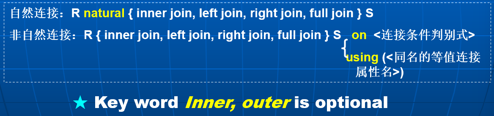

```sql
loan natural inner join borrower;
loan inner join borrower on loan.number = borrower.number;
-- 非自然连接允许不同名属性的比较，且结果关系中不消去重名属性
loan full outer join borrower using (loan_number);
-- 类似于natural连接，但仅以using列出的公共属性作为连接条件
```

```sql
SELECT customer_name
FROM (depositor natural full outer join borrower)
WHERE account_number is null or loan_number is null;
```

SQL Server 中外连接的表示：

```sql
SELECT loan.loan_number, amount
FROM loan left outer join borrower on
	loan.loan_number = borrower.loan_number;
	
SELECT loan.loan_number, amount
FROM loan, borrower
WHERE loan.loan_number *= borrower.loan_number;
-- left join *=, right join =*
```


---

## Intermediate SQL

### SQL Data Types and Schemas

