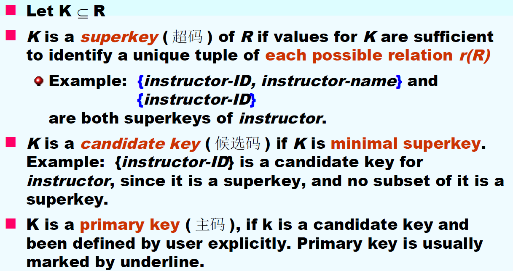
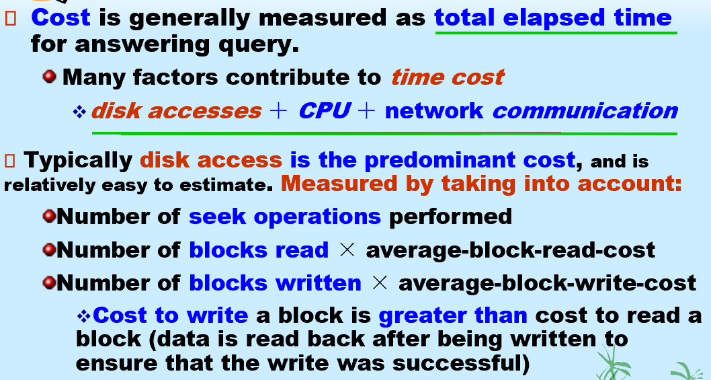

# 。

[TOC]

## Introduction

grading policy (teacher: cl):

50 final exam | 30 lab and project | 20 hw and class test

final exam: close book test, but allow taking one handwritten A4 page note

| 参考资料 | [Chritch](https://obsidian.zerokei.top/Hub/Database%20System/) | [小角龙](https://zhang-each.github.io/My-CS-Notebook/DB/db/) | [DB_book](https://db-book.com/Practice-Exercises/index-solu.html) | [数据库系统历年卷求助 - CC98论坛](https://www.cc98.org/topic/5917876) |

### what should we learn?

* Modeling and design of databases
* Programming: use database - queries and update of data
* `DBMS( Database Management system )` implementation - how does DBMS work, and how to design a DBMS

### what’s a database

<details>
    <summary>Database Definition [click]</summary>
    .<br/>
    A collection of <b>interrelated data</b>, relevant to an enterprise.<br/>
    A large collection of <b>integrated and persistent</b> data.<br/>
    A collection of information that exists over a long period of time, often many years.<br/>
    .
</details>

<details>
	<summary>Database Management System (DBMS) [click]</summary>
    .<br/>
    (Database) + A set of programs used to access, update and manage the data in database.<br/>
    .
</details>

<details>
    <summary>Major properties of DBMS [click]</summary>
    .<br/>
    * <b>Efficiency</b> and <b>scalability</b> (可扩展性) in data access;<br/>
    * <b>Reduced</b> application development time;<br/>
    * Data <b>independence</b> (physical data independence / logical data independence);<br/>
    * Data <b>integrity</b> (完整性) and security;<br/>
    * <b>Concurrent access</b> and <b>robustness</b> (recovery).<br/>
    .
</details>
:star:Characteristics of Databases:

- data persistence(**数据持久性**)
- convenience in accessing data(**数据访问便利性**)
- data integrity （**数据完整性**）
- concurrency control for multiple user(**多用户并发控制**)
- failure recovery（**故障恢复**）
- security control（**安全控制**）

### DBMS

- a historical perspective
- database systems VS file processing systems
- marketplace

### Levels of Data Abstraction

How to use DB - Different usage needs different level of **abstraction.** 
(e.g., student score management system)

* Physical level: describes how a record is stored.
* Logical level: describes data stored in database, and the relationships among the data on upper level.
* View level: application programs hide details of data types. Views can also hide information.

`Schemas (模式) and Instances (实例)`

Similar to types (schema) and variables (instance) in programming languages

* Schema: the **structure of the database on different level**
* Instance: the actual **content** of the database at a particular point in time


### Data Models

<details>
    <summary>Data model - A collection of conceptual tools for describing [click]</summary>
    .<br/>
    data（数据）, data relationships（联系）, data semantics (语义), data constraints（约束）<br/>
    .
</details>
<details>
    <summary>Different data models [click]</summary>
    .<br/>
    Entity-Relationship model, Relational model, object-oriented model. semi-structured data model(XML)…<br/>
    .
</details>

<details>
    <summary>6 Steps of Database Design [click]</summary>
    .<br/>
    Requirement analysis<br/>
    Conceptual database design<br/>
    Logical database design<br/>
    Schema refinement<br/>
    Physical database design<br/>
    Create and initialize the database.Security design<br/>
    .
</details>
### Database Language

#### Data Definition Language (DDL,数据定义语言)

* Specifies a **database scheme** as a set of definitions of **relational schema**.
* Also specifies **storage structure, access methods and consistency constraints.**
* DDL statements are compiled, resulting in a set of tables stored in a special file: **data dictionary** (数据字典), which contains metadata (元数据).

#### Data Manipulation Language (DML,数据操纵语言)

DML (alse known as query language):

**Retrieve**(检索) data from the database, **Insert / delete / update** data in the database 

Two classes of languages: Procedural and **Non**procedural (user specifies what data is required **without** specifying how to get those data e.g. SQL, Prolog)

#### Data Control Language (DCL,数据控制语言)

#### Structured Query Language (SQL,结构化查询语言)

SQL = DDL + DML + DCL, it’s the most widely used query language.

### Database Users


### Database Administrator (DBA)

### Transaction Management (事务管理)

**Transaction requirement: ACID**

atomicity ( 原子性), consistence (一致性), isolation (隔离性), durability ( 持久性)

### Database management system structure

---

## Relational Model

### What is relational model

* The relational model is very simple and elegant.
* A `relational database` is a collection of one or more `relations`, which are based on relational model.
* A relation is a **table** with **rows and columns.**
* The major advantages of the relational model are its simple data representation and the ease with which even complex queries can be expressed.
* Owing to the great language SQL, the most widely used language for creating, manipulating, and querying relational database.

| A **relationship** (联系): an association among several **entities**. |

| A **relation**(关系): is the mathematical concept, referred to a **table**. |

### Basic Structure

A relation *r* is a subset of $D_1\times D_2\times \dots \times D_n$, a Cartesian product (笛卡尔积) of a list of domain $D_i$.

Thus a relation is a set of n-tuples $(a_{1j},\;a_{2j},\;\dots ,\;a_{nj})$

#### Attribute Types (属性类型)

* Each attribute of a relation has a name
* The set of allowed values for each attribute is called the **domain** of the attribute
* `Attribute values` are (normally) required to be **atomic**, that is, indivisible (1st NF，第一范式)
* The special value **null** is a member of every domain
* The **null** value causes complications in the definition of many operations

#### Concepts about relation

A relation is concerned with two concepts: 

* `relation schema 模式`: describe the structure of the relation
* `relation instance 实例`: corresponds to the snapshot of the data in the relation at a given instant in time

|    variable    |     relation      |
| :------------: | :---------------: |
| variable type  |  relation schema  |
| variable value | relation instance |

#### Relations are Unordered

**Order of tuples is irrelevant** (tuples may be stored in an arbitrary order), and tuples in a relation are no duplicate.

#### Keys (码，键)



#### Foreign Key (外键，外码)


#### :question:Query Languages

* Language in which user requests information from the database
* “Pure” languages:
  * Relational Algebra - the basis of SQL
  * Tuple Relational Calculus (元组关系演算)
  * Domain Relational Calculus (域关系演算) - QBE
* Pure languages form underlying basis of query languages that people use

### :star:Relational Algebra

* Procedural language (in some extent)

* **Six basic** operators

  |          operator          |             notation             |                      example                      |
  | :------------------------: | :------------------------------: | :-----------------------------------------------: |
  |     select 选择(tuple)     |          $\sigma_P(r)$           |   $\sigma_{dept\_ name='Finance'}(department)$    |
  |    Project 投影(column)    |  $\Pi_{A_1,A_2,\dots ,A_k}(r)$   |           $\Pi_{building}(department)$            |
  |          Union 并          |            $r\cup s$             | $\Pi_{name}(instructor)\cup \Pi_{name}(student)$  |
  |     set difference 差      |              $r-s$               |          (between compatible relations)           |
  | Cartesian product 笛卡尔积 |           $r\times s$            | ($R\cap S=\varnothing$ or rename the attributes)  |
  |       Rename 重命名        | $\rho_{X(A_1,A_2,\dots,A_n)}(E)$ | ($E\rightarrow X,attributes\rightarrow A_1\dots$) |

* The operators take one or two relations as inputs and give a new relation as a result.

  

* **Additional** operations

|       operator        |                           notation                           |                   example                   |
| :-------------------: | :----------------------------------------------------------: | :-----------------------------------------: |
|  Set intersection 交  |                          $r\cap s$                           |             ($r\cap s=r-(r-s)$)             |
| Natural join 自然连接 |  |                :point_down:                 |
|      Division 除      |                          $r$ ÷ $s$                           |                :point_down:                 |
|    Assignment 赋值    |                       $r\leftarrow s$                        | (be  made to a temporary relation variable) |


`Priority`:
$$
Project\rightarrow Select\rightarrow Cartesian\;Product\rightarrow Join,division\\\rightarrow Intersection\rightarrow Union,difference
$$

> ##### 区别笛卡尔积和自然连接
>
> 做笛卡尔积时，attribute不同名（满足条件空集）或是需要在新的关系中重命名（如r.B和s.B，满足条件重命名）；做自然连接时，attribute必须有同名的部分（作为连接桥梁）。
>
{: .block-warning}

### Extended Relational-Algebra-Operations

| operator                        |         notation          |                           example                            |
| ------------------------------- | :-----------------------: | :----------------------------------------------------------: |
| Generalized Projection 广义投影 | $\Pi_{F1,F2,\dots,Fn}(E)$ | $\Pi_{customer-name,\;limit\;-\;credit-balance}(credit-info)$ |
| Aggregate Functions 聚集函数    | avg, min, max, sum. count | $_{account.name}g_{avg(balance)\;as\;c.avg}(account)$ :point_down: |
| Outer Join 外连接               |       :point_down:        |                         :point_down:                         |


* **Null Values**: *null* signifies an **unknown value** or that a value **does NOT exist,** and the result of any arithmetic expression involving *null* is null (so aggregate functions simply ignore null values)


### Modification of the Database

| operator  |               notation               |                           example                            |
| :-------: | :----------------------------------: | :----------------------------------------------------------: |
| Deletion  |          $r \leftarrow r-E$          | $account\leftarrow account-\sigma_{branch-name="xxx"}(account)$ |
| Insertion |        $r\leftarrow r\cup E$         | $account \leftarrow account\cup \{ ("Perry",A-973,1200) \}$  |
| Updating  | $r\leftarrow \Pi_{F1,F2\dots,Fn}(r)$ |      $account\leftarrow \Pi_{AN,BN,BAL*1.05}(account)$       |


---

## Introduction to SQL

Structured Query Language 结构化查询语言

SQL Conformance levels 标准符合度

### Data Definition Language

:anchor: ​`Create Table` - example:

```sql
CREATE TABLE instructor(
	ID char(5),
	name varchar(20) not null,
	dept_name varchar(20),
	salary numeric(8,2) default 0,
	primary key(ID)); -- automatically ensured not null
```

|      Domain Types      |                         description                          |
| :--------------------: | :----------------------------------------------------------: |
|        char(n)         |  fixed length character string, with user-specified length   |
|       varchar(n)       | variable length character strings, with user-specified maximum length |
|          int           | integer (a finite subset of the integers that is machine-dependent) |
|        smallint        | small integer (machine-dependent subset of the integer domain type) |
|      numeric(p,d)      | fixed point number (user-specified precision $p$, $d$ digits to the right of decimal point) |
| real, double precision |  floating point and double-precision floating point numbers  |
|        float(n)        | floating point number (user-specified precision of at least $n$ dight) |
|          Null          |               allowed in all the domain types                |
|          data          |            year, month and date (e.g. 2005-7-27)             |
|          time          |        hours, minutes and seconds (e.g. 09:00:30.75)         |
|       Timestamp        |                        date plus time                        |
|        interval        |                period of time (e.g. ‘1’ day)                 |

Integrity `Constraints` in Create Table:

|                 Constraints                 |                 example                 |
| :-----------------------------------------: | :-------------------------------------: |
|                  not null                   |        name varchar(20) not null        |
|        primary key $(A_1,\dots,A_n)$        |            primary key (ID)             |
| foreign key  $(A_m,\dots,A_n)$ references r | foreign key (dept_name) references dept |
|     check $(P)$, where P is a predicate     |           check(salary >= 0)            |


:anchor: `Drop Table` deletes the table and its contents:

```sql
DROP TABLE r;
```

:anchor: `Delete From (table)` deletes all contents of table, but remains table:

```sql
DELETE FROM student;
```

:anchor: `Alter Table`command is used to add attributes to an existing relation (all tuples in the relation are assigned *null* as the value for the new attribute):

```sql
ALTER TABLE r ADD (
	A1 D1,
	A2 D2,
	...
	An Dn);
```

Alter Table command can also be used to drop attributes of a relation (not supported by many database):

```sql
ALTER TABLE r DROP A
```

The Alter Table command can also be used to modify the attributes of a relation:

```sql
ALTER TABLE instructor MODIFY (ID char(10), salary not null);
```

:anchor: `Create Index` or `Drop Index`:

```sql
CREATE INDEX <i-name> ON <table-name>(<attribute-list>);
```

```sql
CREATE UNIQUE INDEX <i-name> ON <table-name>(attribute-list);
```

```sql
DROP INDEX <i-name>;
```

```sql
create index studentID_index on student(ID)
-- using index to find the required record, without looking at all records of student
```

### Basic Structure of select

> use SQL Server query analyzer 查询分析器

```sql
SELECT A1, A2,..., An
FROM r1, r2,..., rm
WHERE P
```

$\Leftrightarrow \Pi_{A1,A2,\dots,An}(\sigma_P(r_1\times r_2\times\dots\times r_m))$​

| 前者是SQL语言 (其结果是一个relation)，后者是relational algebra expression |

> ##### Note
>
> SQL dose not permit the '-' character in names, Use, e.g.
>
> SQL names are **case insensitive** (不区分大小写)
>
{: .block-danger}

- SQL allows duplicates (重复) in relations as well as in query results

  force the elimination of duplicates: `distinct` (e.g. <u>SELECT</u> distinct dept_name…)

  default: `all` allow duplicates

- `*` denotes “all attributes”: <u>SELECT</u> * FROM …

  <u>SELECT</u> ID, name, salary * 1.05 FROM… (times)

- `AND OR NOT BETWEEN`: <u>WHERE</u> salary BETWEEN 90000 AND 100000

-  <u>SELECT</u> * <u>FROM</u> instructor, teaches: Cartesian product

  (如果是自然连接，要在WHERE里加上限制条件，如instructor.ID=teaches.ID；或者<u>SELECT</u> name, course_id FROM instructor `natural join` teaches)

- `as`: column rename

  ```sql
  SELECT name as instructor_name,course_id
  FROM instructor,teaches
  WHERE instructor.ID = teaches.ID and dept_name = 'xxx';
  
  SELECT T.name, S.course_id
  FROM instructor as T, teaches as S
  WHERE T.ID = S.ID;
  
  -- 用以区分
  SELECT distinct T.name
  FROM instructor as T, instructor as S
  WHERE T.salary > S.salary and S.dept_name = 'xxx';
  ```

- string-matching operator for comparison on character strings

  `%` matches **any substring** (like * in file system)

  `_` matches **any character** (like ? in file system)

  ```sql
  SELECT FirstName, LastName
  FROM Person.Person
  WHERE FirstName LIKE 'Dan%';
  -- 名字以Dan开头
  
  SELECT FirstName, LastName
  FROM Person.Person
  WHERE FirstName LIKE 'J%n';
  -- 以J开头以n结尾
  
  SELECT name FROM sys.databases
  WHERE name LIKE 'm_d%';
  -- 例如model
  ```

- `order by`:  (ascending order is the default)

  ```sql
  SELECT *
  FROM instructor
  ORDER BY salary desc, name asc;
  ```

- `limit`: constrain the number of rows returned

  ```sql
  SELECT name
  FROM instructor
  ORDER BY salary desc
  limit 3; // limit 0, 3
  ```

### Set Operations

In SQL, use the set operations: `union, intersect, except`operate on relations and correspond to the relational algebra operations $\cup, \cap,-$

* each of the operations automatically **eliminates duplicates**

* to retain all duplicates use the corresponding multiset versions: `union all, intersect all, except all`

* suppose a tuple occurs m times in r and n times in s:

  | occurs _ times |     in _ relation      |
  | :------------: | :--------------------: |
  |     $m+n$      |   $r\;union\;all\;s$   |
  |   $min(m,n)$   | $r\;intersect\;all\;s$ |
  |  $max(0,m-n)$  |  $r\;except\;all\;s$   |

  ```sql
  (SELECT course_id
   FROM section
   WHERE semester = 'Fall' and year = 2009)
   UNION
  (SELECT course_id
   FROM section
   WHERE semester = 'Spring' and year = 2010);
  ```

### Aggregate Functions

$avg(col),min(col),max(col),sum(col),count(col)$

```sql
SELECT avg(salary) as avg_salary
FROM instructor
WHERE dept_name = 'Comp.Sci';
```

* Attribute in select clause outside of aggregate functions must appear in **group by** list

```sql
SELECT dept_name, avg(salary) avg_salary
FROM instructor GROUP BY dept_name;
```

```sql
SELECT branch_name, count(distinct customer_name) as tot_num
FROM depositor D, account A
WHERE D.account_number = A.account_number GROUP BY branch_name;
```

```sql
SELECT dept_name, avg(salary) as avg_salary
FROM instructor
GROUP BY dept_name
HAVING avg(salary) > 42000;
```

> ##### note:
>
> aggregate function不能直接用在WHERE语句中。
>
> predicates in the **having** clause are applied after the formation of groups whereas predicates in the **where** clause are applied before forming groups.
>
> {: .block-tip}

### Null values

* *null* signifies an **unknown value** or that a value **does not exist**

* The result of any arithmetic expression involving *null* is null

* Any comparison with *null* returns *unknown*

* Result of WHERE clause predicate is treated an **false** if it evaluates to **unknown**

* The predicate `is null`, `is not null`

  ```sql
  SELECT name
  FROM instructor WHERE salary is null;
  ```

* Aggregate functions simply ignore nulls, except `count(*)`

### Nested Subqueries

A common use of subqueries is to perform tests for: set membership, set comparisons, set cardinality.

- Set membership: `in, not in`

  ```sql
  SELECT distinct course_id
  FROM section
  WHERE semester = 'Fall' and year = 2009 and
  	course_id not in (SELECT...FROM...WHERE...)
  ```

- Set comparison: `some, all`

  ```sql
  WHERE salary > some (select salary from..where..);
  ```

- Set cardinality: `exists, not exists`

  ```sql
  WHERE not exists();
  ```

- `not unique`whether a subquery has any duplicate tuples in its result.

  ```sql
  WHERE unique ();
  ```

### Views

> Provide a mechanism to **hide certain data** from the view of certain users

```sql
CREATE VIEW <v_name> AS
select c1,c2,...,from...;
CREATE VIEW <v_name> (c1,c2,...) AS
select e1,e2,...from...;
```

```sql
DROP VIEW <v_name>;
```

### Complex Queries

#### Derived Relations导出关系

| 不管是否被引用，导出表（嵌套表）必须给出别名。 |

```sql
SELECT dept_name, avg_salary
FROM (SELECT dept_name, avg(salary)
	  FROM instructor
	  GROUP BY dept_name)
	  AS dept_avg(dept_name,avg_salary) -- 局部视图
WHERE avg_salary > 42000;
```

#### :star:WITH Clause

```sql
WITH max_budget(value) as -- local view
	SELECT max (budget)
	FROM department
SELECT budget
FROM department, max_budget
WHERE department.budget = max_budget.value;
```

```sql
WITH dept_total(dept_name, value) AS
	(SELECT dept_name, sum(salary)
     FROM instructor
     GROUP BY dept_name),
     dept_total_avg(value) AS 
    (SELECT avg(value)
     FROM dept_total)
SELECT dept_name
FROM dept_total A, dept_total_avg B
WHERE A.value >= B.value;
```

> ##### warning
> 
> Sql Server2000未实现此类WITH的用法，但是考试可以用。
> 
{: .block-danger}

### Modification of the Database

#### Deletion

```sql
DELETE FROM <table/view>
	[WHERE <condition>];
```

```sql
DELETE FROM instructor
WHERE dept_name = 'SCI';
```

```sql
DELETE FROM instructor
WHERE salary < (SELECT avg(salary) FROM instructor);
```

| delete 后面什么都没有，不加 * ；只能从一个表里删，不能delete from A, B, C |

#### Insertion

```sql
INSERT INTO <table/view>[(c1,c2,...)]
	VALUES(e1,e2,...);
```

```sql
INSERT INTO course
VALUES('CS-437','Database System','Comp.Sci',4);
-- 如果不知道，也可以用null或直接空着
```

```sql
INSERT INTO <table/view>[(C1,c2,...)]
	SELECT e1,e2,...FROM...; -- select语句早于insert
```

```sql
INSERT INTO student
	SELECT ID, name, dept_name, 0
	FROM instructor
-- add all instructors to the student relation with total_credits set to 0
```

> ##### note
>
> 下面这条语句是正确的，没有问题（但是不能有primary key）。并不会因为table1插入新内容后有所改变而影响插入语句。（在同一SQL语句内，除非外层查询的元组变量引入内层查询，否则内层查询只进行一次。）
>
> The ‘select from where’ statement is fully evaluated before any of its results are inserted into the relation.
>
> ```sql
> INSERT INTO table1 SELECT * FROM table1;
> ```
>
> 
{: .block-tip}

#### Updates

```sql
UPDATE <table/view>
	SET <c1=e1[,c2=e2,...]>
[WHERE <condition>];
```

```sql
UPDATE instructor
SET salary = salary * 1.03
WHERE salary > 10000;
UPDATE instructor
SET salary = salary * 1.05
WHERE salary <= 10000;
-- the order is important
-- better try:
UPDAtE instructor
SET salary = CASE
    WHEN salary <= 10000
    THEN salary*1.05
    ELSE salary*1.03
    END;
```

| 对简单视图（view）执行update语句，会自动转化成对表执行；对复杂视图执行update语句不被允许。=》View是虚表，对其进行的所有操作都转化为对基表的操作。查询操作时，view与基表没有区别，但对view 的更新操作有严格限制《= |

#### Transactions事务

> A transaction is a sequence of queries and data update statements executed as a single logical unit.

```sql
-- motivating example
UPDATE account SET balance = balance - 100
WHERE account_number = 'A-101';
UPDATE account SET balance = balance + 100
WHERE account_number = 'A-201';
COMMIT WORK;
```

- If one steps succeeds and the other fails, database is in an inconsistent state
- Therefore, either both steps should succeed or neither. (Atomicity原子性, automatic **rollback work**)

### Joined Relations

> Join opetations take two relations and return as a result another relation.

Join condition: $natural\;on<predicate>\;using(A_1,A_2,\dots,A_n)$

Join type: inner join, left outer join, right outer join, full  outer join


```sql
loan natural inner join borrower;
loan inner join borrower on loan.number = borrower.number;
-- 非自然连接允许不同名属性的比较，且结果关系中不消去重名属性
loan full outer join borrower using (loan_number);
-- 类似于natural连接，但仅以using列出的公共属性作为连接条件
```

```sql
SELECT customer_name
FROM (depositor natural full outer join borrower)
WHERE account_number is null or loan_number is null;
```

SQL Server 中外连接的表示：

```sql
SELECT loan.loan_number, amount
FROM loan left outer join borrower on
	loan.loan_number = borrower.loan_number;
	
SELECT loan.loan_number, amount
FROM loan, borrower
WHERE loan.loan_number *= borrower.loan_number;
-- left join *=, right join =*
```

:star: 执行顺序：

```sql
FROM -> WHERE -> GROUP BY -> HAVING -> SELECT -> DISTINCT -> ORDER BY
```


---

## Intermediate SQL

### SQL Data Types and Schemas

- User-Defined Types

  ```sql
  create type Dollars as numeric(12,2);
  create table department
  	(dept_name varchar(20),
       budget Dollars);
  ```

- create new Domain

  ```sql
  create domain Dollars as numeric(12,2) not null;     create domain Pounds as numeric(12,2);
  Create table instructor
  	(ID char(5) primary key,
       name varchar(20),
       dept_name varchar(20),
       salary Dollars,
       comm Pounds default 0);
  ```

​	| 尝试为Pounds类型的变量赋予一个Dollars类型的值会导致编译错误，尽管二者是相同的数值类型。 |


> ##### difference between create type and domain
>
> **Domains can have constrains,** such as not null, specified on them, and can have **default value** defined for variables of the domain type.
>
> Domains are NOT strongly typed, and the values of one domain type can be assigned to values of another domain type as long as the underlying types are compatible (底层类型兼容).
>
{: .block-tip}

- Large-Object Types: blob (binary), clob (character)

  When a query returns a large object, **a pointer is returned** rather than the large object itself.


### Integrity Constraints

> 完整性约束保证授权用户对数据库所做的修改不会破坏数据的一致性，防止对数据的意外破坏。（由DBMS维护）

Constraints on a Single Relation:

- `not null`

- `primary key`

- `unique(A1,A2,...An)`，没有两个元组能在所有列出的属性上取值相同 (可以作为候补码candidate key)

- `check(P)`, where P is a predicate

  ```sql
  check(semester in('Fall','Winter','Spring','Summer'))
  ```

Check子句应用到Domain时：*constraints value_test* 是可选择的用来命名该约束，方便后续指出更新违反了哪个约束。

```sql
create domain hourly-wage numeric(5,2)
constraint value_test check(value >= 4.00);
```

#### Referential Integrity参照完整性约束

> also called **subset dependency (子集依赖)**

Let A be a set of attributes. Let R and S be two relations that contain attributes A and where A is the primary key of S. A is said to be a **foreign key** of R if for any values of A appearing in R these values also appear in S. (参照关系中外码的值必须在被参照关系中实际存在，或为null)

```sql
foreign key(dept_name) references department[(name)]
-- R 参照关系		S 被参照关系
```

```sql
CREATE TABLE course (
	course_id	char(5) primary key,
	title		varchar(20),
	dept_name	varchar(20) references department
		[on delete cascade] -- 在course中串联继承删除操作
		[on update cascade]);
```

```sql
on delete set null
on delete set default
```

如果多重关系集里有 a chain of foreign-key dependencies 且都 on delete cascade，链端有删除操作则整条链都有。但如果删除操作导致了 constraint violation，全部操作都 undone。

#### Assertions断言

对数据库中需要满足的关系的预先判断

```sql
CREATE ASSERTION <assertion-name>
	CHECK <predicate>;
```

系统测试update语句是否违背断言，并报告错误

```sql
CREATE assertion credits_earned_constraint CHECK
     (not exists 
		(SELECT ID 
         FROM student
		WHERE tot_cred <> (
			SELECT sum(credits)
			FROM takes natural join course
			WHERE student.ID=takes.ID
				and grade is not null 
				and grade<>’F’));
```

#### Triggers触发器

（这里只记录的最简单的用法）

A trigger is a statement that is executed **automatically** by the system as a side-effect of a **modification** to the database.

选择时间节点：

`referencing old row as` ：对旧的进行操作，用于delete和update

`referencing new row as`：对新的进行操作，用于insert和update

```sql
create trigger timeslot_check1 after insert on section
	referencing new row as nrow
	for each row
	when (nrow.time_slot_id not in(
    	select time_slot_id
    	from time_slot))
    begin
    	rollback -- sql operation
    end;
```

```sql
create trigger reorder after update of o_level on o
	referencing old row as orow, new row as nrow
	for each row ...
```

Instead of executing a separate action for each affected row, a single action can be executed for all rows affected by a transaction：

`for each statement`

`referencing old/new table ` (temporary table is called transition table过渡表)

### Authorization授权

Forms of **authorization** on parts of the database:

- **Select** - allows reading, but not modification of data.
- **Insert** - allows insertion of new data, but not modification of existing data.
- **Update** - allows modification, but not deletion of data.
- **Delete** - allows deletion of data.

Forms of authorization to **modify** the database schema

- **Index** - allows creation and deletion of indices.

- **Resources** - allows creation of new relations.

- **Alteration** - allows addition or deletion of attributes in a relation.

- **Drop** - allows deletion of relations.

Ability of views to hide data serves both to **simplify usage** of the system and to **enhance security** by allowing users access only to data they need for their job

```sql
grant <privilege list>
on <relation name or view name>
to <user list>;
```

`privilege list`: select, insert, update, delete, references, all privileges, all

`user list`: user_id, public, role

`with grant option`:用户拥有赋予其他用户这项权限的权力

```sql
revoke <privilege list> -- can also revoke grant option for select/...
on <relation name or view name>
from <user list> [restrict/cascade];
-- restrict: the revoke command fails if cascading revokes are required
```

```sql
create role instructor;
grant instructor to Amit;
grant select on takes to instructor;

create role ta
grant ta to instructor -- inherits privileges
```

---

## Advanced SQL

### Trigger

TODO

### Audit Trails审计跟踪

TODO

### Embedded SQL嵌入式

```c
EXEC SQL<embedded SQL statement> END_EXEC // c
```

```java
# SQL{...}; //java
```

### Dynamic SQL

ODBC: Open DataBase Connectivity

TODO

---

## Entity-Relationship Model

Entity Sets实体集


Relationship sets联系集: e.g. advisor(s_ID, i_ID, date)

- `Degree` of a relationship set: binary (degree two), ternary (rare)

- `Mapping Cardinalities(映射基数)`: most useful in describing binary relationship sets, (1:1), (1:n), (n:1), (n:n)

Keys码

- super key: a set of one or more attributes whose values uniquely determine each entity

- candidate key: a minimal super key

- primary key
- The combination of primary keys of the participating entity sets forms a super key of a relationship set. 

### E-R Diagrams


横线连接实体集和联系集（可以有自环联系集；横线上可以有role indicators；箭头表示基数约束是1，只有横线是many但也可以是0）

虚线连接联系集的属性和联系集

双横线: total participation

双菱形: 联系集连接到弱实体集


### Weak Entity Sets弱实体集

An entity set that **does not have a primary key**

The existence of a weak entity set depends on the existence of **a identifying entity set** or **owner entity set**. It must relate to the identifying entity set via a **total, one-to-many relationship set** from the identifying to the weak entity set. 

**discriminator** or **partial key** (分辨符或部分码)

### Extended E-R features

`Stratum(层)` of the entity set

- Specialization特殊化、具体化：
  Top-down design process.
  lower-level entity sets  have attributes or participate in relationships that do NOT apply to the higher-level entity set.
  Attribute inheritance – a lower-level entity set inherits all the attributes and relationship participation of the higher-level entity set to which it is linked.


- Generalization泛化、普遍化
  bottom-up design process.

| vSpecialization and generalization are simple **inversions** of each other; they are represented in an E-R diagram **in the same way.** |


`aggregation聚合`

有些E-R关系含有重叠的信息，通过聚合减少冗余：

- Treat relationship as an abstract entity
- Allows relationships between relationships 
- Abstraction of relationship into new entity


| summary |


### Design of an E-R database schema

TODO PPT 6-49

### Reduction of an E-R Schema to Tables

TODO PPT 6-59

---

TODO

学不完了…

- A relational schema R is in **first normal form (1NF)** if the domains of all attributes of R are atomic. 
  For relational database, it’s required that all relations are in 1NF.

- functional dependencies (函数依赖)

- 1 - test relations to see if they are legal under a given set of functional dependencies F.  
  If a relation r is legal under a set F of functional dependencies, we say that **r satisfies F.**

- 2 - specify constraints (F) on the set of legal relations - schema.
  We say that **F holds on R**  (F在R上成立)  if all legal relations r on R satisfy the set of functional dependencies F.

- A functional dependency is trivial （平凡的）if it is satisfied by all relations
  

- Closure of a Set of Functional Dependencies (函数依赖集的闭包)

- The set of all functional dependencies logically implied by F is the closure of F , denoted by F+ ( E.g  F = { A $\rightarrow$B, B$\rightarrow$C },  F+  = { A$\rightarrow$B, B$\rightarrow$C, A$\rightarrow$C,  A$\rightarrow$A, AB $\rightarrow$A, AB $\rightarrow$B, AC$\rightarrow$C, A $\rightarrow$​BC, … })

- Armstrong’s Axioms provide  inference rules to find F+ 
  

  

  

- Closure of Attribute Sets (属性集的闭包)
- Given a set of attributes a, the closure of a under F  (denoted by a+ ) is the set of attributes that are functionally determined by a under F. 
- 用来测试属性是否为主键/测试函数依赖/计算函数依赖闭包
  
- Canonical Cover (正则覆盖)
- Intuitively, a canonical cover of F (denoted Fc) is a “minimal” set of FDs equivalent to F
- Extraneous Attributes (无关属性)
  
- Decomposition (分解)
- lossless-join decomposition (无损连接分解)，dependency preservation (依赖保持)，each relation R is in good form（ BCNF or 3NF）. 
  

- BCNF （Boyce-Codd Normal Form）
  

  可以在F下判断R是否违反BCNF，但必须在F+下判断R的分解式是否违反。BCNF不总是dependency preserving的

- 3NF（不容易考到？PPT 7-52）
  

---

- 层次化存储

- 文件组织-变长记录-slotted page
  

- 文件中记录的组织–存放顺序
  

---

- B+ Tree
  
- 高度估计
  

---

- 查询处理
  

  

  Costs depends on the size of the buffer in main memory

so hard555
