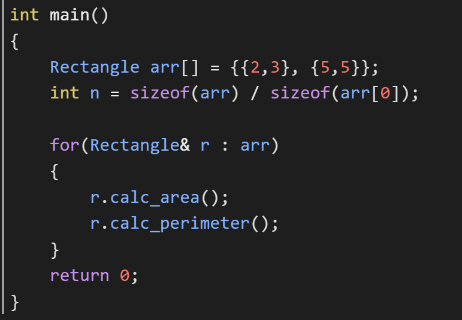
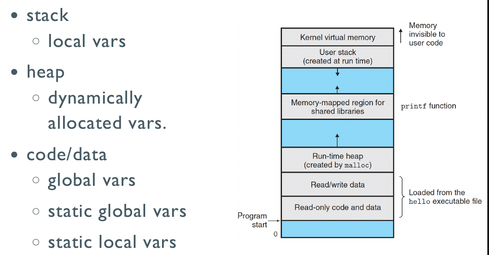

# 。

## starting

### assessment

50 lab | 50 final exam on PTA

### c++

first try !

```c++
# include <iostream>
using namespace std;

int main()
{
    cout << "Hello,world" << endl;
    return 0;
}
```

---

## Using Objects

### The string class

* You must add this at the head of you code `#include <string>`
* Define variable of string like other types `string str;`
* Initialize it with string content `string str = "Hello";`
* Read / Write string with cin / cout `cin >> str;`, `cout << str;`

- [ ] Assignment


```c++
char cstr1[28];
char cstr2[28] = "jaguar";

string str1;
string str2 = "panther";

cstr1 = cstr2; // illegal
str1 = str2; // legal
```

* 上面有`using namespace std;`，可以直接`string`；否则要`std::string`

- [ ] Concatenation

```c++
string str3;
str3 = str1 + str2;
str1 += str2;
str1 += "a string literal";
```

- [ ] Constructors

```c++
string (const char *cp, int len);
string (const string& s2, int pos);
string (const string& s2, int pos, int len);
```

- [ ] Sub-string

```C++
substr (int pos, int len);
```

- [ ] Modification

```c++
assign (...);
insert (...);
erase(...);
append(...);
replace(...);
```

- [ ] Search

```c++
find (const string& s);
```

- [x] e.g.

```c++
string str3 = "Hello, china";
string str4("Hello, zju");
string str5(str3);
string str6(str3, 7, 5); // china
string str7 = str3.substr(7, 5); // china

string str8 = str3;
str8.replace(7, 5, "hangzhou"); // Hello, hangzhou
str8.assign(10. 'A'); // AAAAAAAAAA

string str9 = "hello, hangzhou city";
cout << "str9 = " << str9 << endl;
string str_to_find = "hangzhou";
cout << str9.find(str_to_find) << endl; // 7
str9.replace(str9.find(str_to_find), str_to_find.length(), "beijing"); // hello, beijing city
```

### File I/O

```c++
#include <ifstream> // read from file
#include <ofstream> // write to file
#include <fstream>

ofstream File1("C:\\test.txt");
File1 << "Hello" << std::endl;

ifstream File2("C:\\test.txt"); // 读入时空格会断开
std::string str;
File2 >> str;
```

### Make them sorted

```c++
int main()
{
    int arr[] = {64, 25, 12, 22, 11};
    int n = sizeof(arr)/sizeof(arr[0]);
    
    selection_sort(arr, n);
    return 0;
}
```

引用类型：

```c++
void swap(int& a, int& b)
{
    ...
}
```

函数重载（两个同名函数是允许的）:

```c++
void print_array(int arr[], int n)
{
    ...
}
void print_array(double arr[], int n)
{
    ...
}
```

模板:

```c++
template<typename T>
void print_array(T arr[], int n)
{
    for(int i = 0; i < n; ++i)
        std::cout << arr[i] << ' ';
    std::cout << '\n';
}
```

```c++
template<typename T>
void swap(T& a, T& b)
{
    T tmp = a;
    a = b;
    b = tmp;
}
```

自定义操作：

```c++
struct Student
{
    int id;
    std::string name;
    
    bool operator<(const Student& s){
        return id < s.id;
    }
};
```

```c++
struct Student
{
    int id;
    std::string name;
};
bool operator<(const Student& s1, const Student& s2){
    return s1.id < s2.id;
    // return s1.name < s2.name;
}
std::ostream& operator<<(std::ostring& out, const Student& s){
    return out << "(" << s.id << "," << s.name << ")";
}
```

类：

```c++
class Rectangle{
private:
    double w, h;
    double area, perimeter;
public:
    Rectangle(double w, double h) : w(w), h(h) {}
    // 字段(参数)
    void calc_area(){
        area = w * h;
    }
    void calc_perimeter(){
        perimeter = 2 * (w + h);
    }
};
```



Rectangle、Circle和Triangle都可以有周长和面积两个参数，为不重复：

```c++
class Shape {
    protected:
    	double area, perimeter;
    public:
    	virtual ~Shape(){} // 析构函数
    	virtual void calc_area() = 0; // 虚函数
    	virtual void calc_perimeter() = 0;
    	virtual std::string name() const = 0;
    	// 调用的时候不改变，用const
    	friend std::ostream& operator<<(std::ostream&, const Shape&);
    	// 可以定义访问函数，也可以用friend
};
class Rectangle : public Shape { // 从中派生/继承
    private:
    	int w, h;
    public:
    	void calc_area() override {
            // override可以不加，但是加上更清楚
            area = w * h;
        }
    	std::string name() const override {
            return "Rectangle";
        }
};
class Circle : public Shape {
    ...
};
std::ostream& operator<<(std::ostream& out, const Shape& s)
{
    return out << "(" << s.name() << ":" s.area << "," << s.perimeter << ")";
    // 用上述模板时需要更改，否则输出的是地址
    // template<typename T>
	// void print_array(T* arr[], int n)
}
int main()
{
    Shape arr[] = {Rectangle(2,3), Circle(3), Triangle(2,3,4)};
    // 这样会发生截断！
    // Rectangle中包含Shape和w、h，但是放进Shape中就只有Shape内定义的周长和面积了
    // 修改：Shape指针
}
```

修改后：

```c++
int main()
{
    Shape* arr[] = {new Rectangle(2,3), new Circle(3),  new Triangle(2,3,4)};
    int n = sizeof(arr) / sizeof(arr[0]);
    
    for(Shape* s : arr){
        s->calc_area();
        s->calc_perimeter();
    }
    
    for(Shape* s : arr)
        delete s; // new完要及时delete
    return 0;
}
```

### STL

> STL =  Standard Template Library
>
> Part of the ISO Standard C++ Library
>
> Data Structures and algorithms for C++

#### Containers

- Sequential

  `array`(static),`vector`(dynamic),`deque`(double-ended queue),`forward_list`(singly-linked),`list`(doubly-linked)

- Associative

  `set`(collection of unique keys),`map`(collection of key-value pairs),`multiset`,`multimap`

- Unordered associative

  *hashed* by keys

  `unordered_set`,`unordered_map`,`unordered_multiset`,`unordered_multimap`

- Adaptors

  `stack`,`queue`,`priority_queue`

- [ ] vector

```c++
#include <iostream>
#include <vector>
using namespace std;

int main(){
    vector<int> x;
    for(int a = 0; a < 1000; a++)
        x.push_back(a);
    
    vector<int>::iterator p; // 迭代器
    for(p = x.begin(); p < x.end(); p++) // 可以上面不定义，这里 auto p
        cout << *p << " ";
    // for(int e : x) cout << e << " ";
}
```

- [ ] list

```c++
#include <iostream>
#include <string>
#include <list>
using namespace std;

int main(){
    list<string> s;
    s.push_back("hello");
    s.push_back("world");
    
    list<string>::iterator p;
    for(p = s.begin(); p != s.end(); p++) // 终结条件!=
        cout << *p << " ";
}
```

- [ ] map

lookup by *key*, and retrieve a *value*

```c++
#include <iostream>
#include <map>
#include <string>
using namespace std;

int main(){
    map<string, float> price;
    price["snapple"] = 8.74;
    price["coke"] = 0.50;
    
    string item;
    double total = 0;
    while (cin >> item){
        // if(price_list.contains(item))
        total += price[item]; // 如果没有这个item，会自动加入到map中
    }
}
```

#### Algorithms

words on a range defined as `[first, last)`

[Good talk](https://www.fluentcpp,com.getthemap)

`#include <algorithm>`

```c++
#include <algorithm>
#include <iostream>
#include <iterator>
#include <string>
#include <list>
#include <vector>
using namespace std;

int main()
{
    vector<int> v = {1,2,3,5};
    reverse(v.begin(), v.end());
    
    vector<int> u;
    // copy(v.begin(), v.end(), u.begin()); // Error!
    copy(v.begin(), v.end(), back_inserter(u));
    copy(u.begin(), u.end(), ostream_iterator<int>(cout, ", "));
    // <int>也可以写成<decltype(v)::value_type>
    
    vector<int> w(10, 8); // 10个8
    copy(v.begin(), v.end(), w.begin());
}
```

Typedef:

```c++
map<Name,list<PhoneNum>> phonebook;
map<Name,list<PhoneNum>>::iterator finger;
// ==>
typedef PB map<Name,list<PhoneNum>>
PB phonebook;
PB::iterator finger;
```

Pitfalls - invalid iterator

```c++
list<int> L;
list<int>::iterator li;
li = L.begin();
L.erase(li);
++li; // wrong

li = L.erase(li); // right
```

## Memory Model

### Variables

```c++
int i;			// global vars
static int j;	// static global vars

void f()
{
    int k;			// local vars
    static int l;	// static local vars
    
    int *p = malloc(sizeof(int)); // allocated vars
}
```



### Pointers to objects

```c++
string s = "hello";
string *ps = &s;	// get address

(*ps).length()		// get the object, *解引用
ps->length()		// call the function
```

### Reference

```c++
char c;			// a character
char* p = &c;	// a pointer to a character
char& r = c;	// a reference to a character
// r初始化的时候就绑定了c，后续就当成c来用，不能重新绑定
```

```c++
void func (int &);
func (i * 3);	// warning of error!
// the target of a non-const reference must be an lvalue
// lvalue:左值；rvalue:右值
```

```c++
void f(int* x) { // f(&a);
    (*x)++;
}
void g(int& x) { // g(a);
    x++; // same effect as in f()
}
```

```c++
int&* p;			// illegal
void f(int*& p);	// ok
```

### Dynamically Allocated Memory

