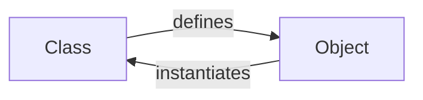

# 。

## starting

### assessment

50 lab | 50 final exam on PTA

| 参考资料 | [zhang-each](https://zhang-each.github.io/My-CS-Notebook/PL/CPP/OOP-Review/) | [yaoyaoling](https://yaoyaolingbro.github.io/notebook/ZJU_CS/oop/) |

### c++

first try !

```c++
# include <iostream>
using namespace std;

int main()
{
    cout << "Hello,world" << endl;
    return 0;
}
```

---

## Using Objects

### The string class

* You must add this at the head of you code `#include <string>`
* Define variable of string like other types `string str;`
* Initialize it with string content `string str = "Hello";`
* Read / Write string with cin / cout `cin >> str;`, `cout << str;`

- [ ] Assignment


```c++
char cstr1[28];
char cstr2[28] = "jaguar";

string str1;
string str2 = "panther";

cstr1 = cstr2; // illegal
str1 = str2; // legal
```

* 上面有`using namespace std;`，可以直接`string`；否则要`std::string`

- [ ] Concatenation

```c++
string str3;
str3 = str1 + str2;
str1 += str2;
str1 += "a string literal";
```

- [ ] Constructors

```c++
string (const char *cp, int len);
string (const string& s2, int pos);
string (const string& s2, int pos, int len);
```

- [ ] Sub-string

```C++
substr (int pos, int len);
```

- [ ] Modification

```c++
assign (...);
insert (...);
erase(...);
append(...);
replace(...);
```

- [ ] Search

```c++
find (const string& s);
```

- [x] e.g.

```c++
string str3 = "Hello, china";
string str4("Hello, zju");
string str5(str3);
string str6(str3, 7, 5); // china
string str7 = str3.substr(7, 5); // china

string str8 = str3;
str8.replace(7, 5, "hangzhou"); // Hello, hangzhou
str8.assign(10. 'A'); // AAAAAAAAAA

string str9 = "hello, hangzhou city";
cout << "str9 = " << str9 << endl;
string str_to_find = "hangzhou";
cout << str9.find(str_to_find) << endl; // 7
str9.replace(str9.find(str_to_find), str_to_find.length(), "beijing"); // hello, beijing city
```

### File I/O

```c++
#include <ifstream> // read from file
#include <ofstream> // write to file
#include <fstream>

ofstream File1("C:\\test.txt");
File1 << "Hello" << std::endl;

ifstream File2("C:\\test.txt"); // 读入时空格会断开
std::string str;
File2 >> str;
```

### Make them sorted

```c++
int main()
{
    int arr[] = {64, 25, 12, 22, 11};
    int n = sizeof(arr)/sizeof(arr[0]);
    
    selection_sort(arr, n);
    return 0;
}
```

引用类型：

```c++
void swap(int& a, int& b)
{
    ...
}
```

函数重载（两个同名函数是允许的）:

```c++
void print_array(int arr[], int n)
{
    ...
}
void print_array(double arr[], int n)
{
    ...
}
```

模板:

```c++
template<typename T>
void print_array(T arr[], int n)
{
    for(int i = 0; i < n; ++i)
        std::cout << arr[i] << ' ';
    std::cout << '\n';
}
```

```c++
template<typename T>
void swap(T& a, T& b)
{
    T tmp = a;
    a = b;
    b = tmp;
}
```

自定义操作：

```c++
struct Student
{
    int id;
    std::string name;
    
    bool operator<(const Student& s){
        return id < s.id;
    }
};
```

```c++
struct Student
{
    int id;
    std::string name;
};
bool operator<(const Student& s1, const Student& s2){
    return s1.id < s2.id;
    // return s1.name < s2.name;
}
std::ostream& operator<<(std::ostring& out, const Student& s){
    return out << "(" << s.id << "," << s.name << ")";
}
```

类：

```c++
class Rectangle{
private:
    double w, h;
    double area, perimeter;
public:
    Rectangle(double w, double h) : w(w), h(h) {}
    // 字段(参数)
    void calc_area(){
        area = w * h;
    }
    void calc_perimeter(){
        perimeter = 2 * (w + h);
    }
};
```


Rectangle、Circle和Triangle都可以有周长和面积两个参数，为不重复：

```c++
class Shape {
    protected:
    	double area, perimeter;
    public:
    	virtual ~Shape(){} // 析构函数
    	virtual void calc_area() = 0; // 虚函数
    	virtual void calc_perimeter() = 0;
    	virtual std::string name() const = 0;
    	// 调用的时候不改变，用const
    	friend std::ostream& operator<<(std::ostream&, const Shape&);
    	// 可以定义访问函数，也可以用friend
};
class Rectangle : public Shape { // 从中派生/继承
    private:
    	int w, h;
    public:
    	void calc_area() override {
            // override可以不加，但是加上更清楚
            area = w * h;
        }
    	std::string name() const override {
            return "Rectangle";
        }
};
class Circle : public Shape {
    ...
};
std::ostream& operator<<(std::ostream& out, const Shape& s)
{
    return out << "(" << s.name() << ":" s.area << "," << s.perimeter << ")";
    // 用上述模板时需要更改，否则输出的是地址
    // template<typename T>
	// void print_array(T* arr[], int n)
}
int main()
{
    Shape arr[] = {Rectangle(2,3), Circle(3), Triangle(2,3,4)};
    // 这样会发生截断！
    // Rectangle中包含Shape和w、h，但是放进Shape中就只有Shape内定义的周长和面积了
    // 修改：Shape指针
}
```

修改后：

```c++
int main()
{
    Shape* arr[] = {new Rectangle(2,3), new Circle(3),  new Triangle(2,3,4)};
    int n = sizeof(arr) / sizeof(arr[0]);
    
    for(Shape* s : arr){
        s->calc_area();
        s->calc_perimeter();
    }
    
    for(Shape* s : arr)
        delete s; // new完要及时delete
    return 0;
}
```

### STL

> STL =  Standard Template Library
>
> Part of the ISO Standard C++ Library
>
> Data Structures and algorithms for C++

#### Containers

- Sequential

  `array`(static),`vector`(dynamic),`deque`(double-ended queue),`forward_list`(singly-linked),`list`(doubly-linked)

- Associative

  `set`(collection of unique keys),`map`(collection of key-value pairs),`multiset`,`multimap`

- Unordered associative

  *hashed* by keys

  `unordered_set`,`unordered_map`,`unordered_multiset`,`unordered_multimap`

- Adaptors

  `stack`,`queue`,`priority_queue`

- [ ] vector

```c++
#include <iostream>
#include <vector>
using namespace std;

int main(){
    vector<int> x;
    for(int a = 0; a < 1000; a++)
        x.push_back(a);
    
    vector<int>::iterator p; // 迭代器
    for(p = x.begin(); p < x.end(); p++) // 可以上面不定义，这里 auto p
        cout << *p << " ";
    // for(int e : x) cout << e << " ";
}
```

- [ ] list

```c++
#include <iostream>
#include <string>
#include <list>
using namespace std;

int main(){
    list<string> s;
    s.push_back("hello");
    s.push_back("world");
    
    list<string>::iterator p;
    for(p = s.begin(); p != s.end(); p++) // 终结条件!=
        cout << *p << " ";
}
```

- [ ] map

lookup by *key*, and retrieve a *value*

```c++
#include <iostream>
#include <map>
#include <string>
using namespace std;

int main(){
    map<string, float> price;
    price["snapple"] = 8.74;
    price["coke"] = 0.50;
    
    string item;
    double total = 0;
    while (cin >> item){
        // if(price_list.contains(item))
        total += price[item]; // 如果没有这个item，会自动加入到map中
    }
}
```

#### Algorithms

words on a range defined as `[first, last)`

[Good talk](https://www.fluentcpp,com.getthemap)

`#include <algorithm>`

```c++
#include <algorithm>
#include <iostream>
#include <iterator>
#include <string>
#include <list>
#include <vector>
using namespace std;

int main()
{
    vector<int> v = {1,2,3,5};
    reverse(v.begin(), v.end());
    
    vector<int> u;
    // copy(v.begin(), v.end(), u.begin()); // Error!
    copy(v.begin(), v.end(), back_inserter(u));
    copy(u.begin(), u.end(), ostream_iterator<int>(cout, ", "));
    // <int>也可以写成<decltype(v)::value_type>
    
    vector<int> w(10, 8); // 10个8
    copy(v.begin(), v.end(), w.begin());
}
```

Typedef:

```c++
map<Name,list<PhoneNum>> phonebook;
map<Name,list<PhoneNum>>::iterator finger;
// ==>
typedef PB map<Name,list<PhoneNum>>
PB phonebook;
PB::iterator finger;
```

Pitfalls - invalid iterator

```c++
list<int> L;
list<int>::iterator li;
li = L.begin();
L.erase(li);
++li; // wrong

li = L.erase(li); // right
```

---

## Memory Model

### Variables

```c++
int i;			// global vars
static int j;	// static global vars

void f()
{
    int k;			// local vars
    static int l;	// static local vars
    
    int *p = malloc(sizeof(int)); // allocated vars
}
```


### Pointers to objects

```c++
string s = "hello";
string *ps = &s;	// get address

(*ps).length()		// get the object, *解引用
ps->length()		// call the function
```

### Reference

```c++
char c;			// a character
char* p = &c;	// a pointer to a character
char& r = c;	// a reference to a character
// r初始化的时候就绑定了c，后续就当成c来用，不能重新绑定
```

```c++
void func (int &);
func (i * 3);	// warning of error!
// the target of a non-const reference must be an lvalue
// lvalue:左值；rvalue:右值
```

```c++
void f(int* x) { // caller: f(&a);
    (*x)++;
}
void g(int& x) { // caller: g(a);
    x++; // same effect as in f()
}
```

```c++
int&* p;	// illegal
void f(int*& p);	// ok
```

…(这一块还有点不太懂)3.22？

### Dynamically Allocated Memory

```c++
new int;
new Stash;
new int[10];

delete p;
delete[] p;
```

`new`不仅会分配内存，还会执行对象的构造函数进行初始化。

同理，`delete`先执行析构函数（析构数组时从后往前，如id从5到0），再释放内存。

```c++
int *p = new int;
int *a = new int[10];
// int *a = new int[10](); ()用来初始化
delete p;
delete[] a;

Student *q = new Student();
Student *r = new Student[10];
delete q;
delete[] r;
```

不能对同一片内存delete两次，但是可以delete空指针。

```c++
int *a = new int[10]();
delete[] a;
a = nullptr;
delete[] a;
```

内存泄漏 Memory Leak：

```c++
int *p = new int;
*p = 123;
p = new int;
```

上述代码中原来存储了123的内存空间已经没有指针指向了，因此不能访问也不能删除，造成了内存泄漏。

### Constant

```c++
const int x = 123;
x = 27; // illegal
x++; // illegal

int y = x; // ok
const int z = y; // ok
```

编译器存在符号表中，直接嵌到代码里，不会分配内存存储，也不能在连接单元外使用。

```c++
const int size = 12;
int grade[size]; // ok

int x;
cin >> x;
const int size2 = x;
double average[size2]; // illegal
```

```c++
int a[] = {53, 54, 55};

int * const p = a; // p is const
*p = 20; // ok
p++; // error

const int *p = a; // (*p) is const
*p = 20; // error
p++; // ok
```

```c++
int i;
const int ci = 3;

int *ip;
const int *cip;

ip = &i;
ip = &ci; // error
cip = &i;
cip = &ci;
```

`char *s = "hello,world"`等同于`const char *s`，不可以修改。

```c++
const char *s1 = "Hello";
const char *s2 = "Hello";
cout << (void *)s1 << endl;
cout << (void *)s2 << endl;
// 输出s1和s2的地址，结果是一样的
```

传递参数的时候需要复制，开销很大，可以用pointer或reference来传递参数/不需要改值的时候传递constant：

```c++
struct Student{
    int id;
    char address[1000];
};
void foo(const Student *ps)
{
    cout << ps->id << endl;
    cout << (*ps).id << endl;
}
void bar(const Student &s)
{
    cout << s.id << endl;
}
int main()
{
    Student s;
    s.id = 2;
    foo(&s);
    bar(s);
}
```

---

## Class

### Class (Struct)

Objects = Attributes + Services

`struct`中不写`private`限定符，默认数据是`public`的（为了和c兼容），`class`则正好相反，不写`public`则默认是`private`的。



OOP Characteristics:

- Everything is an object.
- A program is a bunch of objects telling each other what to do by sending messages.
- Each object has its own memory made up of other objects.
- Every object has a type. 
- All objects of a particular type can receive the same messages.

> ::是运算符中等级最高的，它分为三种:
>
> 1)global scope(全局作用域符），用法（::name)。
>
> 2)class scope(类作用域符），用法(class::name)。
>
> 3)namespace scope(命名空间作用域符），用法(namespace::name)。
>
> 都是左关联（left-associativity)，作用都是为了更明确的调用想要的变量
>
> <div style="text-align:right"><a href="https://blog.csdn.net/weixin_40787463/article/details/106001960">---- link</a></div>

通过头文件对函数进行封装：

```c++
class Point{
private:
    int x, y;
public:
    void init(int x, int y)
    {
        this->x = x;
        this->y = y;
    }
    void print()
    {
        cout << "Point at (" << x << "," << y << ")\n"; 
    }
    void move(int dx, int dy)
    {
        x += dx;
        y += dy;
    }
};
int main()
{
    Point p;
    p.init(2, 3);
    p.print();
    p.move(5, 4);
    p.print();
}
```

```c++
// point.h
#ifndef _POINT_H_
#define _POINT_H_
class Point{
private:
    int x, y;
public:
    void init(int x, int y);
    void print();
    void move(int dx, int dy);
};
#endif
// 头文件中不能出现全局变量，但是可以有extern
// Only declarations are allowed to be in .h

// point.cpp
#include <iostream>
#include "point.h"
void Point::init(int x, int y)
{
    ...
}

// compile: g++ main.cpp point.cpp -o main
```

CMake来生成当前编译环境下的可执行文件:


```cmd
vim CMakeLists.txt
	cmake_minimum_required(VERSION 2.8.9)
	project(hello)
	add_executable(hello main.cpp point.cpp)
mkdir build
cd ./build
cmake ..
make
./hello
```

### Object Interaction

- 构造函数：可以无参也可以带参数，默认执行，可以有多个构造函数

- 析构函数：对象销毁（出生命周期）的时候一定会执行，无参，只有一个

- 对象生命周期：花括号后对象的生命周期就结束了
  ```c++
  int main()
  {
      cout << "before opening brace" << endl;
      {
          cout << "after opening brace" << endl;
          Tree(12);
          cout << "before closing brace" << endl;
      }
      cout << "after closing brace" << endl;
  }
  // before opening brace
  // after opening brace
  // inside Tree::Tree()
  // before closing brace
  // inside Tree::~Tree()
  // after opening brace
  ```

- 无特殊处理时，编译器会自动生成（有指针时要自己写，否则可以默认）
  ```c++
  A(){};
  ~A(){};
  A(const A&); // copy
  A& operator=(const A&);
  ```

  已经定义函数，则不会自动生成：
  ```c++
  struct Y
  {
      int i;
      Y(int a){i = a;};
  };
  int main()
  {
      Y y[3] = {Y(2), Y(1)};
  }
  // error，默认调用缺省初始函数Y()，但是找不到
  ```

- 初始化列表：（按照声明中顺序初始化，而不是按初始化列表中的顺序，析构函数中按反序。如果类中有const成员，需要在此初始化）
  ```c++
  struct Y{
      int i;
      Y(int ii){
          i = ii;
          cout << "Y::Y(int)" << endl;
      }
  };
  struct X{
      Y y;
      X() : y(10) {
          cout << "X::X()" << endl;
      }
  };
  int main()
  {
      X x;
  }
  // Y::Y(int)
  // X::X()
  ```

- const and non-const objects
  ```c++
  // non-const
  Date when(1,2,2001);
  int day = when.get_day(); // ok
  when.set_day(13); // ok
  
  // const
  const Date birthday(12,25,1994);
  int day = birthday.get_day(); // ok
  birthday.set_day(14); // ERROR
  ```

- make the const value static (one per class, not one per object)
  ```c++
  class Students{
      const int size;
      int array[size]; // ERROR
  }
  
  >>> static const int size = 100;
  ```

- inline把函数实体在调用函数的地方展开了，就不会有函数调用开销（在类中定义的函数自动为inline，头文件中使用inline确保不会在include时多重定义）
  ```c++
  inline int f(int a, int n)
  ```

---

## Composition & Inheritance

### Composition

construct new object with existing objects: `has-a`

```c++
class Person {...};
class Currency {...};
class SavingsAccount {
public:
    SavingsAccount(
    	const string& name,
    	const string& addr,
    	int cents);
    ~SavingsAccount();
    void print();
private:
    Person m_saver;
    Currency m_balance;
};
SavingsAccount::SavingsAccount(
	const string& name, const string& addr, int cents)
   : m_saver(name, addr), m_balance(0, cents){};
void SavingsAccount::print()
{
    m_saver.print();
    m_balance.print();
}
```

### Inheritance

clone an existing class and extend it: `is-a`

```c++
struct A{ // Base Class
    int x, y, z;
};
struct B{
    A a;
};
struct C : public A{}; // Derived Class
int main()
{
    B b; // B has-a A
    C c; // C is-a specialized A
}
```

类中private的数据在派生类中是不能访问的；`protected`的数据外界不能访问，但是派生类可以访问

初始化时，base class is mentioned by its class name:

```c++
Manager::Manager(const string& name,
                 const string& ssn,
                 const string& title = "")
    : Employee(name, ssn), m_title(title) {}
```

```c++
void Manager::print(ostream& out) const
{
    Employee::print(out); // call the base class print
    out << m_title << endl;
}
const string Manager::title_name() const
{
    return string(m_title + ": " + m_name);
    // access base m_name
}
```

