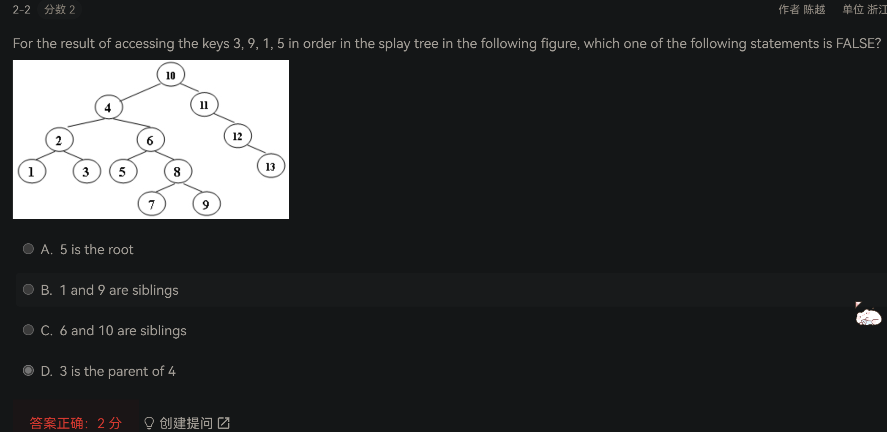
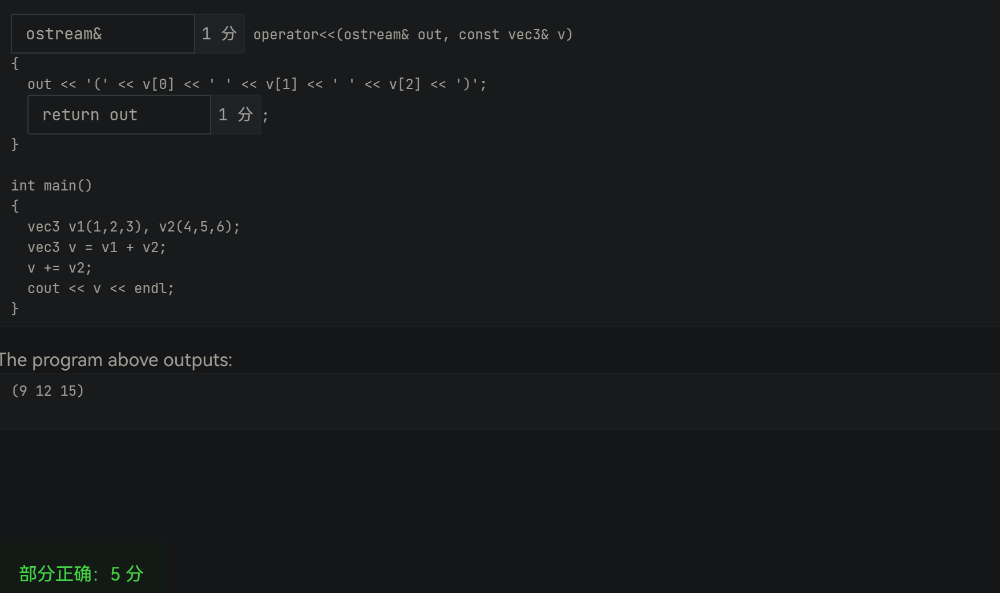

# ADS

## hw1





编程题：Root of AVL Tree

## hw2


编程题：Self-printable B+ Tree

## hw3


编程题：Document Distance

## hw4


程序填空题比大小搞反了

## hw5


## hw6


编程题：Werewolf

## hw7


## midterm

。。。https://pintia.cn/problem-sets/1781129330240528384/exam/problems/type/1

## hw8


函数题：Programming Contest

## hw9


编程题：To Fill or Not to Fill

## hw10


- [ ] 正解：

补充题目可以看这里：https://blog.csdn.net/HGGshiwo/article/details/118367178


---

# OOP

## hw1.5


## hw2.5


- [x] 正解：C (20 pointers)


## hw3.5

```c++
#include <iostream>

struct X {
    X() {
        std::cout << "X::X()" << std::endl;
    }
    ~X() {
        std::cout << "X::~X()" << std::endl;
    }
};

struct Y {
    Y() {
        std::cout << "Y::Y()" << std::endl;
    }
    ~Y() {
        std::cout << "Y::~Y()" << std::endl;
    }
};

struct Parent {
    Parent() {
        std::cout << "Parent::Parent()" << std::endl;
    }
    ~Parent() {
        std::cout << "Parent::~Parent()" << std::endl;
    }
    X x;
};

struct Child : public Parent {
    Child() {
        std::cout << "Child::Child()" << std::endl;
    }
    ~Child() {
        std::cout << "Child::~Child()" << std::endl;
    }
    Y y;
};

int main() {
    Child c;
}
```


## hw4.5

```c++
#include <iostream>
using namespace std;

class A
{
public:
  A(int i) : mi(i) {}
  A(const A& rhs) : mi(rhs.mi)
  {
    cout << "A::A(&)" << endl;
  }
  A& operator=(const A&rhs)
  {
    mi = rhs.mi;
    cout << "A::operator=()" << endl;
    return *this;
  }
  virtual void f()
  {
    cout << "A::f(), " << mi << endl;
  }
protected:
  int mi;
};

class B : public A
{
public:
  B(int i, int j) : A(i), mj(j) {}
  void f() override
  {
    cout << "B::f(), " << mi << ", " << mj << endl;
  }
private:
  int mj;
};

int main()
{
  A a1(1);
  B b(3,4);

  A& ra = b;
  ra.f();
  ra = a1;
  ra.f();

  A a2 = b;
  a2.f();
}
```


## hw5.5




## hw6.5


---

# 诚信守则

F:11、15、20、21、30、31、34、56


