# 。

| 参考资料 | [鹤翔万里](https://note.tonycrane.cc/cs/tcs/toc/) | [Chritch](https://obsidian.zerokei.top/Hub/Compute%20Theory/) | [HobbitQ](https://note.hobbitqia.cc/TCS/) |

### Grading

| 10 HW | 20 Quizzes | 70 Final exam 

### Basic Questions

- What are the fundamental limitations of computers?
  Computability / Undecidability (可计算性/计算的边界)

- What makes problems hard/easy? (=>>课程<计算复杂性>)

  Problem classification

### Course Overview

Sets, logic, infinities, notation, proof types

Formal languages/grammars/machines

Computability/undecidability

NP - completeness, complexity

## 1-Sets, Relations, and Languages

### Sets

an **unordered** collection of elements

empty set $\emptyset$, subset $\subseteq$, proper subset $\subset$, equal ＝

power set:  $2^S$ = set of all subset of S

Union, Intersection, Difference, Symmetric difference, complement

partition 划分

### Relations and Functions

:anchor: set和logic（底层的工具）$\Rightarrow$ Relations（计算机内离散数据表现为关系）$\rightarrow$ set，matrix，graph

Ordered Pair: $(a,b)=(c,d)\Leftrightarrow (a=c)\wedge (b=d)$

Cartesian Product: $A\times B=\{ (a,b)\mid a\in A\wedge b\in B \}$

Binary Relation on A and B: $R\subseteq A\times B$

Inverse: $R\subseteq A\times B\Rightarrow R^{-1}\subseteq B\times A$

Function(对于a有唯一b): write $(a,b)\in f$ as $f(a)=b$

### Special Types of Binary Relations

- Representation of Relations: directed graph, adjacency matrix

- Properties of Relations: reflexive, symmetric, antisymmetric, transitive

- Equivalence Relation: reflexive, symmetric, transitive

  <u>Theorem</u>: Let R be an equivalence relation on a nonempty set A. Then the equivalence classes of R constitute a partition of A.

- Partial Order: reflexive, antisymmetric, transitive

全部能比较-全序 total order；部分不能比较-偏序 partial order

### Finite and Infinite Sets

Equinumerous 相等

- Sets A and B equinumerous $\Leftrightarrow$ bijection 双射 $f:A\rightarrow B$

- Cardinality(基数) and generalized Cardinality
- Finite and Infinite Sets

Countable and Uncountable Infinite

- A set is said to be **countably infinite** $\Leftrightarrow$ it is equinumerous with $\mathbb{N}$
- S is an **uncountable** set $\Leftrightarrow |S|\gt |\mathbb{N}|$

The union of a countably infinite collection of countably infinite sets is countably infinite.(e.g. $\mathbb{N}\times \mathbb{N}$ is countably infinite.)

<u>Theorem</u>:$|\mathbb{R}|\gt |\mathbb{N}|$

<u>Question</u>: is $|\mathbb{R}|\gt |(0,1)|$ ？($f(x)=\frac1{\pi}\arctan(x)+\frac12$)

### Three Fundamental Proof Techniques

The Principle of Mathematical Induction

The Pigeonhole Principle

The Diagonalization Principle

<u>Theorem</u>: The set $2^N$ is uncountable. (0,1) is uncountable.

### Closures

The **Transitive Closure**: the “smallest” relation that includes R and is transitive (usually called $R^+$)

Reflexive, transitive closure of R is usually denoted $R^*$

### Alphabet and Language

#### Alphabet: finite set of symbols

- String: finite symbol sequence（无理数:x:）
- Length: #(number) of symbols
- Empty string: $e$

#### Operations of Strings:

- Concatenation: $x\circ y=xy$

- String exponentiation: $w^0=e,\;w^{i+1}=w^i\circ w\;(i\ge 0)$

- Reversal: 
  $$
  w^R=w=e\;(w\text{ is a string of length 0})\\
  w=ua\text{ for some }a\in\Sigma\text{, and }w^R=au^R\;(\text{length }n+1\gt 0)
  $$

#### Language: set of strings

- $\Sigma$-alphabet, $\Sigma^*$-the set of all strings($e\in \Sigma^*$)
- language $L\subseteq\Sigma^*$
- $\empty$（空语言）, $\Sigma$ and $\Sigma^*$ are languages

:o:空语言中连空串都没有 $\empty \ne \{e \}$

finite language(有限语言)中串的个数是有限个 / infinite language

> <u>Theorem</u>: If $\Sigma$ is a finite alphabet, then $\Sigma^*$ is countably infinite set.
>
> 语言L是$\Sigma^*$的子集，（而$\Sigma^*$是可数无限的）因此语言是不可数无限的

#### Operations of Languages:

- Union, Intersection, Difference, Complement($\overline A=\Sigma^*-A$)

- Concatenation: $L_1L_2=\{w_1w_2\mid w_1\in L_1\wedge w_2\in L_2 \}$
  $$
  L^0=\{e \}\\
  L^{i+1}=LL^i\text{, for each }i\ge 0
  $$

- Kleene Star: 
  $$
  \begin{aligned}
  L^*
  &=\{w\in\Sigma^*:w=w_1\cdots w_k,k\ge 0,w_1,\dots,w_k\in L \}\\
  &=L^0\cup L^1\cup L^2\cup\cdots\\
  &L^+=L^1\cup L^2\cup\cdots
  \end{aligned}
  $$

$L^*$和$L^+$可能相差一个空串

:o: $\empty^*=\{e \}$，$L^+=LL^*$，$(L^*)^*=L^*;L\empty=\empty L=\empty$（空语言，不是空串）

### Finite Representations of Languages

#### finite representations（有限表示）：

must be a string, different languages to have different representations.不同语言有不同的表示（但是同一个语言的表示可能不唯一）

表示是可数无限的（$\Sigma^*$），语言是不可数无限的（$2^{\Sigma^*}$），因此大量语言没有有限表示（如，分数是有限表示，但无理数没有有限表示）

#### Regular Expression（正则表达式）：

如果一个语言能够找到有限表示，就把这个表示叫做正则表示​​

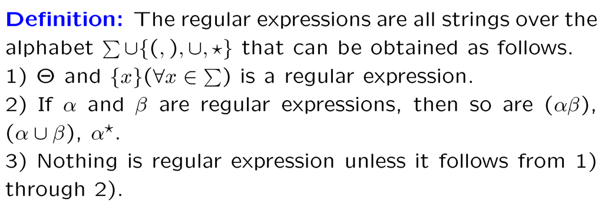

有正则表示的是最简单的语言，很多语言没有正则表示，比如$a^nb^n$

有限语言的问题不必谈算法，都可解因为可以穷举（比如棋类问题，但是计算复杂性可能会很高）（在正则表示方面表现为可以用$\cup$连接）

#### $\mathcal{L}$: Function from string to languages

If $\alpha$ is any regular expression, then $\mathcal{L}(\alpha)$ is the language represented by $\alpha$. That is, $\mathcal{L}$ is a function from string to languages. And the function is defined as follows.

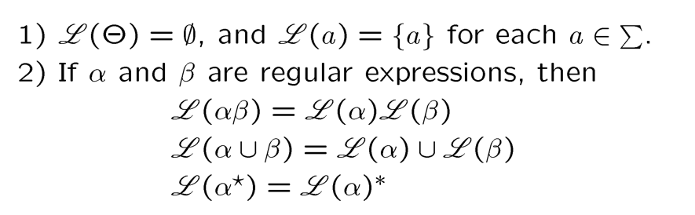

Regular Expression Identities:

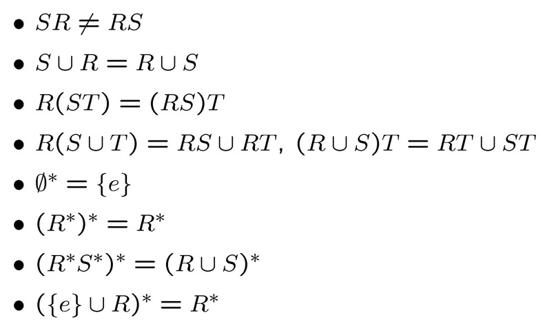

#### Remark

1. Every language that can be represented by a regular expression can be represented by <u>infinitely</u> many of them. 有限语言的正则表示不唯一
2. The class of regular languages over an alphabet $\Sigma$ is defined to consist of all languages $L$ such that $L=L(\alpha)$ for some regular expression $a$ over $\Sigma$. (precisely the closure of the set of languages) $\{\{ \sigma\}:\sigma\in\Sigma \}\cup\{\empty \}$
   :o:对单个字符和空语言进行并、连接、kleene star三种运算

3. The regular expression are an inadequate specification method in general. 很多语言没有正则表示，比如$a^nb^n$

4. Two important and useful means of representing languages:
   1. language recognition device
   2. language generators

## 2-Finite Automata

自然语言是context-sensitive:question:

The Chomsky hierachy:

|   Language type   | Automata type  |
| :---------------: | :------------: |
|      regular      |     finite     |
|   context-free    |    pushdown    |
| context-sensitive | linear bounded |
|   unrestricted    | Turing Machine |

### Deterministic Finite Automata(DFA)

Input tape（输入带）分成很多方格，只读不写，只能向右移且一次一格。状态改变取决于当前状态和读到的下一个符号。

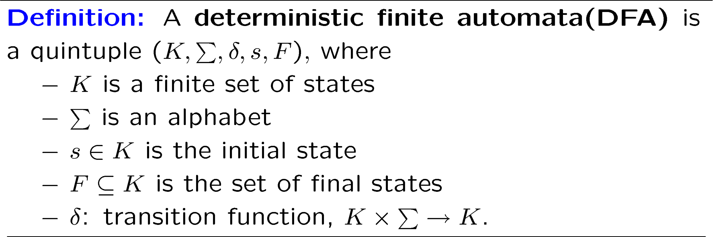

Transition function will determine **unique** next state based on current input and state.

- A **configuration** of a DFA($K,\Sigma,\delta,s,F$) is any element of $K\times\Sigma^*$ 格局（由当前状态和待读字符串决定，已经消耗的字符不影响机器的后续操作，不计入格局）

- The binary relation $\vdash_M$ between two configurations of M:
  $(q,w)\vdash_M(q^{\prime},w^{\prime})\Leftrightarrow\exists a\in\Sigma,w=aw^{\prime}\text{,and }\delta(q,a)=q^{\prime}.$
  格局与格局之间的计算关系

- The reflexive, transitive closure of $\vdash_M:\;\vdash^*_M$
  不带*是一步计算，（自反是零步计算）自反传递闭包是有限步计算

- A **string** $w\in\Sigma^*$ is said to **be accepted by** M iff there is a state $q\in F$ such that $(s,w)\vdash^*_M(q,e)$

  两个条件均满足才说串被接受：输入串全部被消耗，终结状态
  The **language accepted by** M, $L(M)$ is the set of all strings accepted by M. 

Graphical representation —— **State Diagram**

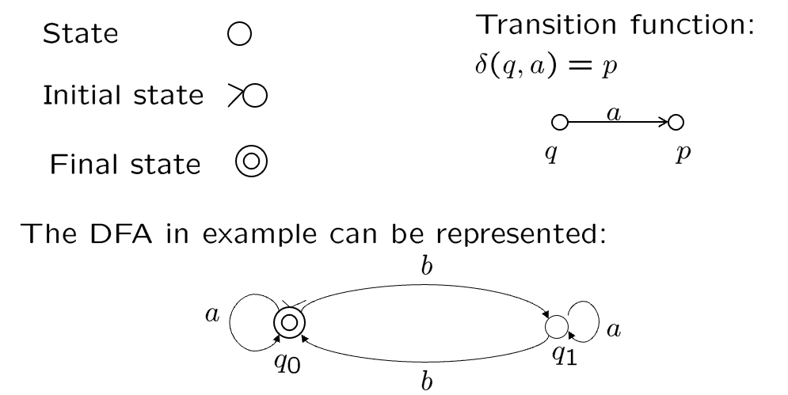

补语言（$L_2=\Sigma^*-L_1$）只需要对终结状态做补（此方法仅限DFA，这是确定和非确定型机器的一大区别:o:）

### Nondeterministic Finite Automata（NFA）

> 通过改进现有模型获得更强大的计算能力 => 计算能力一样，但是改进了计算复杂性。

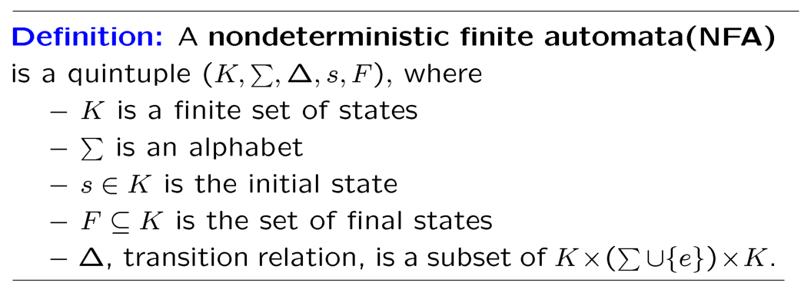

:o:（NFA中不是函数而是三元关系）函数是特殊的关系，所以DFA是NFA的特例。

计算从线性结构变成了树型结构，只要有一个计算被接受了就算串被接受，拒绝则要遍历全部计算路线。（其他定义，比如配置configuration，都和DFA一致）

有时候设计DFA很难，可以先设计成非确定的，再通过算法改成确定的

### NFA/DFA Equivalence

<u>Definition</u>: Two FA $M_1$ and $M_2$ (deterministic or nondeterministic) are **equivalenct** iff $L(M_1)=L(M_2)$.
可计算性一样，但是计算复杂性不一样。

<u>Theorem</u>: For each NFA, there is an equivalent DFA.

:package: 证明：把原来非确定机器<u>下一个状态的集合</u>当成新机器状态（下图）

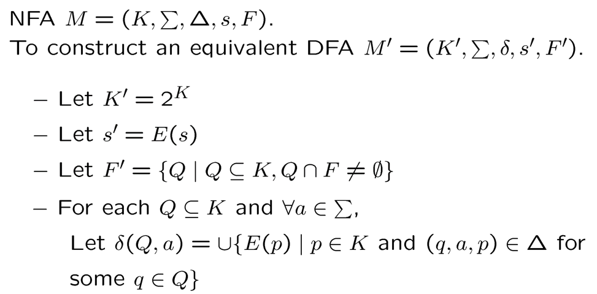

- Size of new DFA can be exponential in size of old NFA.
- The proof of theorem providers an actual algorithm for constructing an equivalent DFA form any NFA.

### Finite Automata & Regular Expression

Closure Properties （正则语言的封闭性）

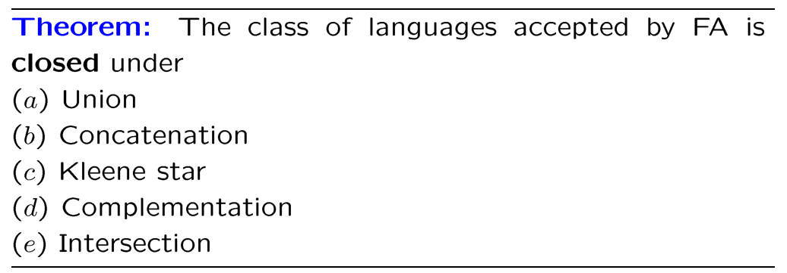

|            action            |                                                              |                            figure                            |
| :--------------------------: | :----------------------------------------------------------: | :----------------------------------------------------------: |
|            Union             |                   $L(M)=L(M_1)\cup L(M_2)$                   | 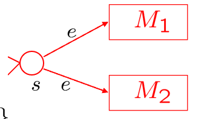 |
|        Concatenation         |                  $L(M)=L(M_1)\circ L(M_2)$                   | 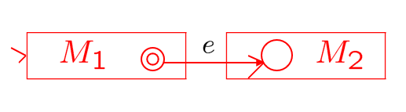 |
|         Kleene star          |                       $L(M)=L(M_1)^*$                        | 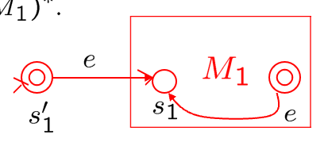 |
| Complementation (DFA: M) |          $L(M)=\overline {L(M_1)}=\Sigma^*-L(M_1)$           |                          $F=K-F_1$                           |
|  Intersection (DFA: M)   | $L(M)=L(M_1)\cap L(M_2)$ $=\Sigma^*-((\Sigma^*-L_1)\cup(\Sigma^*-L_2))$ |                      $F=F_1\times F_2$                       |

对单个字符和空语言进行并、连接、kleene star三种运算==>任意正则表达式可以用机械化方法很快画出FA

<u>Theorem</u>: A language is regular iff it’s accepted by a FA.

:package:证明：定义了$R(i,j,k)$, $L(M)=\cup\{ R(1,j,n)\mid q_j\in F \}$

<u>Theorem</u>: $R(i,j,k)$ are regular languages.

(:package:证明：数归，$R(i,j,k)=R(i,j,k-1)\cup R(i,k,k-1)R(k,k,k-1)^*R(k,j,k-1)$ )

从FA得到正则语言：特殊形式（一个终止状态，不进起点，不从终点出去），慢慢消去状态，将$R(i,j,k)$写上

### Not Regular Languages

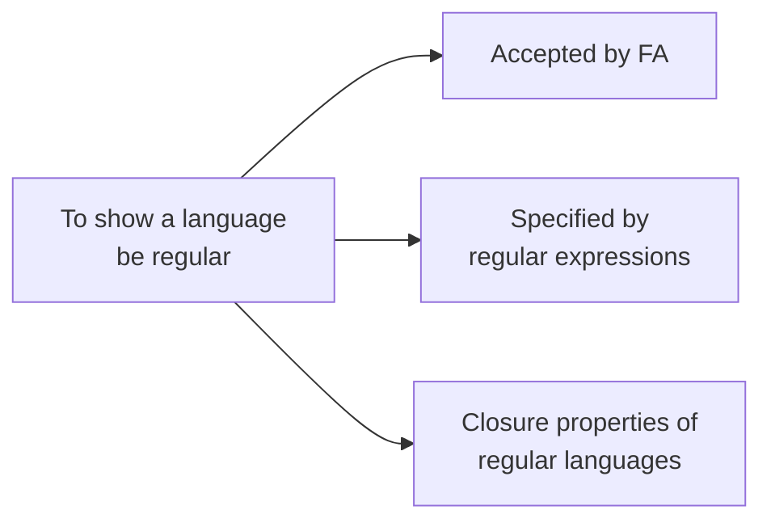

=>正则：FA/regex/封闭性

<u>Theorem</u>: **(Pumping Theorem)** 

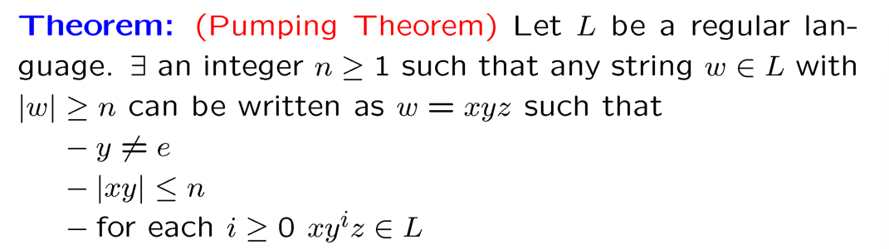

泵：必要，不能用来判断正则，可以用来判断非正则，封闭性64

65: 1y2y3n4?5y6n(反例$\Sigma^*$正则，它的子语言不一定；如$\{a,b\}^*,\{a^nb^n\}$)

### State Minimization*

To find the smallest DFA equivalent to a given DFA. (fewest states)

去掉不可达的节点，合并等价的节点

两种等价关系71 73 他们之间的关系75（机器划分的等价关系更细）

（对q3有点疑惑）

### Algorithms for FA*

。。。

## 3-Context-Free Language

context-free 上下文无关
