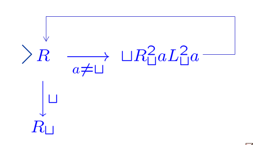
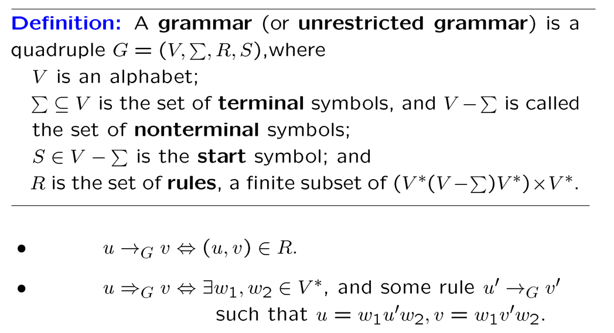

# 。

| 参考资料 | [鹤翔万里](https://note.tonycrane.cc/cs/tcs/toc/) | [Chritch](https://obsidian.zerokei.top/Hub/Compute%20Theory/) | [HobbitQ](https://note.hobbitqia.cc/TCS/) | [zju-icicles/计算理论 at master · QSCTech/zju-icicles](https://github.com/QSCTech/zju-icicles/tree/master/计算理论) |

### Grading

| 10 HW | 20 Quizzes | 70 Final exam | JXG |

### Basic Questions

- What are the fundamental limitations of computers?
  Computability / Undecidability (可计算性/计算的边界)

- What makes problems hard/easy? (=>>课程<计算复杂性>)

  Problem classification

### Course Overview

Sets, logic, infinities, notation, proof types

Formal languages/grammars/machines

Computability/undecidability

NP - completeness, complexity

## 1-Sets, Relations, and Languages

### Sets

an **unordered** collection of elements

empty set $\emptyset$, subset $\subseteq$, proper subset $\subset$, equal ＝

power set:  $2^S$ = set of all subset of S

Union, Intersection, Difference, Symmetric difference, complement

partition 划分

### Relations and Functions

:anchor: set和logic（底层的工具）$\Rightarrow$ Relations（计算机内离散数据表现为关系）$\rightarrow$ set，matrix，graph

Ordered Pair: $(a,b)=(c,d)\Leftrightarrow (a=c)\wedge (b=d)$

Cartesian Product: $A\times B=\{ (a,b)\mid a\in A\wedge b\in B \}$

Binary Relation on A and B: $R\subseteq A\times B$

Inverse: $R\subseteq A\times B\Rightarrow R^{-1}\subseteq B\times A$

Function(对于a有唯一b): write $(a,b)\in f$ as $f(a)=b$

### Special Types of Binary Relations

- Representation of Relations: directed graph, adjacency matrix

- Properties of Relations: reflexive, symmetric, antisymmetric, transitive

- Equivalence Relation: reflexive, symmetric, transitive

  <u>Theorem</u>: Let R be an equivalence relation on a nonempty set A. Then the equivalence classes of R constitute a partition of A.

- Partial Order: reflexive, antisymmetric, transitive

全部能比较-全序 total order；部分不能比较-偏序 partial order

### Finite and Infinite Sets

Equinumerous 相等

- Sets A and B equinumerous $\Leftrightarrow$ bijection 双射 $f:A\rightarrow B$

- Cardinality(基数) and generalized Cardinality
- Finite and Infinite Sets

Countable and Uncountable Infinite

- A set is said to be **countably infinite** $\Leftrightarrow$ it is equinumerous with $\mathbb{N}$
- S is an **uncountable** set $\Leftrightarrow |S|\gt |\mathbb{N}|$

The union of a countably infinite collection of countably infinite sets is countably infinite.(e.g. $\mathbb{N}\times \mathbb{N}$ is countably infinite.)

<u>Theorem</u>:$|\mathbb{R}|\gt |\mathbb{N}|$

<u>Question</u>: is $|\mathbb{R}|\gt |(0,1)|$ ？($f(x)=\frac1{\pi}\arctan(x)+\frac12$)

### Three Fundamental Proof Techniques

The Principle of Mathematical Induction

The Pigeonhole Principle

The Diagonalization Principle

<u>Theorem</u>: The set $2^N$ is uncountable. (0,1) is uncountable.

### Closures

The **Transitive Closure**: the “smallest” relation that includes R and is transitive (usually called $R^+$)

Reflexive, transitive closure of R is usually denoted $R^*$

### Alphabet and Language

#### Alphabet: finite set of symbols

- String: finite symbol sequence（无理数:x:）
- Length: #(number) of symbols
- Empty string: $e$

#### Operations of Strings:

- Concatenation: $x\circ y=xy$

- String exponentiation: $w^0=e,\;w^{i+1}=w^i\circ w\;(i\ge 0)$

- Reversal: 
  $$
  w^R=w=e\;(w\text{ is a string of length 0})\\
  w=ua\text{ for some }a\in\Sigma\text{, and }w^R=au^R\;(\text{length }n+1\gt 0)
  $$

#### Language: set of strings

- $\Sigma$-alphabet, $\Sigma^*$-the set of all strings($e\in \Sigma^*$)
- language $L\subseteq\Sigma^*$
- $\empty$（空语言）, $\Sigma$ and $\Sigma^*$ are languages

:o:空语言中连空串都没有 $\empty \ne \{e \}$

finite language(有限语言)中串的个数是有限个 / infinite language

> <u>Theorem</u>: If $\Sigma$ is a finite alphabet, then $\Sigma^*$ is countably infinite set.
>
> 语言L是$\Sigma^*$的子集，（而$\Sigma^*$是可数无限的）因此语言是不可数无限的

#### Operations of Languages:

- Union, Intersection, Difference, Complement($\overline A=\Sigma^*-A$)

- Concatenation: $L_1L_2=\{w_1w_2\mid w_1\in L_1\wedge w_2\in L_2 \}$
  $$
  L^0=\{e \}\\
  L^{i+1}=LL^i\text{, for each }i\ge 0
  $$

- Kleene Star: 
  $$
  \begin{aligned}
  L^*
  &=\{w\in\Sigma^*:w=w_1\cdots w_k,k\ge 0,w_1,\dots,w_k\in L \}\\
  &=L^0\cup L^1\cup L^2\cup\cdots\\
  &L^+=L^1\cup L^2\cup\cdots
  \end{aligned}
  $$

$L^*$和$L^+$可能相差一个空串

:o: $\empty^*=\{e \}$，$L^+=LL^*$，$(L^*)^*=L^*;L\empty=\empty L=\empty$（空语言，不是空串）

### Finite Representations of Languages

#### finite representations（有限表示）：

must be a string, different languages to have different representations.不同语言有不同的表示（但是同一个语言的表示可能不唯一）

表示是可数无限的（$\Sigma^*$），语言是不可数无限的（$2^{\Sigma^*}$），因此大量语言没有有限表示（如，分数是有限表示，但无理数没有有限表示）

#### Regular Expression（正则表达式）：

如果一个语言能够找到有限表示，就把这个表示叫做正则表示​​


有正则表示的是最简单的语言，很多语言没有正则表示，比如$a^nb^n$

有限语言的问题不必谈算法，都可解因为可以穷举（比如棋类问题，但是计算复杂性可能会很高）（在正则表示方面表现为可以用$\cup$连接）

#### $\mathcal{L}$: Function from string to languages

If $\alpha$ is any regular expression, then $\mathcal{L}(\alpha)$ is the language represented by $\alpha$. That is, $\mathcal{L}$ is a function from string to languages. And the function is defined as follows.


Regular Expression Identities:


#### Remark

1. Every language that can be represented by a regular expression can be represented by <u>infinitely</u> many of them. 有限语言的正则表示不唯一
2. The class of regular languages over an alphabet $\Sigma$ is defined to consist of all languages $L$ such that $L=L(\alpha)$ for some regular expression $a$ over $\Sigma$. (precisely the closure of the set of languages) $\{\{ \sigma\}:\sigma\in\Sigma \}\cup\{\empty \}$
   :o:对单个字符和空语言进行并、连接、kleene star三种运算

3. The regular expression are an inadequate specification method in general. 很多语言没有正则表示，比如$a^nb^n$

4. Two important and useful means of representing languages:
   1. language recognition device
   2. language generators

## 2-Finite Automata

自然语言是context-sensitive（后面提到）

The Chomsky hierachy:

|   Language type   | Automata type  |
| :---------------: | :------------: |
|      regular      |     finite     |
|   context-free    |    pushdown    |
| context-sensitive | linear bounded |
|   unrestricted    | Turing Machine |

### Deterministic Finite Automata(DFA)

Input tape（输入带）分成很多方格，只读不写，只能向右移且一次一格。状态改变取决于当前状态和读到的下一个符号。


Transition function will determine **unique** next state based on current input and state.

- A **configuration** of a DFA($K,\Sigma,\delta,s,F$) is any element of $K\times\Sigma^*$ 格局（由当前状态和待读字符串决定，已经消耗的字符不影响机器的后续操作，不计入格局）

- The binary relation $\vdash_M$ between two configurations of M:
  $(q,w)\vdash_M(q^{\prime},w^{\prime})\Leftrightarrow\exists a\in\Sigma,w=aw^{\prime}\text{,and }\delta(q,a)=q^{\prime}.$
  格局与格局之间的计算关系

- The reflexive, transitive closure of $\vdash_M:\;\vdash^*_M$
  不带*是一步计算，（自反是零步计算）自反传递闭包是有限步计算

- A **string** $w\in\Sigma^*$ is said to **be accepted by** M iff there is a state $q\in F$ such that $(s,w)\vdash^*_M(q,e)$

  两个条件均满足才说串被接受：输入串全部被消耗，终结状态
  The **language accepted by** M, $L(M)$ is the set of all strings accepted by M. 

Graphical representation —— **State Diagram**


补语言（$L_2=\Sigma^*-L_1$）只需要对终结状态做补（此方法仅限DFA，这是确定和非确定型机器的一大区别:o:）

### Nondeterministic Finite Automata（NFA）

> 通过改进现有模型获得更强大的计算能力 => 计算能力一样，但是改进了计算复杂性。


:o:（NFA中不是函数而是三元关系）函数是特殊的关系，所以DFA是NFA的特例。

计算从线性结构变成了树型结构，只要有一个计算被接受了就算串被接受，拒绝则要遍历全部计算路线。（其他定义，比如配置configuration，都和DFA一致）

有时候设计DFA很难，可以先设计成非确定的，再通过算法改成确定的

### NFA/DFA Equivalence

<u>Definition</u>: Two FA $M_1$ and $M_2$ (deterministic or nondeterministic) are **equivalenct** iff $L(M_1)=L(M_2)$.
可计算性一样，但是计算复杂性不一样。

<u>Theorem</u>: For each NFA, there is an equivalent DFA.

:package: 证明：把原来非确定机器<u>下一个状态的集合</u>当成新机器状态（下图）


- Size of new DFA can be exponential in size of old NFA.
- The proof of theorem providers an actual algorithm for constructing an equivalent DFA form any NFA.

### Finite Automata & Regular Expression

Closure Properties （正则语言的封闭性）


|            action            |                                                              |                            figure                            |
| :--------------------------: | :----------------------------------------------------------: | :----------------------------------------------------------: |
|            Union             |                   $L(M)=L(M_1)\cup L(M_2)$                   |  |
|        Concatenation         |                  $L(M)=L(M_1)\circ L(M_2)$                   |  |
|         Kleene star          |                       $L(M)=L(M_1)^*$                        |  |
| Complementation<br/>(DFA: M) |          $L(M)=\overline {L(M_1)}=\Sigma^*-L(M_1)$           |                          $F=K-F_1$                           |
|  Intersection<br/>(DFA: M)   | $L(M)=L(M_1)\cap L(M_2)$<br/>$=\Sigma^*-((\Sigma^*-L_1)\cup(\Sigma^*-L_2))$ |                      $F=F_1\times F_2$                       |

对单个字符和空语言进行并、连接、kleene star三种运算==>任意正则表达式可以用机械化方法很快画出FA

<u>Theorem</u>: A language is regular iff it’s accepted by a FA.

:package:证明：定义了$R(i,j,k)$, $L(M)=\cup\{ R(1,j,n)\mid q_j\in F \}$

<u>Theorem</u>: $R(i,j,k)$ are regular languages.

(:package:证明：数归，$R(i,j,k)=R(i,j,k-1)\cup R(i,k,k-1)R(k,k,k-1)^*R(k,j,k-1)$ )

从FA得到正则语言：特殊形式（一个终止状态，不进起点，不从终点出去），慢慢消去状态，将$R(i,j,k)$写上

### Not Regular Languages


=>正则：FA/regex/封闭性

<u>Theorem</u>: **(Pumping Theorem)** 


n: DFA M with n states.

泵：必要条件，不能用来判断正则，可以用来判断非正则

PPT-65: Which of the following are necessary regular? => 1y2y3n4n5y6n (6反例$\Sigma^*$正则，它的子语言不一定；如$\{a,b\}^*,\{a^nb^n\}$)


### State Minimization*

To find the smallest DFA equivalent to a given DFA. (fewest states)

去掉不可达的节点，合并等价的节点

两种等价关系（respect to language / via DFA）

Decomposition of $\Sigma^*$ into Equivalence Classes with respect to Language.


Decomposition via DFA


机器划分的等价关系更细: relation $\sim_M$ is a refinement of $\approx_M$

<u>Theorem:</u> (The Myhill-Nerode theorem) A language $L$ is regular iff $\approx_L$ has finitely many quivalence classes.


### Algorithms for FA*

。。。

## 3-Context-Free Language

### Context-Free Grammars

context-free 上下文无关

Chomsky Hierarchy:

((((Regular Grammar)CFG)CSG))Unrestricted Grammar)

 一个串来替换非终结的符号（注意下面定义中符号表示和DFA的区别，二者一个是grammar一个是automata）


a derivation in $G$ of $w_n$ from $w_0$: $w_0\Rightarrow_G w_1\Rightarrow_G\dots\Rightarrow_G w_n$

$\Rightarrow^*_G$ is the reflexive, transitive closure of $\Rightarrow_G$

:anchor:All regular languages are CFL. 正则语言一定是上下文无关

### Parse Tree


等价关系对应的等价类就是语法树


- Similarity is an equivalence relation.
- Derivations in the same equivalence class under similarity have the same parse tree.
- Each parse tree contains a derivation that is maximal under $\prec$. (**leftmost derivation**最左派生，每一步都替换最左边的变元, and similarly, rightmost derivation)


**Ambiguity**歧义 => 不确定性

A Grammar in which some word has two parse trees is said to be ambiguous.

### Pushdown Automata

PDA：有一个输入带，一个有限控制，一个栈（一般默认非决定性的PDA）

PDA的格局$K\times \Sigma^*\times \Gamma^*$ ($\Gamma$: Gamma) （注意格局和转移关系的区别）


接受串的条件：输入清空，栈清空，停在终结状态

所有FA可以被视作没有用到栈的PDA

### Pushdown Automata and Context-Free Language

<u>Theorem:</u> The class of languages accepted by PDA is exactly the class of CFL.

**从CFG构建PDA：**

定义一个PDA去模仿输入串的leftmost derivation最左推导（本质上是在栈顶模拟推导）：s进栈，栈顶替换，非替换符抵消


**从PDA构建CFG：**


简单PDA：栈顶必须读且只能读一个字符，写的时候长度不能超过2

PDA => simple PDA：新定义一个起始状态和终结状态并作转移，把转移语句用满足简化要求的等价转移语句替换等（拆分$\beta,\gamma$，可以使用更严格的改造，如只允许长度为一）

simple PDA => CFG：:cactus:


### Languages that are and are not Context-Free

（回顾）正则语言：5种运算均封闭——并、连接、Kleene star、交、补

上下文无关语言：3种封闭——并、连接、Kleene star，两种不封闭

<u>Theorem:</u> The CFL are closed under union, concatenation, and Kleene star.


<u>Theorem:</u> The intersection of a CFL with a regular language is a CFL.

**Pumping Theorem:**

<u>Lemma</u>: 树高$h$，最多有$\Phi(G)^h$个叶子（数归证明）


利用引理和鸽洞原理证明泵定理（$V-\Sigma$是非终结符）

> :anchor: $L=\{a^nb^nc^n:n\ge 0 \}$ is not CFL.
>
> :anchor: $L=\{a^n\mid n \text{ is prime} \}$ is not CFL.
>
> :anchor: $L=\{w\in \{ a,b,c\}^*\mid w\text{ has an equal number of a's,b's,c's} \}$ is not CFL. (这个可以用$\{ a^nb^nc^n\mid n\ge 0\}=L\cap a^*b^*c^*$来判断，一个正则一个非上下文无关)

:anchor: Any CFL over a single-letter alphabet is regular.

<u>Theorem:</u> The CFL are not closed under intersection or complementation.

例如，$a^nb^nc^m$和$a^mb^nc^n$都是CFL，但是交后是$a^nb^nc^n$非CFL。

### Algorithms for Context-Free Grammar


There are **no** algorithms for two CFGs (or PDA) are equivalent.

针对上述(c)，目前只学习了non-algorithmic, nondeterministic acceptor——DFA，接下来我们学习deterministic acceptor.

<u>question:</u> Given CFG $G$ and string $w$ to determine if $w\in L(G)$

由G构建PDA不能解决问题，因为PDA是非确定性的。

两种方法：Brute-Force Method（检查所有语法树，开销大）；动态规划

动态规划DP来判断$w$是否属于$L(G)$：先把G转化成**CNF**，再用特殊算法

**Chomsky normal form (CNF)**：乔姆斯基范式 $R\sube (V-\Sigma)\times V^2$（关系右边长度为2，因此不能生成长度小于2的字符串 => 可擦除非终结符集合，$D(A)$）


Determining $x \in L(G)$ for $G$ in CNF


## 4-Turing Machine

中间应该还有上下文有关的语言，但是先讲图灵机

可计算性（第5章讲）：

Computible: equivalence of DFAs, string membership in a regular language.

Uncomputible: equivalence of CFGs, emptiness of the complement of a CFL (emptiness of CFL is computible)

### The Definition of Turing Machines

可读写，双向移动；纸带无限长度；blank => 串行机制下最强的机器


非停机状态读到一个字符：在当前位置改写一格/不改写但左移一格/不改写但右移

前面的机器都是有限的，而<span alt="dotted">图灵机可以是**无限**的</span>（第5章讲图灵机的停机问题）

因为可以左移/右移，所以格局中要包含纸带上所有信息：


图灵机的计算：分左移右移改写三种情况，符号$\vdash_M,\;\vdash^*_M$

:anchor: 图灵机的表示：（空字符作为下标：找到空字符为止）

| TM                    | fig                                                          |
| --------------------- | ------------------------------------------------------------ |
| copying machine       |  |
| left-shifting machine |  |
| erase a               |  |

### Computing with Turing Machines

TM初始格局**initial configuration**：方向符，空格x1，无空格字串w，空格

定义两个停机状态，y对应被接受（accepting configuration），n对应被拒绝

对于语言L，如果“属于L的字串w被M接受，不属于L的w被M拒绝”，则 **M decides L** 。此时L是 **recursive** 的（递归的，也称可判定的，如$L=\{a^nb^nc^n:n\ge 0 \}$。不是所有语言都是可判定的。）

有多少可判定语言？与自然数一样多，无限可数

用TM来计算函数：$M(w)=y$，如果$M(w)=f(w)$，则 M computes f，f 是recursive 的。

<u>A function from numbers to numbers is recursive if the string function on their binary notations is recursive.</u>


半判定：w属于L则停止，不适合就不会停机（对属于部分的半判定和对不属于部分的半判定两个半判定加起来才是判定）（如果有TM半判定L，则L是递归可枚举的）

性质（:cactus: 做个表格比对一下不同的语言）

<u>Theorem:</u> The complement of a recursive language is recursive.

<u>Theorem:</u> If L is a recursive  language, then it’s recursively enumerable（被判定->能被半判定）

<u>Theorem:</u> The union / intersection of two recursive languages is recursive.

目前为止讲的都是标准图灵机（线性计算）

### Extension of Turing Machines

这些改进（多纸带，两边无限纸带，多磁头，非确定…）都没有增强图灵机的能力（能不能做），但是降低了计算复杂性

上标不是平方，而是标记哪一条带：


k带转标准TM：把单带图灵机划成2k个轨道，2个一组，奇数放tape symbols，偶数放head position（one in each track）

其他方法省略。

### Nondeterministic Turing Machines

:star: 非常重要的机器（由状态转移函数变成关系）


至少有一个计算停机表示接受一个字符串；一般不用于做计算


猜合数的例子（但是其实它是可判定的）

非确定和标准图灵机是否等价（计算能力有无增强=>无）=> 等价


给计算全部编号，然后先做所有的一步计算，没有停机就做所有的两步计算，以此类推。

以半判定为例（不能用深度优先，用类似对角线的层次遍历=>所有一步计算停则yes否则所有都两步计算）

- The simulation of a NTM by a deterministic one is not a step by step simulation, as well all other simulation we have seen.
- It requires **exponentially many steps** in *n* to simulation of *n* step by the NTM —- whereas all other simulation described in this chapter are in **polynomial**.

### Grammars




Grammar / Turing Machine equivalent:

<u>Theorem:</u> A language is generated by a grammar if and only if it is recursively enumerable.

证明：。。。没学 :cactus:

Building a Grammar from a TM：没学 :cactus:


### Numerical Functions

84

## 5-Undecidability

### Church-Turing Thesis

TM有许多用于计算的模型，最后它们被发现是一样的

Church - Turing Thesis:

Intuitive notation of “computable” == Formal notation of “computable functions by TM”

- 不是theorem，不能被证明（期待被证伪）。

- 算法必须停机，即它是递归的。
- 如果问题是递归的，它是可确定的（即不区分二者）；如果不是，它是不可确定的。

### Universal Turing Machines

通用图灵机：能编译所有程序，执行所有算法

对M进行编码（$\Sigma,K$，前者用a标记，后者用q标记，后接二进制串），编码所用的字符就是通用TM（U）的$\Sigma'$


*U* halts on input *“M””w”* iff *M* halts on the input *w*:
$$
U('M'\;'w')='M(w)'
$$
设计通用图灵机——3带：

1.“M”“w”, 2.””, 3.”” => 1.”w”, 2.”M”, 3.”s” => 根据2改3的状态和1的内容（用编码做计算）=> 停止后输出1的内容。

### The Halting Problem

目标是找到一个非递归语言

TM决定递归语言，TM可数，语言不可数 => 许多语言非递归

```c
halts(P,X):
	if P(X) halts return true;
	else return false;
diagonal(X):
a:	if halts(X,X) goto a else halt;
```


递归语言是递归可枚举语言的真子集（停机问题是非递归的，递归可枚举的）

23

### Undecidable Problems about TM

25

### Properties of Recursive languages

32

### More unsolvable problems

46

## 小测-1


第一大题：1F（{e}）2T 3T（{e}）4F（e.g. A={e}, B={…}, C=$\Sigma^*$）

第二大题：1T 2F（$a^{2024}a^nb^n$, pumping theorem）3T（finite）4T 5T（14年1月卷T2，下图）6F


第三大题：1. [e], [a], [aa], [aaa]=[bb]. 2.略


## 小测-2


大题没记录

## 题目

14年1月T1：


（T）非A = 非(A交B) 交 B，再并上 非(A并B)，非A证出re则A re

18:

FFTTFF TTTFFF


