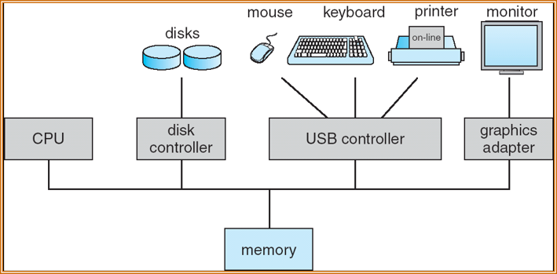

# 。

## 0-Overview

| 参考资料 | [咸鱼暄](https://xuan-insr.github.io/%E6%A0%B8%E5%BF%83%E7%9F%A5%E8%AF%86/os/I_overview/2_overview/) | [isshikih修](https://note.isshikih.top/cour_note/D3QD_OperatingSystem/) |

### Main Contents

- Overview
  - Intro
  - OS structure

- Process Management
  - Processes
  - Threads
  - CPU scheduling
  - Process Synchronization
  - Deadlocks
- Memory Management
  - Main memory
  - Virtual memory
- Storage Management
  - File-system interface
  - File-system implementation
  - Mass-storage structure
  - I/O systems

### Lab Projects

- 每个同学独立完成
  - 实验0 RISC-V 64 内核调试   5%
  - 实验1 内核引导；时钟和中断 15%
- 分组完成5个实验，每组2人
  - 实验2 线程调度,上下文切换 15%
  - 实验3 虚拟内存管理 15%
  - 实验4 用户模式（shell） 20%
  - 实验5 Page fault 20%
  - 实验6 Fork  10%
- 实验7 File System  <u>Bonus</u> 10%

实验0、1：每个同学提交一份实验报告；

实验2-6：每个同学提交一份实验报告（侧重自己完成的那部分内容）；

自己写的代码必须有详细的注释，每5行代码有注释

每个实验必须写“讨论心得” (实验过程中遇到的问题及解决方法)这部分内容占本实验报告20%分数

每个实验完成后，以个人（lab0-1）/小组（lab2-3-4-5-6）为单位向老师/助教演示，以完成验收。

实验说明文档在 [https://zju-sec.github.io/os24fall-stu](https://zju-sec.github.io/os23fall-stu/)

实验所需代码[https://github.com/ZJU-SEC/os24fall-stu](https://github.com/ZJU-SEC/os23fall-stu) 

### Final Grade

| Final exam 50 | HW 5 | In-class Quiz 5 | Lab Report 20 | Lab Demos 20

## 1-Introduction

<u>[structure] 4 components</u> :

- **Hardware** – provides basic computing resources
  - CPU, memory, I/O devices
- **Operating system**
  - Controls and coordinates use of hardware among various applications and users
- **System & application programs** – define the ways in which the system resources are used to solve the computing problems of the users
  - Word processors, compilers, web browsers, database systems, video games
- **Users**
  - People, machines, other computers

<u>[OS Definition]</u> :

- **resource allocator**: 
  Manages all resources.
  Decides between conflicting requests for efficient and fair resource use.
- **control program**:
  Controls execution of programs to prevent errors and improper use of the computer.

- No universally accepted definition.

- “Everything a vendor ships(供应商提供的一切) when you order an operating system” is good approximation.

  But varies wildly.

- “The one program running at all times on the computer” is the **kernel.** Everything else is either a system program (ships with the operating system) or an application program.

<u>Computer Startup</u> :

**bootstrap program** is loaded at power-up or reboot

- Typically stored in ROM or EPROM, generally known as **firmware**
- Initializes all aspects of system
- Loads operating system kernel and starts execution

<u>Computer System Organization</u> :

冯诺依曼计算机的核心是memory，不是cpu

- I/O devices and the CPU can execute concurrently(同时地).

- Each device controller is in charge of a particular device type.

- Each device controller has a **local buffer**.

- CPU moves data from/to main memory to/from local buffers

- I/O is from the device to local buffer of controller.

- Device controller informs CPU that it has finished its operation by causing an *interrupt* (via system bus).

  interrupt 分为 hardware 层面和 Trap，而 Trap 又分为 Errors 和 system call (也叫exceptions/ecalls)

45
