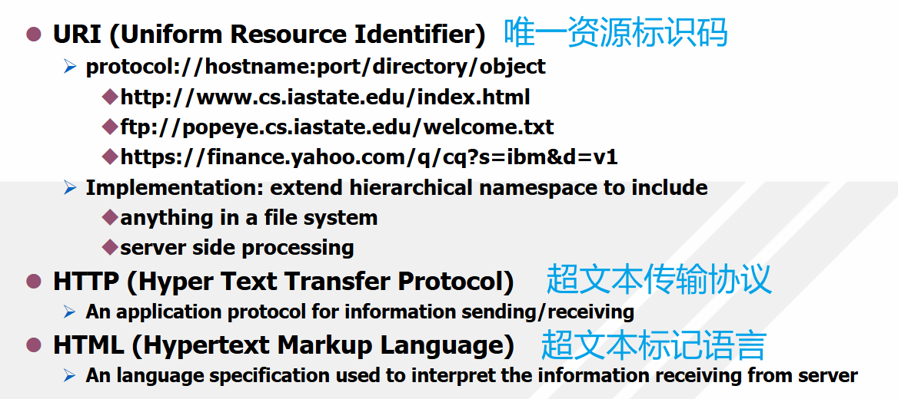

# 。

## 1-basic

### 课程内容

B/S开发基础

HTML/CSS/JavaScript

前端框架

Node.js/Python

Java EE

Spring/Spring Boot/Spring Cloud

Web应用优化

ASP.NET

### 参考资料

- HTML5与CSS3基础教程（第8/9版）

➢Elizabeth Castro/Bruce Hyslop，望以文译

➢人民邮电出版社

- JavaScript权威指南（第7版）

➢Javascript: The Definitive Guide

➢David Flanagan

➢机械工业出版社

- https://sca.aliyun.com

- Front-end Development with ASP.NET Core, Angular, Bootstrap

➢Simone Chiaretta

➢Wrox

### 考核

大程：独立完成一个网站开发（任选Web开发技术实现一个商品价格比较网站）

### 网络协议

TCP/IP(Transmission Control Protocol/Internet Protocal)

- 网络层：IP, IPv4, IPv6
- 传输层：TCP, UDP(User Datagram Protocol)
- 应用层：HTTP, FTP, SMTP, Telnet, DNS, …

World Wide Web(WWW)

- Core Components: servers, browsers, networks
- Problems: how to identify/retrieve/interpret an object



HTTP Properties:

- Request-response exchange
  - Server runs over TCP, Port 80(默认端口)
  - Client sends HTTP requests and gets responses from server
  - Synchronous request/reply protocol 
- Stateless
  - No state is maintained by clients or servers across requests and responses 
  - Each pair of request and response is treated as an independent message exchange

- Resource metadata
  - Information about resources are often included in web transfers and can be used in several ways

### Web服务器

IIS、Nginx、Java EE应用服务器

## 2-HTML

web开发的协议/规范等：`http://www.w3.org`

标签tag大部分成对出现：`<tag>...</tag>`

注释：`<!--...-->`

大部分样式通过CSS（样式管理器）来实现，HTTP用来实现一些比较重要的属性（比如跳转链接）

HTML structure:

```html
<html>
    <head>
        <title>...</title>
    </head>
    <body>
    </body>
</html>
```

前端框架（封装好的组件）

（常见情况：浏览器一侧用id且要求唯一，服务器一侧用name且可重名）

### 注意点

- space（空格）、tab、new-line（换行）会被忽略（全部用一个空格来替换，哪怕是连续的空格）

- 重复的`<p>`会被忽略

- 被当成tag符号而不能正确显示（不同字符集下空格长度不一样，因此不要用空格来进行排版）：

  |       code        | show  |
  | :---------------: | :---: |
  |       `&lt`       |   <   |
  |       `&gt`       |   >   |
  |      `&amp`       |   &   |
  |      `&nbsp`      | space |
  | `&#97`（ASCII码） |   a   |

### note

<ul>
    <li>aaa</li>
    bbb
    <li>ccc</li>
</ul>

<ol>
    <li>aaa</li>
    bbb
    <li>ccc</li>
    ddd
</ol>

<dl>
    <dt>title</dt>
    <dd>content</dd>
    <dt>title2</dt>
    <dd>content2</dd>
</dl>

<h5>h5<br>br</h5>

<cite>cite</cite>、<code>int main(void)</code>、<em>em</em>、<strong>strong</strong>、<big>big</big>、<small>small</small>、<sub>sub</sub>、<sup>sup</sup>、<tt>tt</tt>

<table>
    <caption>caption</caption>
    <tr>
        <th>th1</th>
        <th>th2</th>
    </tr>
    <tr>
    	<td>td11</td>
        <td>td21</td>
    </tr>
    <tr>
        <td>td12</td>
    </tr>
</table>

（默认表格是没有表格线的，可以用来做内容的排版）

